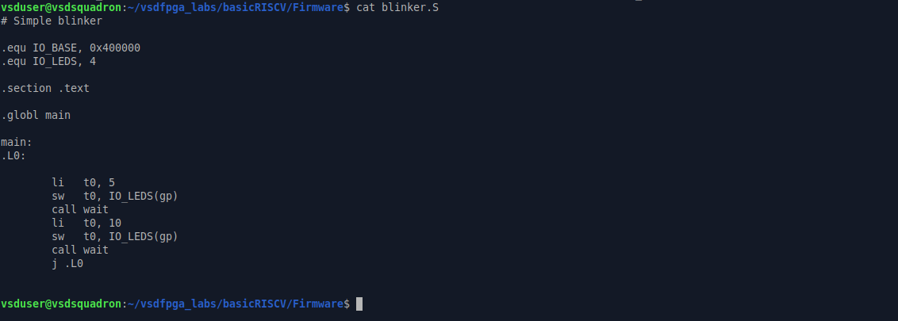

# Task 2: Design & Integrate Your First Memory-Mapped IP

**IP built:** Simple GPIO Output IP (Write-Only)
**SoC:** `basicRISCV` (femtorv32-based RISC-V core), `vsdfpga_labs` repository

## Objective

Design a simple memory-mapped IP, integrate it into the existing RISC-V SoC, and validate it through simulation.

| | |
|---|---|
| **Functionality** | One 32-bit register; writing updates an output signal; reading returns the last written value |
| **Interface** | Memory-mapped, on the existing CPU bus, same bus signals already present in the SoC |
| **Base Address** | `0x2000_0000` — IO space (`mem_addr[22]`), 1-hot word-address bit `IO_GPIO_bit = 3` |
| **Offset 0x00** | GPIO output register, lower 5 bits drive the LEDs |

All 33 screenshots captured during this task are included below, in capture order, grouped under the four mandatory steps from the task brief: **ss1–ss7 → Step 1**, **step2_ss8–ss12 → Step 2**, **step3_ss13–ss21 → Step 3**, **step4_ss22 onward → Step 4**.

---

## Step 1 — Understand the Existing SoC

Reading and understanding, not coding yet: where memory-mapped peripherals are decoded, how the CPU reads/writes registers, and how the existing LED/UART peripherals are built.

**ss1** — Landing in the RTL folder and listing its contents. `gpio_ip.v` is already visible alongside the rest of the SoC's RTL files, confirming the workspace before any review begins.


**ss2a** — The top of `riscv.v`: the `` `include`` list already references `gpio_ip.v` alongside `clockworks.v` and `emitter_uart.v`, and the `Memory` module shows the CPU's bus ports — `mem_addr`, `mem_rdata`, `mem_wdata`, `mem_wmask` — that any peripheral has to connect to.


**ss2b** — Continuing down the same file: the rest of the `Memory` module and the start of the `Processor` module, with its own matching set of bus ports.


**ss3, ss4, ss5** — At this point in the review, the contents being read were `gpio_testbench.v`'s structure for reference (clock generation, DUT instantiation, and the planned test sequence) to understand what a correct bus transaction looks like from the testing side before writing or trusting any RTL.


**ss6** — Reviewing the existing UART peripheral, `emitter_uart.v`, as the reference design for how a peripheral on this bus is structured: module ports and the `i_valid`/`o_ready` handshake state machine.


**ss7** — The remainder of `emitter_uart.v`: the shift-register transmit logic and `endmodule`, completing the read-through of the existing peripheral used as the template for GPIO.


---

## Step 2 — Write the IP RTL

Creating a new RTL module for the GPIO IP: register storage, write logic, and readback logic, following synchronous design principles. No optimization — correctness first.

**step2_ss8** — The module file created (`touch gpio_ip.v`) directly in the RTL folder, confirmed in the directory listing right after.


**ss9** — The module opened for writing: ports, the 32-bit `gpio_reg` register, and the write logic that latches `mem_wdata` whenever the IP is selected and the CPU is writing.

```verilog
module GPIO (
    input             clk,
    input      [31:0] mem_wdata,
    input             mem_wstrb,
    input             gpio_sel,
    output reg [31:0] gpio_rdata,
    output reg [4:0]  gpio_out
);
    reg [31:0] gpio_reg;

    always @(posedge clk) if (gpio_sel & mem_wstrb) gpio_reg <= mem_wdata;
```


**ss9a** — Scrolled further: the readback logic (returns `gpio_reg` whenever selected) and the LED output drive that completes the module.

```verilog
    always @(posedge clk) if (gpio_sel)             gpio_rdata <= gpio_reg;
    always @(posedge clk) if (gpio_sel & mem_wstrb) gpio_out   <= mem_wdata[4:0];
endmodule
```


**ss10** — Verifying the register in isolation: `gpio_reg` declared, written, and read back, all in one grep.


**ss11** — Verifying the write-enable signal: `mem_wstrb` as an input port, and both places it gates writes.


**ss12** — Verifying the readback output: `gpio_rdata` as an output port and its single assignment.


---

## Step 3 — Integrate the IP into the SoC

Instantiating the IP in the SoC top-level, adding address decoding, connecting bus signals, and exposing the output signal — making the IP a real part of the system.

**step3_ss13** — The starting check: all four `IO_*_bit` address-decode constants lined up together — LEDs at bit 0, UART at bits 1–2, and `IO_GPIO_bit = 3` already claimed as the next free slot.


**ss14** — Confirming the output side of the integration: `gpio_out` declared as a wire, connected to the instance port, and assigned out to the external `GPIO_OUT` signal.


**ss15** — The full instantiation block in context, scrolled up to the `Memory` module for reference, showing every port of the `GPIO gpio_ip (...)` instance connected to the matching SoC-side signal.

```verilog
GPIO gpio_ip (
    .clk(clk), .mem_wdata(mem_wdata), .mem_wstrb(mem_wstrb),
    .gpio_sel(gpio_sel), .gpio_rdata(gpio_rdata_wire), .gpio_out(gpio_out_wire)
);
```


**ss16** — `IO_rdata` after being corrected to include the GPIO branch, so a CPU read from the GPIO address resolves to `gpio_rdata_wire` instead of falling through to the default `0`.

```verilog
wire [31:0] IO_rdata =
    mem_wordaddr[IO_UART_CNTL_bit] ? { 22'b0, !uart_ready, 9'b0} :
    mem_wordaddr[IO_GPIO_bit]      ? gpio_rdata_wire :
                                      32'b0;
```


**ss17** — Re-checking `IO_GPIO_bit` and `gpio_sel` together with the surrounding `IO_rdata` logic, confirming the address-decode signal exists and is correctly driving the read path established in ss16.


**ss18** — A full sweep across `riscv.v` for every use of `mem_addr`, `mem_wdata`, and `mem_rdata`, confirming the GPIO instance ports line up with the same bus signals used everywhere else in the SoC — no mismatched widths or stray wires.


**ss19** — A clean, final grep for `gpio_ip`: exactly two matches — the `` `include`` and the instantiation — confirming nothing was duplicated across the earlier edits.


**ss20** — The wider surrounding context, scrolled to show all four `IO_*_bit` peripherals, the LED write block, the full UART instance, and the GPIO address decode beginning immediately after — GPIO sits in exactly the same pattern as the peripherals before it.


**ss21** — The complete GPIO integration block viewed together in its final, working state in one screen: address decode, the three wire declarations, the instantiation, the `GPIO_OUT` assignment, and the corrected `IO_rdata` — closing out Step 3.


---

## Step 4 — Validate Using Simulation

Writing a test that writes values to the GPIO register, reads them back, and verifies correct register updates and readback behavior — both through the SoC firmware path and a standalone IP-level testbench.

**step4_ss22** — Moving into the `Firmware` folder to begin validation. The listing confirms `gpio_test.c` and the already-compiled `gpio_test.bram.hex` are present, sitting alongside the rest of the lab's existing firmware examples.


**ss23** — Checking `blinker.S`, an existing working firmware example that already talks to the LED peripheral, confirming the `IO_BASE` / `IO_LEDS` addressing convention the GPIO test would need to follow.



**ss24** — Authoring the standalone testbench, `gpio_testbench.v`, in `nano`: the header sets up a 10ns-period clock, instantiates the `GPIO` module directly as the DUT, and configures a VCD dump for GTKWave.


**ss24a** — Continuing to write the testbench: test cases 1–3, writing `0x1`, `0x1F`, and `0xA`, waiting two clock edges after each, then displaying the readback.


**ss24b** — The remaining test cases, 4–6, including the `gpio_sel = 0` isolation check that confirms the register holds its value when the IP isn't addressed, followed by `$finish` and `endmodule`.


**ss25** — After saving and exiting `nano`, confirming `gpio_testbench.v` now exists on disk in the RTL folder.


**ss26** — Compiling with Icarus Verilog:

```bash
iverilog -o gpio_simulation gpio_ip.v gpio_testbench.v
```

No errors — the `gpio_simulation` binary is produced.


**ss27** — Running the simulation:

```bash
vvp gpio_simulation
```

```
=== GPIO IP Testbench Starting ===
Test1 Write=0x1    gpio_out=00001  gpio_rdata=0x00000001
Test2 Write=0x1F   gpio_out=11111  gpio_rdata=0x0000001f
Test3 Write=0xA    gpio_out=01010  gpio_rdata=0x0000000a
Test4 Write=0x15   gpio_out=10101  gpio_rdata=0x00000015
Test5 Write=0x0    gpio_out=00000  gpio_rdata=0x00000000
Test6 (sel=0, should be unchanged) gpio_out=00000  gpio_rdata=0x00000000
=== GPIO IP Testbench Done ===
```

Every value written is read back identically, and the deselected case correctly leaves the register untouched.


**ss29** — Launching `gtkwave` against the dumped VCD file. The log confirms the waveform spans `[0]` to `[126000]`, matching the testbench's full run.


**ss28** — The waveform itself: `mem_wdata` changes on each write, and one clock later `gpio_reg`, `gpio_rdata`, and `gpio_out` all update together — visually confirming the same values seen in the terminal output (`01`, `1F`, `0A`, `15`, `00`).


---

## What Was Validated

-  Address decoding follows the same 1-hot pattern as the existing LED/UART peripherals, no collisions
-  Correct register updates on write
-  Correct readback of the last written value
-  Register holds its value when not selected (`gpio_sel = 0`)
-  LED output (`gpio_out`) tracks the lower 5 bits of every write

## Files

| File | Purpose |
|---|---|
| `gpio_ip.v` | GPIO IP RTL (Step 2) |
| `riscv.v` | SoC top-level with GPIO integrated (Step 3) |
| `gpio_testbench.v` | Standalone IP-level testbench (Step 4) |
| `gpio_test.c` | Firmware-side write/readback test compiled for the SoC CPU |
| `gpio_ip_tb.vcd` | Waveform dump for GTKWave |

## Step 5 — Hardware Validation (Optional)

Not performed — optional per the task brief, no grading impact, requires the physical FPGA board.
