# Task 2: Design & Integrate Your First Memory-Mapped IP

**IP built:** Simple GPIO Output IP (Write-Only)
**SoC:** `basicRISCV` (femtorv32-based RISC-V core), `vsdfpga_labs` repository

## Objective

Design a simple memory-mapped IP, integrate it into the existing RISC-V SoC, and validate it through simulation.

---

# Step 1: Understand the Existing SoC

## Objective
Before writing any RTL, explored the existing basicRISCV SoC (`riscv.v`, `emitter_uart.v`) to understand how memory-mapped peripherals are decoded and how the CPU reads/writes registers over the bus. Read-only step — no coding yet.

## Key Findings

**Directory + top-level view.** Located inside `~/vsdfpga_labs/basicRISCV/RTL`, with `riscv.v` as the SoC top file. Running `head -50 riscv.v` shows the `Memory` module first — it exposes the core bus signals every peripheral connects to: `mem_addr`, `mem_wdata`, `mem_rdata`, `mem_wstrb`/`mem_wmask`, and `mem_rstrb`.
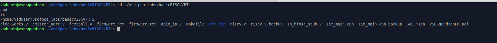
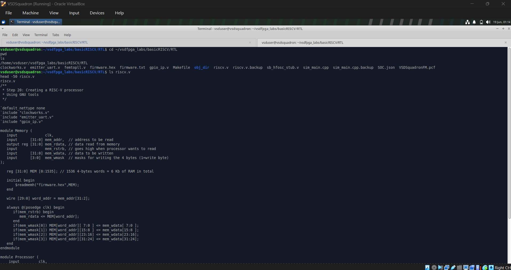
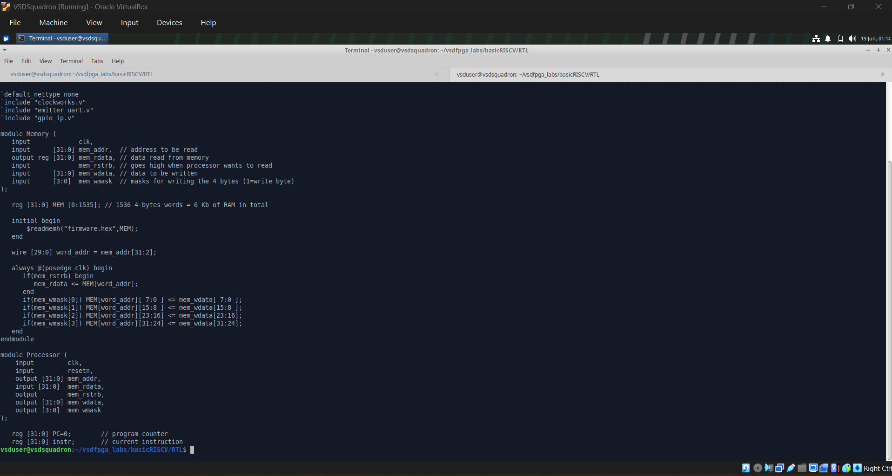

**Address decoding.** The SoC splits the address space using a single bit: `wire isIO = mem_addr[22]` — 0 maps to RAM, 1 maps to memory-mapped IO. Inside IO space, peripherals are selected 1-hot on `mem_wordaddr = mem_addr[31:2]`:
```verilog
localparam IO_LEDS_bit      = 0;  // W five leds
localparam IO_UART_DAT_bit  = 1;  // W data to send (8 bits)
localparam IO_UART_CNTL_bit = 2;  // R status. bit 9: busy sending
```
Confirmed by tracing every use of `mem_addr` across the file.
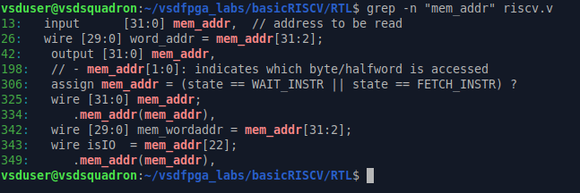

**Write logic (LEDs pattern).** The LEDs peripheral is the simplest existing write-only example:
```verilog
always @(posedge clk) begin
    if(isIO & mem_wstrb & mem_wordaddr[IO_LEDS_bit])
        LEDS <= mem_wdata;
end
```
This is the template every write-only peripheral follows: chip-select (`isIO & mem_wordaddr[bit]`) ANDed with the global write strobe `mem_wstrb`, gating a register update on `posedge clk`. Confirmed by tracing every use of `mem_wdata`.
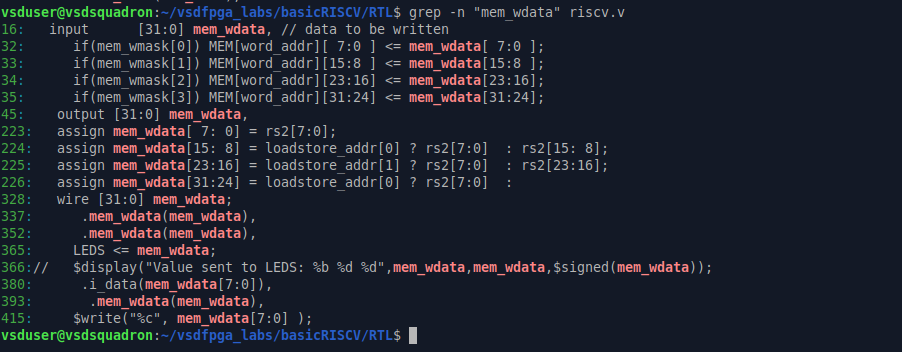

**Read path.** Reads are muxed back depending on which peripheral (or RAM) is addressed:
```verilog
assign mem_rdata = isRAM ? RAM_rdata : IO_rdata;
```
This showed that adding any new peripheral needs three things: a free decode bit, a write-enable gated on that bit, and a corresponding entry in the read mux. Confirmed by tracing every use of `mem_rdata`.
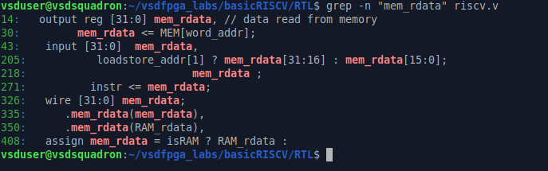

**Existing UART peripheral.** `emitter_uart.v` (`corescore_emitter_uart`) is a self-contained shift-register transmitter. It loads `i_data` into a 10-bit frame (start bit + 8 data bits + stop bit) when `i_valid & o_ready`, then shifts it out serially on `o_uart_tx` at the configured baud rate, using a countdown counter (`cnt`) sized by `$clog2(clk_freq_hz/baud_rate)`.
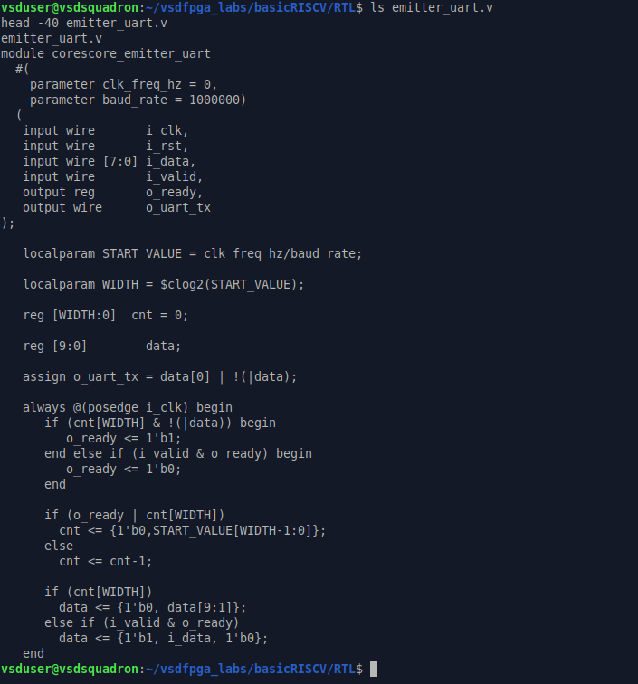
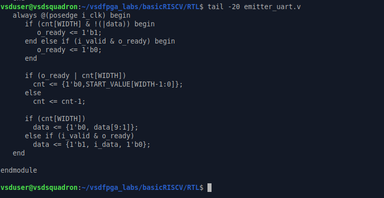

This exploration directly shaped the GPIO IP design: assigned the next free decode bit (`IO_GPIO_bit = 3`), reused the exact LEDS write-enable pattern (`isIO & mem_wstrb & mem_wordaddr[IO_GPIO_bit]`), and added a new entry to the `IO_rdata` read mux for GPIO readback — following the same structure already used for UART status.

# Step 2: Write the IP RTL

## Objective
Implement the GPIO IP as a standalone RTL module: register storage, write logic, and readback logic, following synchronous design principles. Correctness first, no optimizations.

## gpio_ip.v


The `GPIO` module takes `clk`, `mem_wdata`, `mem_wstrb`, and `gpio_sel` as inputs, and drives `gpio_rdata` (read data) and `gpio_out` (5-bit LED output) as registered outputs — using the same bus signal names already present in the SoC.

**Register storage.** A single 32-bit register, `gpio_reg`, holds the last written value:
```verilog
reg [31:0] gpio_reg;
```

**Write logic.** Gated on chip-select AND write-strobe, synchronous to `clk`:
```verilog
always @(posedge clk) begin
    if (gpio_sel & mem_wstrb) begin
        gpio_reg <= mem_wdata;
    end
end
```
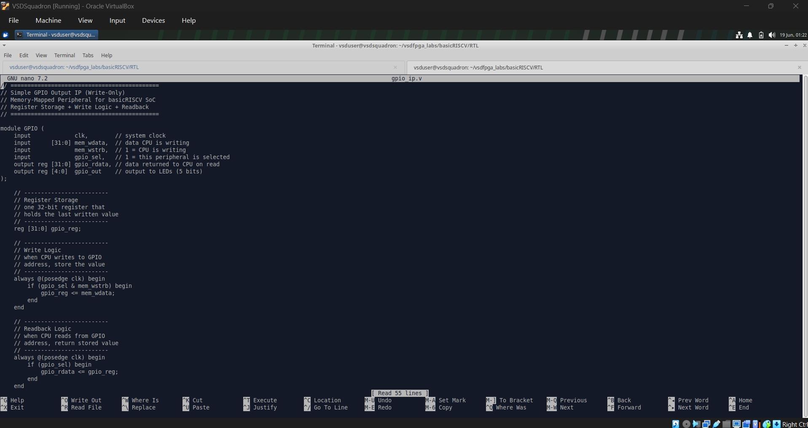

**Readback logic.** When selected, `gpio_rdata` loads from the stored register on the next clock edge:
```verilog
always @(posedge clk) begin
    if (gpio_sel) begin
        gpio_rdata <= gpio_reg;
    end
end
```

**LED output drive.** The lower 5 bits of the written data are latched separately to drive the physical LED pins:
```verilog
always @(posedge clk) begin
    if (gpio_sel & mem_wstrb) begin
        gpio_out <= mem_wdata[4:0];
    end
end
```
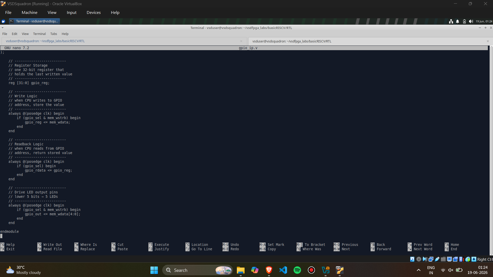

## Verification by Inspection

**Register storage.** `grep -n "gpio_reg" gpio_ip.v` confirms a single declaration, one write site, one read site — exactly the intended single-register design.


**Write-enable isolation.** `grep -n "mem_wstrb" gpio_ip.v` confirms it's used only in the write-gating conditions, keeping the write path correctly isolated to chip-select + write-strobe.
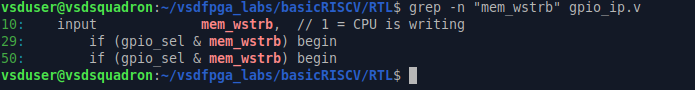

**Readback output.** `grep -n "gpio_rdata" gpio_ip.v` confirms it's declared as the module's read-data output and updated only inside the readback block.


## Design Notes
- One register, one write path, one read path — deliberately simple per the task spec.
- `gpio_sel` is generated outside this module (in Step 3's address decode), keeping the IP itself bus-agnostic and reusable.
- No optimizations applied; correctness over performance, as required by the task.

With `gpio_ip.v` complete and verified by inspection, the next step was instantiating it in `riscv.v`, wiring `gpio_sel` from the address decoder, and connecting `mem_wdata`/`mem_wstrb` from the existing bus.

# Step 3: Integrate the GPIO IP into the SoC

## Overview
The GPIO Output IP (`gpio_ip.v`) was integrated into the SoC top-level (`riscv.v`) by adding an address-decode slot, instantiating the IP, wiring it to the shared CPU bus, and exposing its output as a top-level port. Screenshots below follow the actual order in which the integration was implemented and verified.

## Files Involved
- `riscv.v` — SoC top-level (includes `gpio_ip.v`, instantiates the IP, handles address decode and bus muxing)
- `gpio_ip.v` — GPIO IP RTL module (from Step 2)

---

**Figure 1 — Checking the existing IO address map (`localparam IO_*_bit`)**

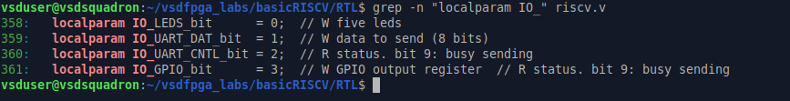

Before integrating, the existing one-hot IO bit map was checked with `grep -n "localparam IO_" riscv.v`. `IO_LEDS_bit`, `IO_UART_DAT_bit`, and `IO_UART_CNTL_bit` already existed; `IO_GPIO_bit = 3` was added to reserve a slot for the new GPIO IP.

---

**Figure 2 — Verifying `gpio_out` wiring (`grep -n "gpio_read\|gpio_out" riscv.v`)**

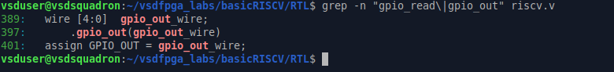

Confirms `gpio_out_wire` is declared, connected to the IP's `.gpio_out()` port, and finally driven out as `GPIO_OUT`.

---

**Figure 3 — Context around the GPIO instantiation (`grep -n "gpio_ip" -A 15 riscv.v`)**

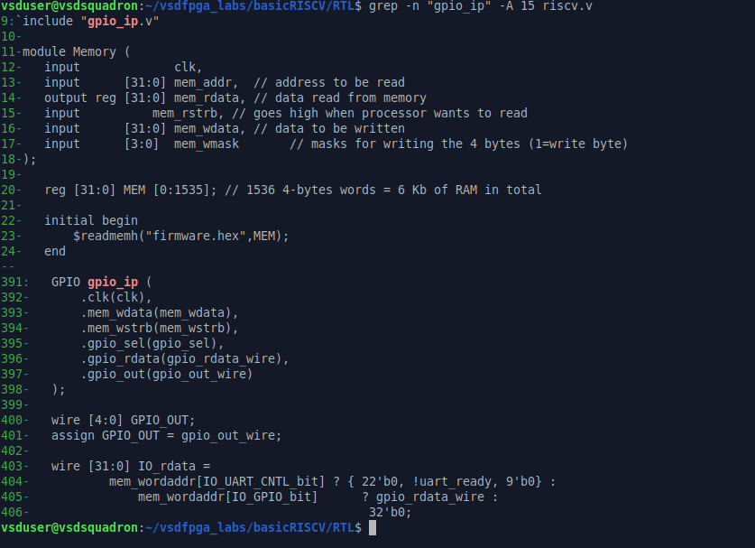

A wider grep showing the `` `include "gpio_ip.v" `` at the top of the file alongside the actual `GPIO gpio_ip (...)` instantiation block and the surrounding `GPIO_OUT` / `IO_rdata` logic.

---

**Figure 4 — `IO_rdata` mux logic (`grep -n "IO_rdata" -A 6 riscv.v`)**

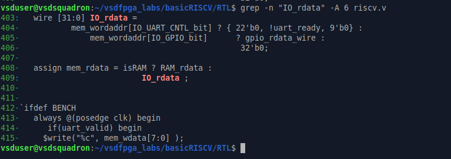

Shows how `IO_rdata` is built: it selects `gpio_rdata_wire` when the GPIO bit is addressed, and feeds into `mem_rdata` so the CPU can read back the register.

---

**Figure 5 — All usages of `IO_GPIO_bit` (`grep -n "IO_GPIO_bit" riscv.v`)**

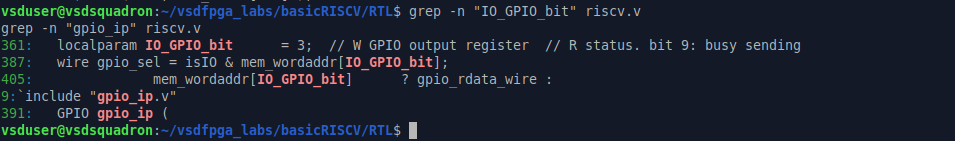

Cross-checks every place the new bit constant is used: its `localparam` definition, the `gpio_sel` decode (`wire gpio_sel = isIO & mem_wordaddr[IO_GPIO_bit];`), and the `IO_rdata` mux entry.

---

**Figure 6 — Bus signal cross-check (`mem_addr`, `mem_wdata`, `mem_rdata`)**

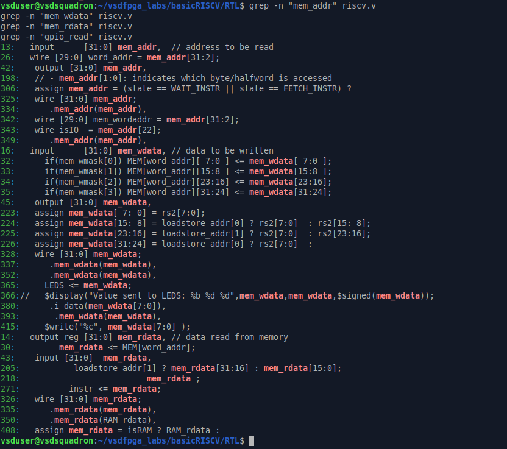

A broad grep across `mem_addr`, `mem_wdata`, and `mem_rdata` confirms the GPIO IP reuses the exact same shared CPU bus signals already used by RAM and the existing LED/UART peripherals — no new bus was introduced.

---

**Figure 7 — Quick sanity check (`grep -n "gpio_ip" riscv.v`)**

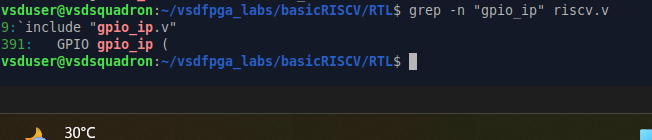

A final, minimal grep confirming just the two essential lines: the `` `include "gpio_ip.v" `` and the `GPIO gpio_ip (` instantiation — both present and in place.

---

**Figure 8 — Full file view in `nano`: existing peripherals + GPIO Address Decode**

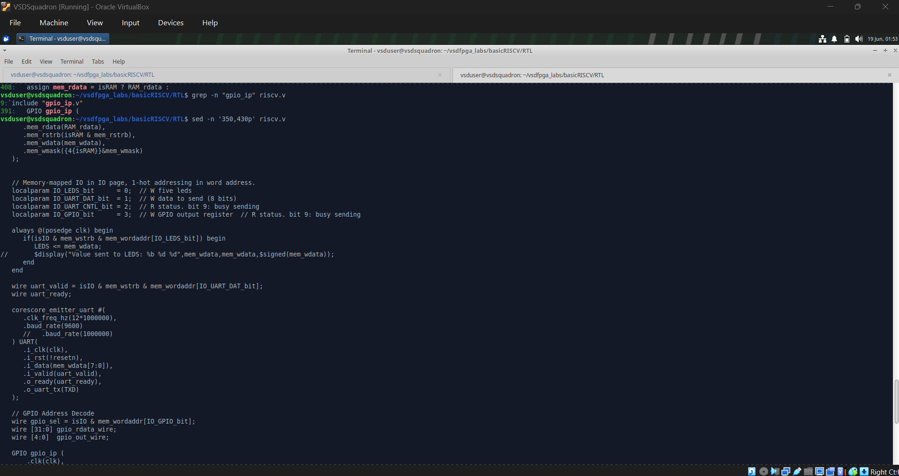

Scrolling through `riscv.v` in `nano` to see the GPIO integration in context with the existing `IO_LEDS_bit` write logic and the UART (`corescore_emitter_uart`) instantiation just above the new GPIO block.

---

**Figure 9 — Full file view in `nano`: GPIO instantiation, output exposure, and clock**

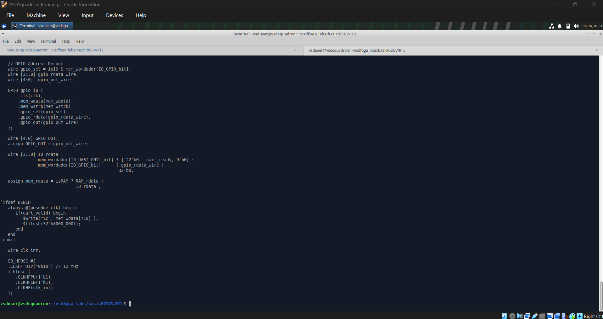

Continuing the scroll: the complete `GPIO gpio_ip (...)` instantiation, `GPIO_OUT` port assignment, the `IO_rdata` mux, the simulation-only `` `ifdef BENCH `` block, and the on-chip clock (`SB_HFOSC`) generation below it.

---

## Summary

| Aspect | Detail |
|---|---|
| Address slot | `IO_GPIO_bit = 3` (one-hot word-offset within IO region) |
| Chip-select | `gpio_sel = isIO & mem_wordaddr[IO_GPIO_bit]` |
| Write path | `mem_wdata`, `mem_wstrb` (shared CPU bus signals) |
| Read path | `gpio_rdata_wire` muxed into `IO_rdata` → `mem_rdata` |
| Output exposure | `gpio_out_wire` → top-level `GPIO_OUT[4:0]` |

At this point, the GPIO IP is no longer a standalone module — it is a live, addressable peripheral on the SoC's memory-mapped bus, ready for the Step 4 simulation validation.

# Step 4: Validate GPIO IP using Simulation

## Objective
The GPIO Output IP (`gpio_ip.v`) was validated using a dedicated Verilog testbench (`gpio_testbench.v`) that directly drives the module's ports to verify write logic, readback logic, and output behavior — without needing the full SoC/CPU.

## Files Involved
- `gpio_ip.v` — GPIO IP RTL module
- `gpio_testbench.v` — Testbench driving `mem_wdata`, `mem_wstrb`, `gpio_sel` and observing `gpio_out`, `gpio_rdata`

---

## Testbench Design

The testbench instantiates the GPIO IP, generates a 10ns-period clock, dumps a VCD file for GTKWave, and drives a sequence of writes to validate write/readback behavior.

**Module declaration, clock generation, and DUT instantiation**

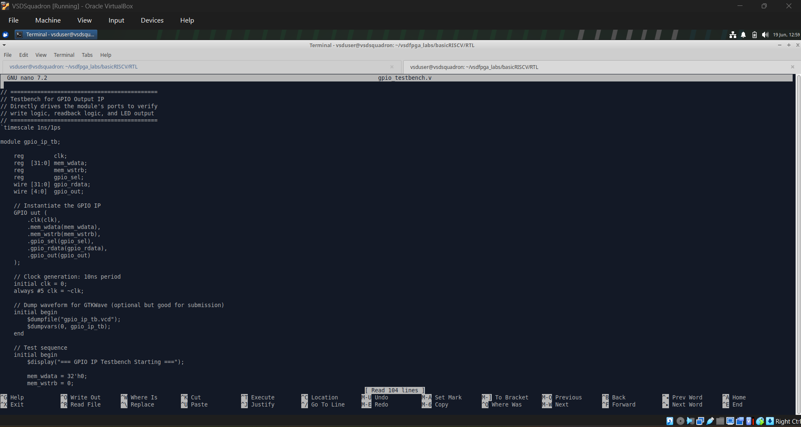

**Test sequence: Test1 to Test3 (writes 0x1, 0x1F, 0xA)**

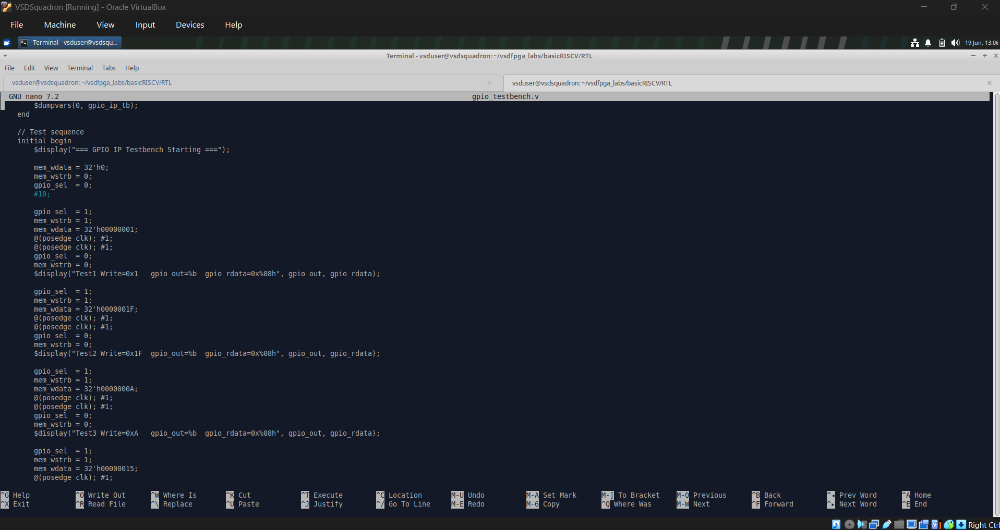

**Test sequence: Test4 to Test6 and endmodule**

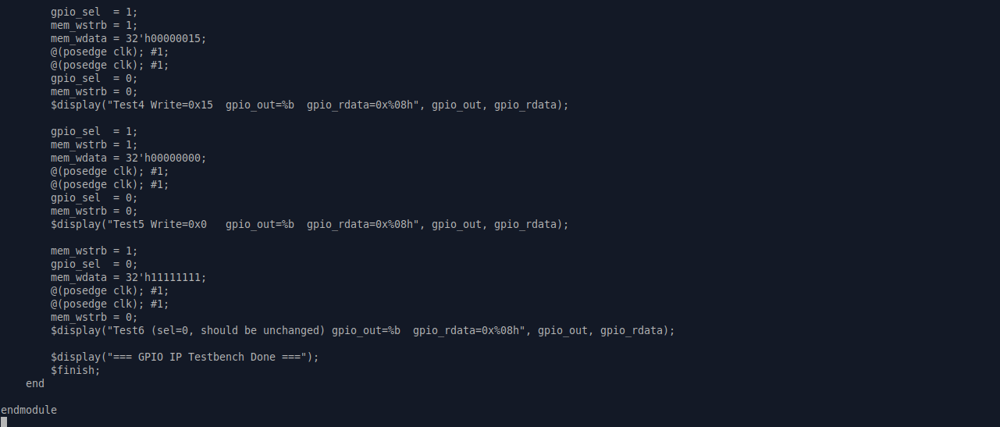

### Expected Results

| Test | Write Value | Expected `gpio_out` | Expected `gpio_rdata` |
|------|-------------|----------------------|--------------------------|
| 1 | 0x1 | 00001 | 0x00000001 |
| 2 | 0x1F | 11111 | 0x0000001F |
| 3 | 0xA | 01010 | 0x0000000A |
| 4 | 0x15 | 10101 | 0x00000015 |
| 5 | 0x0 | 00000 | 0x00000000 |
| 6 | 0x11111111 (sel=0) | unchanged | unchanged |

Test 6 confirms that when `gpio_sel = 0`, the register does **not** update, validating correct address decoding behavior.

---

## Compilation & Simulation

**Project directory before compilation**

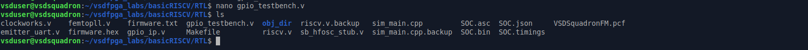

**Compile the testbench and DUT together:**
```bash
iverilog -o gpio_simulation gpio_ip.v gpio_testbench.v
```

**Compilation with iverilog**

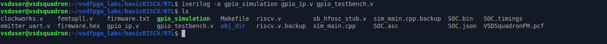

**Run the simulation:**
```bash
vvp gpio_simulation
```

**Simulation run output (vvp)**

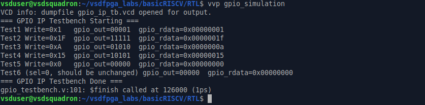

### Simulation Log
```
VCD info: dumpfile gpio_ip_tb.vcd opened for output.
=== GPIO IP Testbench Starting ===
Test1 Write=0x1   gpio_out=00001  gpio_rdata=0x00000001
Test2 Write=0x1F  gpio_out=11111  gpio_rdata=0x0000001f
Test3 Write=0xA   gpio_out=01010  gpio_rdata=0x0000000a
Test4 Write=0x15  gpio_out=10101  gpio_rdata=0x00000015
Test5 Write=0x0   gpio_out=00000  gpio_rdata=0x00000000
Test6 (sel=0, should be unchanged) gpio_out=00000  gpio_rdata=0x00000000
=== GPIO IP Testbench Done ===
gpio_testbench.v:101: $finish called at 126000 (1ps)
```

 All test cases passed — register updates and readback values matched expectations exactly.

---

## Waveform Verification

The generated `gpio_ip_tb.vcd` was opened in GTKWave:
```bash
gtkwave gpio_ip_tb.vcd
```

**GTKWave waveform: `mem_wdata`, `gpio_reg`, `gpio_out`, `gpio_rdata`**

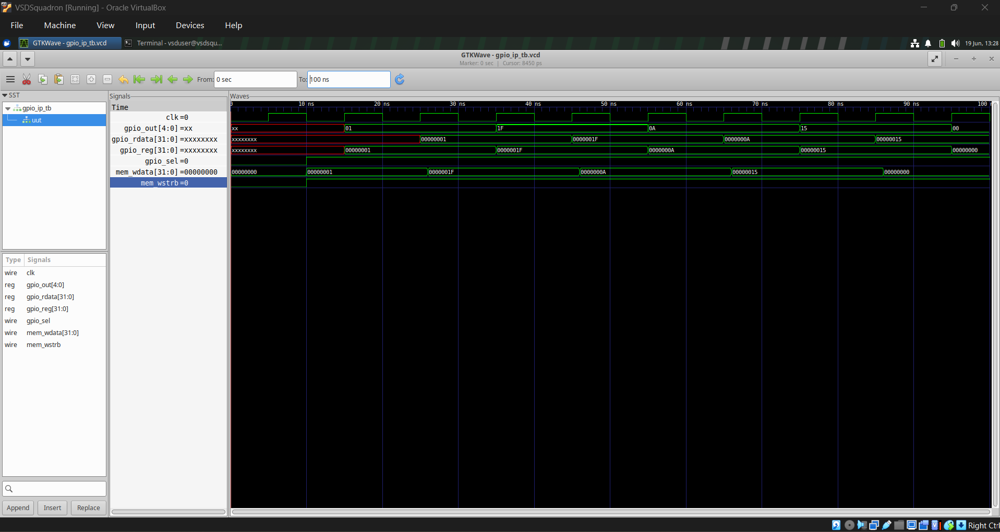

**GTKWave terminal log**

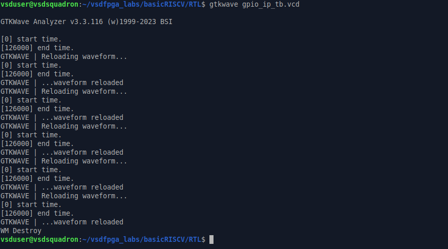

The waveform confirms:
- `mem_wdata` values (0x1, 0x1F, 0xA, 0x15, 0x0) are correctly latched into `gpio_reg`
- `gpio_out` and `gpio_rdata` track the written values in sync with the clock
- No spurious register updates occur

---

## Conclusion
Simulation confirms the GPIO IP correctly implements:
- Synchronous write to the 32-bit register
- Accurate readback of the last written value
- Proper gating via `gpio_sel` (no update when not selected)

This satisfies the mandatory simulation validation requirement for Step 4.
