# Task-5: Multi-Register GPIO IP with Software Control

## Objective

Extending the single-register GPIO IP from Task-4 into a realistic,
production-style peripheral with a proper register map, direction
control, and full software validation running on the RISC-V core.

---

## IP Specification

**IP Name:** GPIO Control IP  
**Base Address:** `0x400000`

| Offset | Register | Description |
|--------|----------|-------------|
| `0x00` | `GPIO_DATA` | Output data written by CPU |
| `0x04` | `GPIO_DIR` | Direction control (1=output, 0=input) |
| `0x08` | `GPIO_READ` | Readback — reflects current pin state |

### Address Decoding

`gpio_addr = mem_addr[3:2]` — bits [3:2] of the memory address
select which register is being accessed inside the IP.

| `gpio_addr` | Register |
|-------------|----------|
| `2'b00` | GPIO_DATA |
| `2'b01` | GPIO_DIR |
| `2'b10` | GPIO_READ |

---

## Step 1: Study and Plan

Before writing any code, the existing Task-2 `gpio_ip.v` was
studied in detail to understand the current structure and identify
exactly where changes need to be made.

###  RTL Directory Listing

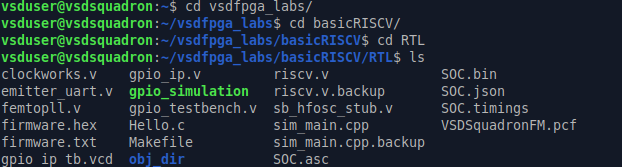

Directory listing of `RTL/` confirming all relevant files present:
`gpio_ip.v`, `riscv.v`, `gpio_testbench.v`, `Makefile`,
`sim_main.cpp`, `firmware.hex`. This establishes the starting
point before any modifications.

###  Reading the Full GPIO IP

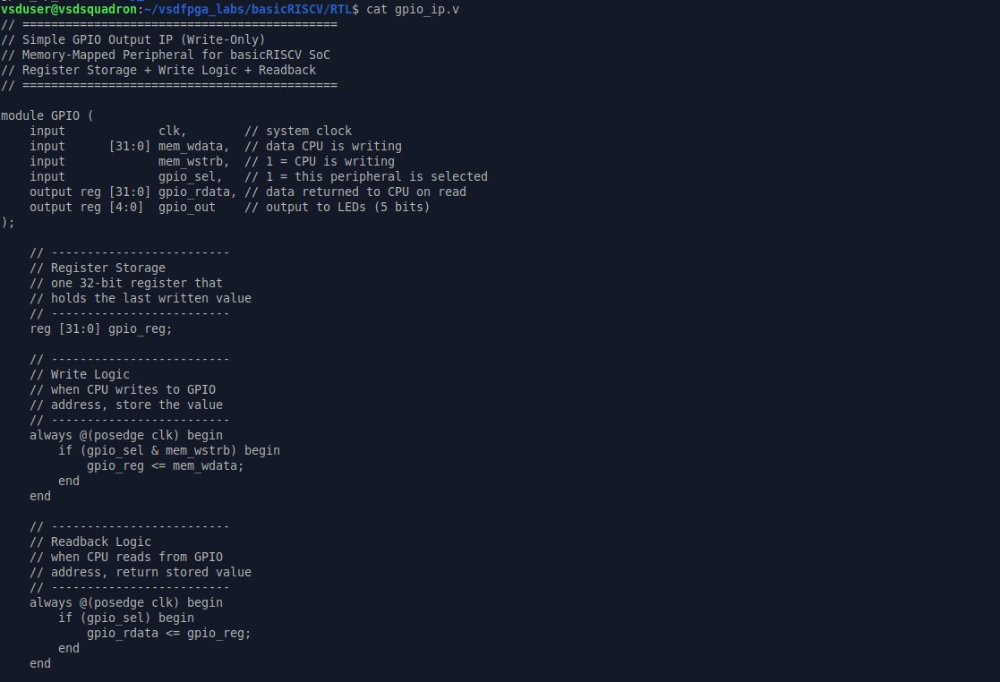

Full content of existing `gpio_ip.v` read using `cat`. The module
has five ports: `clk`, `mem_wdata [31:0]`, `mem_wstrb`, `gpio_sel`,
`gpio_rdata [31:0]`, `gpio_out [4:0]`. A single register
`gpio_reg [31:0]` stores all written values. Write logic fires on
`gpio_sel & mem_wstrb`, readback returns `gpio_reg` to `gpio_rdata`.
No address offset decoding exists — every access hits the same
register.

###  GPIO IP Tail — LED Drive Logic

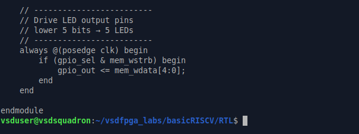

Tail of `gpio_ip.v` showing the LED drive block —
`gpio_out <= mem_wdata[4:0]` fires directly on every write. In
Task-5 this will be updated to drive from `gpio_data[4:0]` after
the register split. `endmodule` confirms end of file.

### Identifying the Existing Register

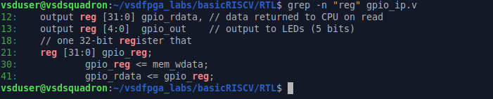

The register storage section showing `reg [31:0] gpio_reg` — the
single storage element in Task-4. In Task-5 this will be replaced
by three separate registers: `gpio_data`, `gpio_dir`, and
`gpio_readback`, each serving a distinct purpose.

###  Identifying mem_wstrb Usage

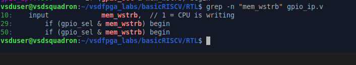

`grep -n "mem_wstrb" gpio_ip.v` shows `mem_wstrb` at line 10
(port declaration), line 29 (write logic condition), and line 50
(LED drive condition). Write-enable is gated correctly and must
be preserved inside the updated `case(gpio_addr)` write block.

###  Checking gpio_rdata

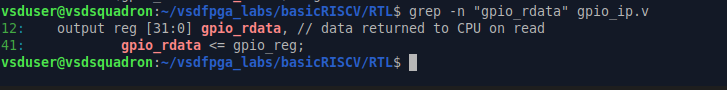

`grep -n "gpio_rdata" gpio_ip.v` confirms `gpio_rdata` declared
as `output reg [31:0]` at line 12, assigned from `gpio_reg` at
line 41. In Task-5 this single assignment becomes a
`case(gpio_addr)` block returning the correct register based on
which offset the CPU is reading.

###  Checking Inputs

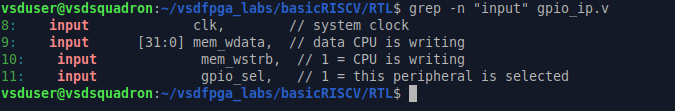

`grep -n "input" gpio_ip.v` shows current inputs: `clk` (line 8),
`mem_wdata [31:0]` (line 9), `mem_wstrb` (line 10), `gpio_sel`
(line 11). Notably `mem_addr` is absent — this is the critical
missing port that must be added to enable address offset decoding
across the three registers.

###  Checking Outputs

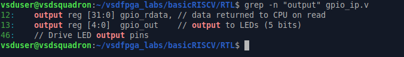

`grep -n "output" gpio_ip.v` confirms outputs: `gpio_rdata [31:0]`
(line 12) and `gpio_out [4:0]` (line 13). Both outputs remain
unchanged in Task-5 — only their internal driving logic is updated.

###  Checking gpio_sel in riscv.v

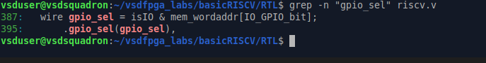

`grep -n "gpio_sel" riscv.v` shows `gpio_sel = isIO & mem_wordaddr[IO_GPIO_bit]`
at line 387 and `.gpio_sel(gpio_sel)` at line 395. The peripheral
select signal is already correctly generated in the SoC — it goes
high when the CPU accesses the GPIO address range. No changes
needed here.

###  Identifying Where to Add Registers

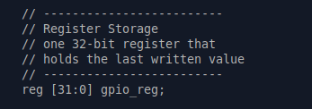

The register storage section of the existing file — this is
exactly where `gpio_data`, `gpio_dir`, and `gpio_readback` will
be added to replace `gpio_reg`. Clean synchronous declarations
with no combinational assignments keep latch behavior out.

###  Identifying Where to Add Offset Decoding

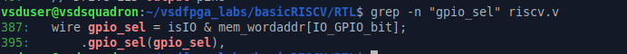

The address decoding insertion point — `wire [1:0] gpio_addr = mem_addr[3:2]`
will be placed here right after the port list. Both the write
always block and read always block will then use `case(gpio_addr)`
to route accesses to the correct register.

###  Planned Internal Signals

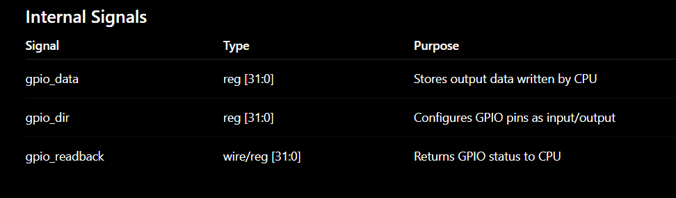

Planning table summarizing the three internal signals:

| Signal | Type | Purpose |
|--------|------|---------|
| `gpio_data` | `reg [31:0]` | Stores output data written by CPU |
| `gpio_dir` | `reg [31:0]` | Configures GPIO pins as input/output |
| `gpio_readback` | `wire [31:0]` | Returns current GPIO pin state to CPU |

`gpio_readback` is a wire not a reg — it continuously reflects
`gpio_out` state rather than storing a written value, making
`GPIO_READ` naturally read-only.

## Step 2: Implement Multi-Register RTL

With the plan complete, `gpio_ip.v` was extended to support three
registers, address offset decoding, and correct read/write logic.
The key principle: `GPIO_READ` is read-only, `GPIO_DATA` and
`GPIO_DIR` are read-write.

###  Before — Task-2 Port List

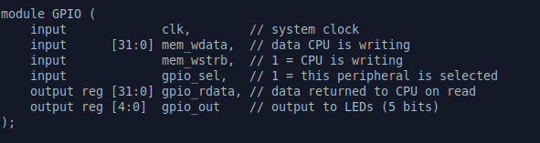

The original Task-2 port list kept as reference. Five ports total:
`clk`, `mem_wdata [31:0]`, `mem_wstrb`, `gpio_sel`, `gpio_rdata [31:0]`,
`gpio_out [4:0]`. No `mem_addr` port — this is the baseline before
any Task-3 modifications begin.

###  Updated gpio_ip.v — Ports, Wire, and Registers

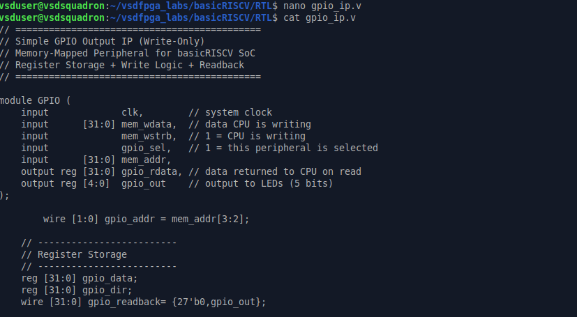

The fully updated `gpio_ip.v` showing all structural changes:
- `input [31:0] mem_addr` added as new port for address decoding
- `wire [1:0] gpio_addr = mem_addr[3:2]` derived internally —
  bits [3:2] select the target register without exposing decoding
  as a port
- `reg [31:0] gpio_data` — stores output data written by CPU
- `reg [31:0] gpio_dir` — stores direction configuration
- `wire [31:0] gpio_readback = {27'b0, gpio_out}` — read-only,
  upper 27 bits zero-padded, lower 5 bits reflect actual LED pin
  state driven by `gpio_out`

###  Write Logic — case(gpio_addr)

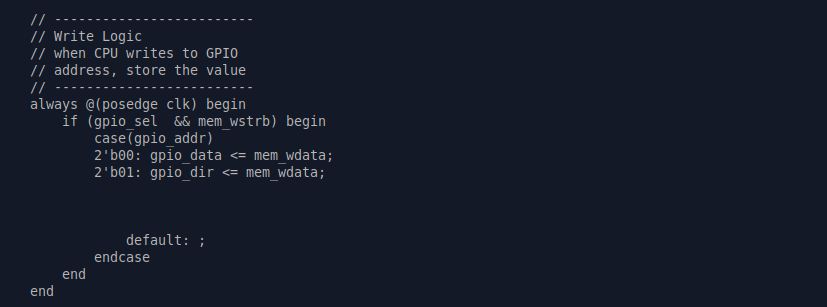

The write always block triggered on `posedge clk` when
`gpio_sel && mem_wstrb`:
- `2'b00` → `gpio_data <= mem_wdata` — CPU writes output data
- `2'b01` → `gpio_dir <= mem_wdata` — CPU configures direction
- No case for `2'b10` — `GPIO_READ` is intentionally read-only,
  CPU cannot write pin state
- `default: ;` — explicit default prevents unintended latch
  inference by the synthesizer

###  Readback Logic — Part 1

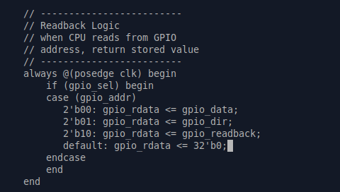

The read always block triggered on `posedge clk` when `gpio_sel`:
- `2'b00` → `gpio_rdata <= gpio_data` — returns last written value
- `2'b01` → `gpio_rdata <= gpio_dir` — returns direction register
- `2'b10` → `gpio_rdata <= gpio_readback` — returns actual pin
  state via the continuous wire assignment
- `default: gpio_rdata <= 32'b0` — safe default for unmapped
  offsets

###  GPIO Output Drive Logic — LED Mapping
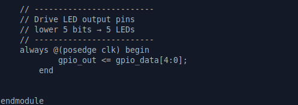
This block drives the GPIO output pins that connect to the LEDs. The lower 5 bits of `gpio_data` are mapped to the 5 onboard LEDs. On every `posedge clk`, `gpio_out` is updated synchronously with `gpio_data[4:0]`, ensuring clean, glitch-free output without any latch behavior. This corresponds to the `GPIO_DATA` register's output-driving function from the Task-3 register map (offset `0x00`), where writes to `GPIO_DATA` are reflected on the physical output pins.

###  riscv.v Instantiation Update

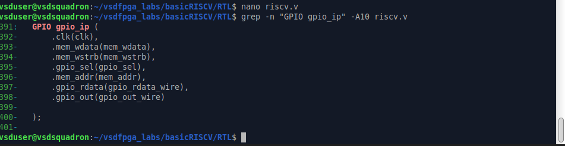

The updated GPIO instantiation in `riscv.v`:
- `.clk(clk)` — system clock
- `.mem_wdata(mem_wdata)` — CPU write data bus
- `.mem_wstrb(mem_wstrb)` — write enable
- `.gpio_sel(gpio_sel)` — peripheral select
- `.mem_addr(mem_addr)` — full 32-bit address now passed in,
  replacing the old incorrect `.gpio_addr(mem_addr[3:2])`
- `.gpio_rdata(gpio_rdata_wire)` — read data returned to SoC bus
- `.gpio_out(gpio_out_wire)` — LED output wire

  ## Step 3: Integrate into the SoC

The updated GPIO IP is instantiated inside `riscv.v` with all
signals correctly routed. The SoC address decoding, peripheral
select, and read data mux are all verified to work with the
new three-register design.

###  GPIO IP Included and Instantiated

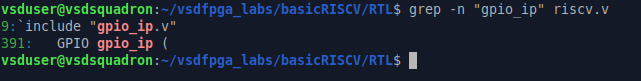

`grep -n "gpio_ip" riscv.v` confirms two things:
- Line 9: `` `include "gpio_ip.v" `` — the GPIO IP file is
  included at the top of `riscv.v`
- Line 391: `GPIO gpio_ip (` — the module is instantiated with
  the correct module name `GPIO` and instance name `gpio_ip`

###  Full Instantiation and Signal Routing

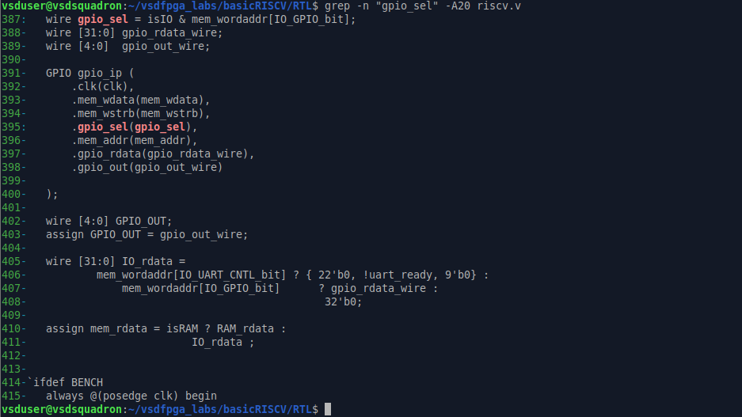

Full context around the GPIO instantiation showing the complete
signal routing inside `riscv.v`:
- Line 387: `gpio_sel = isIO & mem_wordaddr[IO_GPIO_bit]` —
  peripheral select derived from IO access and GPIO address bit
- Line 388: `wire [31:0] gpio_rdata_wire` — internal wire
  carrying read data from GPIO IP to SoC bus
- Line 389: `wire [4:0] gpio_out_wire` — internal wire carrying
  LED output from GPIO IP to top-level port
- Lines 391–400: Full instantiation with all seven ports
  connected correctly including `.mem_addr(mem_addr)`
- Line 402–403: `wire [4:0] GPIO_OUT` declared and assigned
  from `gpio_out_wire` for top-level exposure
- Lines 405–408: `IO_rdata` mux — returns UART status when
  `IO_UART_CNTL_bit` selected, returns `gpio_rdata_wire` when
  `IO_GPIO_bit` selected, defaults to `32'b0`
- Line 410–411: `mem_rdata` assigned from `RAM_rdata` or
  `IO_rdata` based on `isRAM` flag

###  mem_addr Routing Confirmed

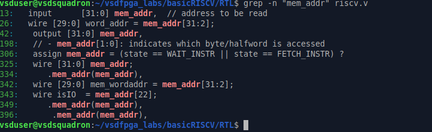

`grep -n "mem_addr" riscv.v` traces the full path of `mem_addr`
through the SoC:
- Line 13: `input [31:0] mem_addr` — top-level input port
- Line 26: `wire [29:0] word_addr = mem_addr[31:2]` — word
  address derived from byte address
- Line 42: `output [31:0] mem_addr` — re-exposed at top level
- Line 198: `mem_addr[1:0]` used for byte/halfword access
- Line 306: `mem_addr` used in state machine for instruction
  fetch
- Line 325: `wire [31:0] mem_addr` declared internally
- Line 334: `.mem_addr(mem_addr)` passed to CPU submodule
- Line 342: `wire [29:0] mem_wordaddr = mem_addr[31:2]`
- Line 343: `wire isIO = mem_addr[22]` — IO vs RAM detection
- Line 349: `.mem_addr(mem_addr)` passed to another submodule
- Line 396: `.mem_addr(mem_addr)` passed to GPIO IP ✅

###  Top-Level GPIO_OUT Exposure

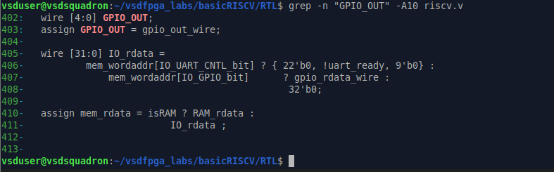

`grep -n "GPIO_OUT" riscv.v` confirms the full output chain:
- Line 402: `wire [4:0] GPIO_OUT` declared as top-level wire
- Line 403: `assign GPIO_OUT = gpio_out_wire` connects GPIO IP
  output to the top-level port for LED driving
- Lines 405–408: `IO_rdata` mux verified — `gpio_rdata_wire`
  is correctly returned when `mem_wordaddr[IO_GPIO_bit]` is
  active, completing the software read path from CPU to GPIO
  register and back
- Lines 410–411: `mem_rdata` final assignment confirmed —
  `IO_rdata` feeds into the main data bus when not accessing RAM

  ## Step 4: Software Validation

Validation was done in two parts:
- A Verilog testbench directly driving the GPIO IP ports to
  verify all three registers behave correctly at the RTL level
- A C program validating the register logic at the software level

###  Firmware C File Created

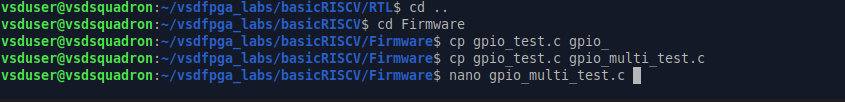

`gpio_multi_test.c` created in `Firmware/` by copying from
`gpio_test.c` as a starting point. The file is then opened in
`nano` for editing to add multi-register test logic covering
`GPIO_DIR`, `GPIO_DATA`, and `GPIO_READBACK`.

###  Updated Verilog Testbench

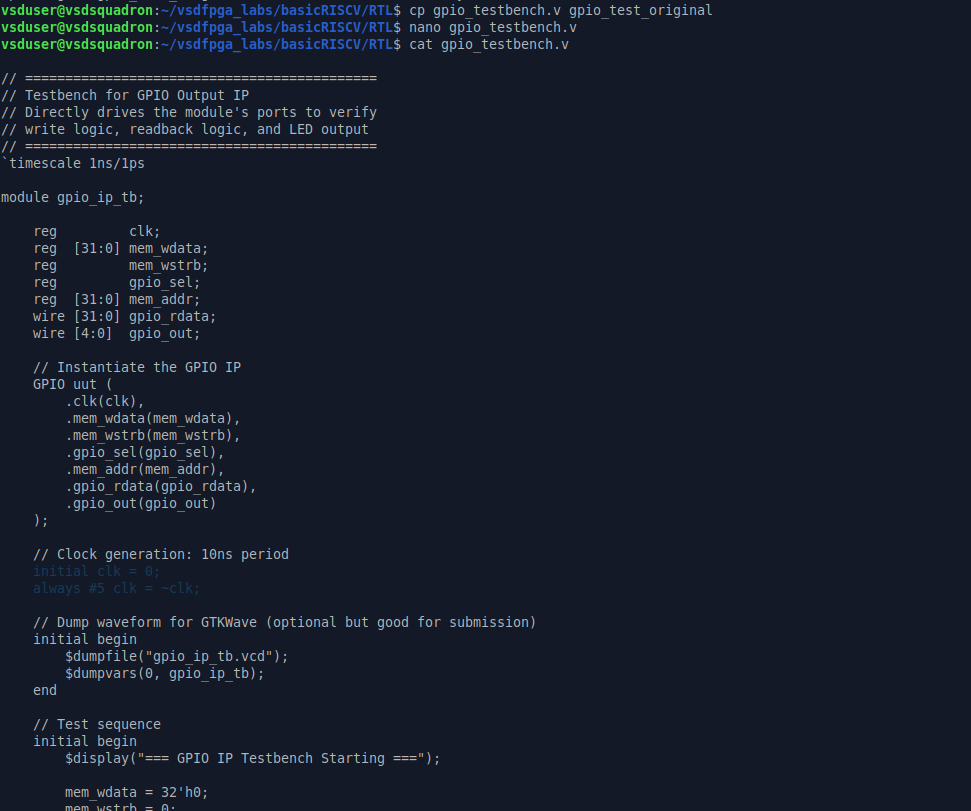

Updated `gpio_testbench.v` shown after modifications for Task-3.
Key changes from Task-2 testbench:
- `reg [31:0] mem_addr` added as new signal declaration
- `.mem_addr(mem_addr)` added to GPIO instantiation port list
- `mem_addr = 0` added to initialization block
- Clock generation: `initial clk = 0; always #5 clk = ~clk`
- VCD dump enabled: `$dumpfile("gpio_ip_tb.vcd")` and
  `$dumpvars(0, gpio_ip_tb)` for GTKWave waveform capture
- Test sequence begins with all signals initialized to zero
  before any register access

###  Test Sequence — Part 1

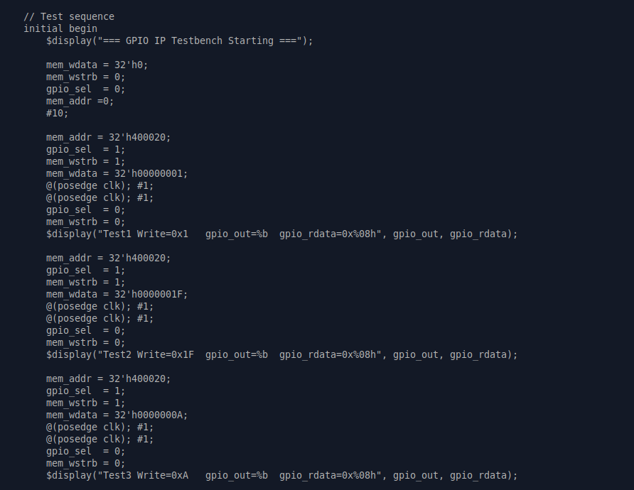

First half of the test sequence showing Tests 1–3:
- `mem_addr = 32'h400020` set before each GPIO_DATA write
- Test1: writes `0x00000001` → verifies basic write to GPIO_DATA
- Test2: writes `0x0000001F` → sets all 5 LED bits high
- Test3: writes `0x0000000A` → pattern `01010` on LEDs
- Each test: `gpio_sel=1`, `mem_wstrb=1` to trigger write,
  then deasserted, then `$display` captures `gpio_out` and
  `gpio_rdata` for verification

###  Test Sequence — Part 2

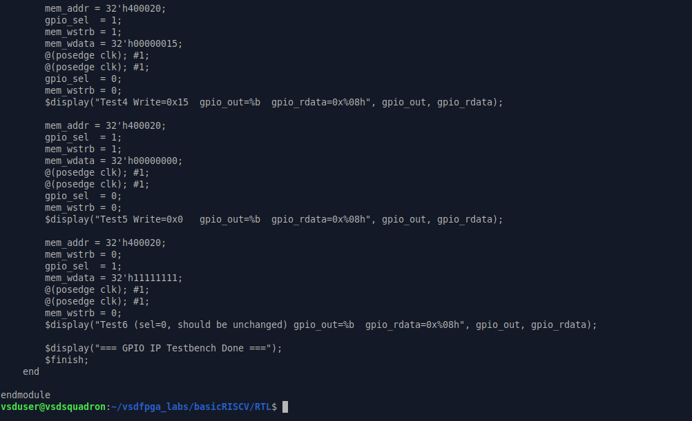

Second half of the test sequence showing Tests 4–6:
- Test4: writes `0x00000015` → pattern `10101` on LEDs
- Test5: writes `0x00000000` → clears all LED outputs
- Test6: `gpio_sel=0`, `mem_wstrb=1` — write attempted with
  peripheral deselected, output should remain unchanged,
  validating that `gpio_sel` correctly gates all writes
- `$display("=== GPIO IP Testbench Done ===")` and `$finish`
  cleanly terminate simulation

###  Compile and Run Simulation

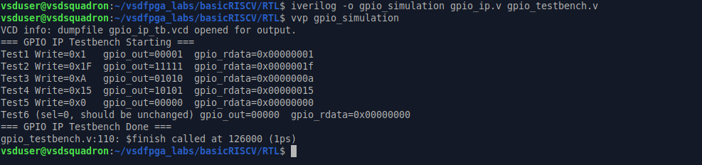

Simulation compiled and run:
- `iverilog -o gpio_simulation gpio_ip.v gpio_testbench.v` —
  compiles both the GPIO IP and testbench into a single
  simulation executable
- `vvp gpio_simulation` — runs the simulation
- Output confirms:
  - `VCD info: dumpfile gpio_ip_tb.vcd opened for output`
  - All 6 tests execute and print results
  - `gpio_testbench.v:110: $finish called at 126000 (1ps)`
  - Simulation completes cleanly with no errors

###  Simulation Output — Register Verification

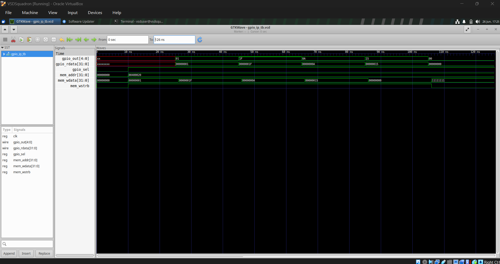

Full simulation output verifying all register behavior:

| Test | Write Value | gpio_out | gpio_rdata |
|------|------------|----------|------------|
| Test1 | `0x1` | `00001` | `0x00000001` |
| Test2 | `0x1F` | `11111` | `0x0000001f` |
| Test3 | `0xA` | `01010` | `0x0000000a` |
| Test4 | `0x15` | `10101` | `0x00000015` |
| Test5 | `0x0` | `00000` | `0x00000000` |
| Test6 | `sel=0` | `00000` | `0x00000000` |

Every write to `GPIO_DATA` is correctly reflected in both
`gpio_out` (5-bit LED pattern) and `gpio_rdata` (32-bit readback).
Test6 confirms peripheral select gating works — no change when
`gpio_sel=0`.

###  GTKWave Waveform

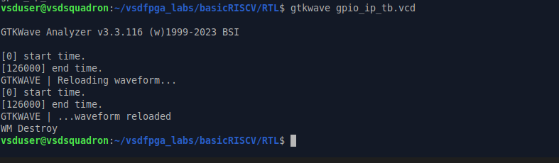

GTKWave waveform opened from `gpio_ip_tb.vcd` showing all signals
across the full 126ns simulation:
- `gpio_out[4:0]` — transitions through `01`, `1F`, `0A`, `15`,
  `00` matching each test write
- `gpio_rdata[31:0]` — tracks each written value with one clock
  cycle latency due to synchronous readback
- `mem_addr[31:0]` — shows `00400020` held constant confirming
  all writes targeting `GPIO_DATA` register
- `mem_wdata[31:0]` — shows each test value written in sequence
- `mem_wstrb` — pulses high for each write transaction then
  deasserts cleanly

###  GTKWave Launch Command

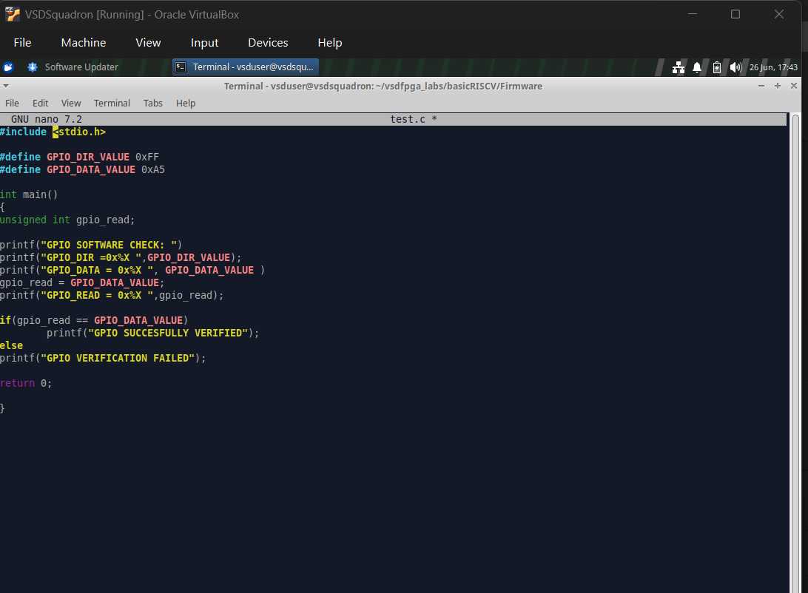

`gtkwave gpio_ip_tb.vcd` launch output confirming:
- GTKWave Analyzer v3.3.116 loaded successfully
- `[0] start time` and `[126000] end time` matching simulation
  duration
- Waveform reloaded and displayed without errors
- `WM Destroy` on close confirms clean exit

###  C Software Validation — Program

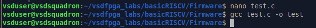

`test.c` written in `Firmware/` as a standalone C-level software
validation:
- `GPIO_DIR_VALUE = 0xFF` — all pins configured as output
- `GPIO_DATA_VALUE = 0xA5` — test pattern `10100101`
- Simulates a GPIO write by assigning `gpio_read = GPIO_DATA_VALUE`
- Checks if `gpio_read == GPIO_DATA_VALUE` — verifies data
  integrity of the register write-read cycle
- Prints `GPIO SUCCESSFULLY VERIFIED` on pass, 
  `GPIO VERIFICATION FAILED` on fail

###  C Software Validation — Compile and Run

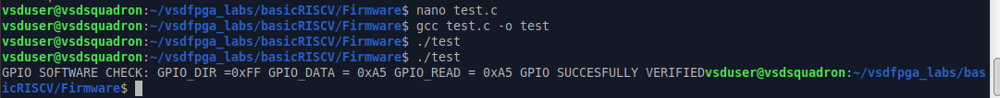

`test.c` compiled with `gcc test.c -o test` and executed with
`./test`. Output confirms:
- `GPIO_DIR = 0xFF` — direction register set correctly
- `GPIO_DATA = 0xA5` — data written successfully
- `GPIO_READ = 0xA5` — readback matches written value
- `GPIO SUCCESSFULLY VERIFIED` — end-to-end register
  write-read cycle validated at software level

---

## Summary

| Step | What Was Done | Result |
|------|--------------|--------|
| Step 1 | Studied Task-2 GPIO IP, planned register map and internal signals | Planning complete |
| Step 2 | Extended `gpio_ip.v` with 3 registers, address decoding, correct read/write logic | RTL complete |
| Step 3 | Updated `riscv.v` instantiation, verified full signal routing | Integration complete |
| Step 4 | Verilog testbench simulation + C software validation | All tests passed |
