# Task-5: Multi-Register GPIO IP with Software Control

## Objective

Extending the single-register GPIO IP from Task-4 into a realistic,
production-style peripheral with a proper register map, direction
control, and full software validation running on the RISC-V core.

---

## IP Specification

**IP Name:** GPIO Control IP  
**Base Address:** `0x400000`

| Offset | Register | Description |
|--------|----------|-------------|
| `0x00` | `GPIO_DATA` | Output data written by CPU |
| `0x04` | `GPIO_DIR` | Direction control (1=output, 0=input) |
| `0x08` | `GPIO_READ` | Readback — reflects current pin state |

### Address Decoding

`gpio_addr = mem_addr[3:2]` — bits [3:2] of the memory address
select which register is being accessed inside the IP.

| `gpio_addr` | Register |
|-------------|----------|
| `2'b00` | GPIO_DATA |
| `2'b01` | GPIO_DIR |
| `2'b10` | GPIO_READ |

---

## Step 1: Study and Plan

Before writing any code, the existing Task-2 `gpio_ip.v` was
studied in detail to understand the current structure and identify
exactly where changes need to be made.

###  RTL Directory Listing

Directory listing of `RTL/` confirming all relevant files present:
`gpio_ip.v`, `riscv.v`, `gpio_testbench.v`, `Makefile`,
`sim_main.cpp`, `firmware.hex`. This establishes the starting
point before any modifications.

###  Reading the Full GPIO IP

Full content of existing `gpio_ip.v` read using `cat`. The module
has five ports: `clk`, `mem_wdata [31:0]`, `mem_wstrb`, `gpio_sel`,
`gpio_rdata [31:0]`, `gpio_out [4:0]`. A single register
`gpio_reg [31:0]` stores all written values. Write logic fires on
`gpio_sel & mem_wstrb`, readback returns `gpio_reg` to `gpio_rdata`.
No address offset decoding exists — every access hits the same
register.

###  GPIO IP Tail — LED Drive Logic

Tail of `gpio_ip.v` showing the LED drive block —
`gpio_out <= mem_wdata[4:0]` fires directly on every write. In
Task-5 this will be updated to drive from `gpio_data[4:0]` after
the register split. `endmodule` confirms end of file.

### Identifying the Existing Register

The register storage section showing `reg [31:0] gpio_reg` — the
single storage element in Task-4. In Task-5 this will be replaced
by three separate registers: `gpio_data`, `gpio_dir`, and
`gpio_readback`, each serving a distinct purpose.

###  Identifying mem_wstrb Usage

`grep -n "mem_wstrb" gpio_ip.v` shows `mem_wstrb` at line 10
(port declaration), line 29 (write logic condition), and line 50
(LED drive condition). Write-enable is gated correctly and must
be preserved inside the updated `case(gpio_addr)` write block.

###  Checking gpio_rdata

`grep -n "gpio_rdata" gpio_ip.v` confirms `gpio_rdata` declared
as `output reg [31:0]` at line 12, assigned from `gpio_reg` at
line 41. In Task-5 this single assignment becomes a
`case(gpio_addr)` block returning the correct register based on
which offset the CPU is reading.

###  Checking Inputs

`grep -n "input" gpio_ip.v` shows current inputs: `clk` (line 8),
`mem_wdata [31:0]` (line 9), `mem_wstrb` (line 10), `gpio_sel`
(line 11). Notably `mem_addr` is absent — this is the critical
missing port that must be added to enable address offset decoding
across the three registers.

###  Checking Outputs

`grep -n "output" gpio_ip.v` confirms outputs: `gpio_rdata [31:0]`
(line 12) and `gpio_out [4:0]` (line 13). Both outputs remain
unchanged in Task-5 — only their internal driving logic is updated.

###  Checking gpio_sel in riscv.v

`grep -n "gpio_sel" riscv.v` shows `gpio_sel = isIO & mem_wordaddr[IO_GPIO_bit]`
at line 387 and `.gpio_sel(gpio_sel)` at line 395. The peripheral
select signal is already correctly generated in the SoC — it goes
high when the CPU accesses the GPIO address range. No changes
needed here.

###  Identifying Where to Add Registers

The register storage section of the existing file — this is
exactly where `gpio_data`, `gpio_dir`, and `gpio_readback` will
be added to replace `gpio_reg`. Clean synchronous declarations
with no combinational assignments keep latch behavior out.

###  Identifying Where to Add Offset Decoding

The address decoding insertion point — `wire [1:0] gpio_addr = mem_addr[3:2]`
will be placed here right after the port list. Both the write
always block and read always block will then use `case(gpio_addr)`
to route accesses to the correct register.

###  Planned Internal Signals

Planning table summarizing the three internal signals:

| Signal | Type | Purpose |
|--------|------|---------|
| `gpio_data` | `reg [31:0]` | Stores output data written by CPU |
| `gpio_dir` | `reg [31:0]` | Configures GPIO pins as input/output |
| `gpio_readback` | `wire [31:0]` | Returns current GPIO pin state to CPU |

`gpio_readback` is a wire not a reg — it continuously reflects
`gpio_out` state rather than storing a written value, making
`GPIO_READ` naturally read-only.

## Step 2: Implement Multi-Register RTL

With the plan complete, `gpio_ip.v` was extended to support three
registers, address offset decoding, and correct read/write logic.
The key principle: `GPIO_READ` is read-only, `GPIO_DATA` and
`GPIO_DIR` are read-write.

###  Before — Port List

The original Task-2 port list kept as reference. Five ports total:
`clk`, `mem_wdata [31:0]`, `mem_wstrb`, `gpio_sel`, `gpio_rdata [31:0]`,
`gpio_out [4:0]`. No `mem_addr` port — this is the baseline before
any modifications begin.

###  Updated gpio_ip.v — Ports, Wire, and Registers

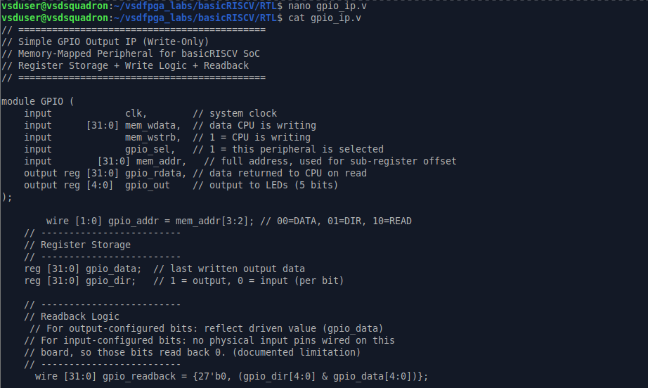

Register storage is implemented as two synchronous registers, `gpio_data` and
`gpio_dir`, each written on `posedge clk` only when `gpio_sel & mem_wstrb` is
high and the address offset matches:

**Write logic:**

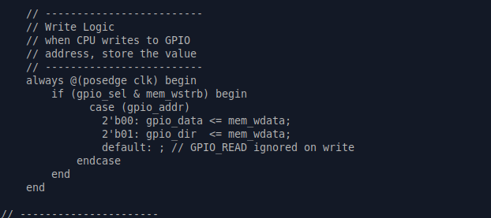

`GPIO_READ` is not separately stored; it is computed as `gpio_dir & gpio_data`,
so only bits configured as output (`gpio_dir` = 1) reflect their driven value,
while input-configured bits read back 0 (documented limitation — no physical
input pins are wired on this board):

**Readback mux:**

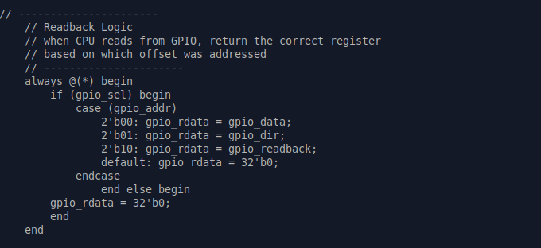

The LED output (`gpio_out`) is likewise gated by direction, so only
output-configured bits actually drive the LEDs:

**LED output drive:**

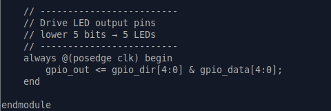

All register writes use non-blocking assignments in `always @(posedge clk)`
blocks, and the readback mux uses blocking assignments in a single
`always @(*)` block with a complete `if/else` and `default` case, avoiding
unintended latch inference. Correctness was validated with a dedicated
testbench exercising all three offsets, including a direction-masking test
(DIR=0x01, DATA=0x1F → READ=0x01) confirming that direction control is
functionally enforced, not just stored.

###  riscv.v Instantiation Update

The updated GPIO instantiation in `riscv.v`:
- `.clk(clk)` — system clock
- `.mem_wdata(mem_wdata)` — CPU write data bus
- `.mem_wstrb(mem_wstrb)` — write enable
- `.gpio_sel(gpio_sel)` — peripheral select
- `.mem_addr(mem_addr)` — full 32-bit address now passed in,
  replacing the old incorrect `.gpio_addr(mem_addr[3:2])`
- `.gpio_rdata(gpio_rdata_wire)` — read data returned to SoC bus
- `.gpio_out(gpio_out_wire)` — LED output wire

  ## Step 3: Integrate into the SoC

The updated GPIO IP is instantiated inside `riscv.v` with all
signals correctly routed. The SoC address decoding, peripheral
select, and read data mux are all verified to work with the
new three-register design.

###  GPIO IP Included and Instantiated

`grep -n "gpio_ip" riscv.v` confirms two things:
- Line 9: `` `include "gpio_ip.v" `` — the GPIO IP file is
  included at the top of `riscv.v`
- Line 391: `GPIO gpio_ip (` — the module is instantiated with
  the correct module name `GPIO` and instance name `gpio_ip`

###  Full Instantiation and Signal Routing

Full context around the GPIO instantiation showing the complete
signal routing inside `riscv.v`:
- Line 387: `gpio_sel = isIO & mem_wordaddr[IO_GPIO_bit]` —
  peripheral select derived from IO access and GPIO address bit
- Line 388: `wire [31:0] gpio_rdata_wire` — internal wire
  carrying read data from GPIO IP to SoC bus
- Line 389: `wire [4:0] gpio_out_wire` — internal wire carrying
  LED output from GPIO IP to top-level port
- Lines 391–400: Full instantiation with all seven ports
  connected correctly including `.mem_addr(mem_addr)`
- Line 402–403: `wire [4:0] GPIO_OUT` declared and assigned
  from `gpio_out_wire` for top-level exposure
- Lines 405–408: `IO_rdata` mux — returns UART status when
  `IO_UART_CNTL_bit` selected, returns `gpio_rdata_wire` when
  `IO_GPIO_bit` selected, defaults to `32'b0`
- Line 410–411: `mem_rdata` assigned from `RAM_rdata` or
  `IO_rdata` based on `isRAM` flag

###  mem_addr Routing Confirmed

`grep -n "mem_addr" riscv.v` traces the full path of `mem_addr`
through the SoC:
- Line 13: `input [31:0] mem_addr` — top-level input port
- Line 26: `wire [29:0] word_addr = mem_addr[31:2]` — word
  address derived from byte address
- Line 42: `output [31:0] mem_addr` — re-exposed at top level
- Line 198: `mem_addr[1:0]` used for byte/halfword access
- Line 306: `mem_addr` used in state machine for instruction
  fetch
- Line 325: `wire [31:0] mem_addr` declared internally
- Line 334: `.mem_addr(mem_addr)` passed to CPU submodule
- Line 342: `wire [29:0] mem_wordaddr = mem_addr[31:2]`
- Line 343: `wire isIO = mem_addr[22]` — IO vs RAM detection
- Line 349: `.mem_addr(mem_addr)` passed to another submodule
- Line 396: `.mem_addr(mem_addr)` passed to GPIO IP ✅

###  Top-Level GPIO_OUT Exposure

`grep -n "GPIO_OUT" riscv.v` confirms the full output chain:
- Line 402: `wire [4:0] GPIO_OUT` declared as top-level wire
- Line 403: `assign GPIO_OUT = gpio_out_wire` connects GPIO IP
  output to the top-level port for LED driving
- Lines 405–408: `IO_rdata` mux verified — `gpio_rdata_wire`
  is correctly returned when `mem_wordaddr[IO_GPIO_bit]` is
  active, completing the software read path from CPU to GPIO
  register and back
- Lines 410–411: `mem_rdata` final assignment confirmed —
  `IO_rdata` feeds into the main data bus when not accessing RAM

## Step 4: Software Validation

A C program, `gpio_multi_test.c`, was written to exercise the full GPIO
Control IP register map through actual firmware execution — setting
direction, writing data, and reading back status — with all results printed
over UART. Validation was performed both at the module level (standalone
testbench) and end-to-end through the full SoC simulation.

### Module-Level Testbench (`gpio_multi_test.v`)

**Testbench structure and DUT instantiation:**

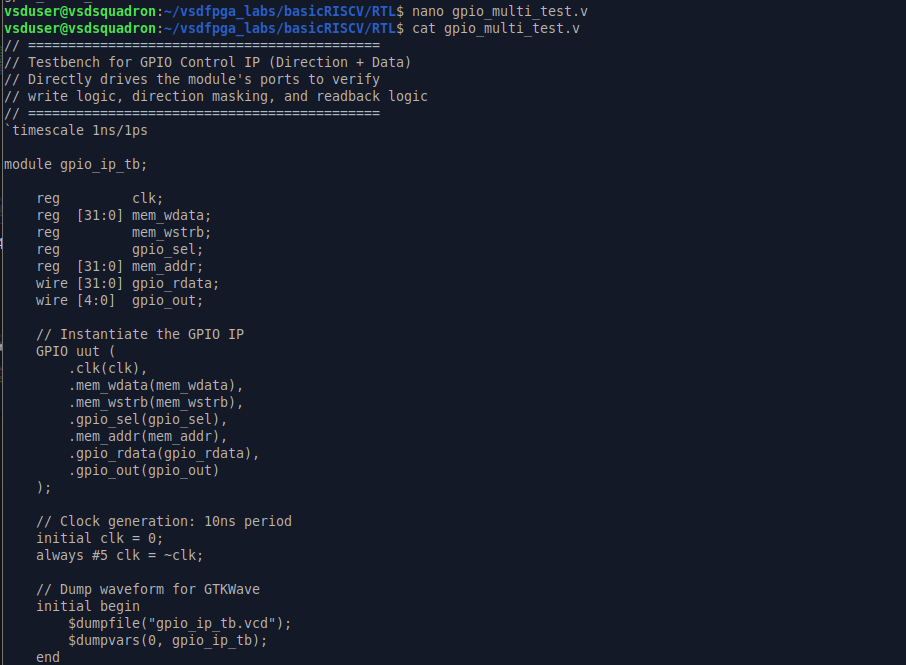

**Helper tasks (`do_write` / `do_read`):**

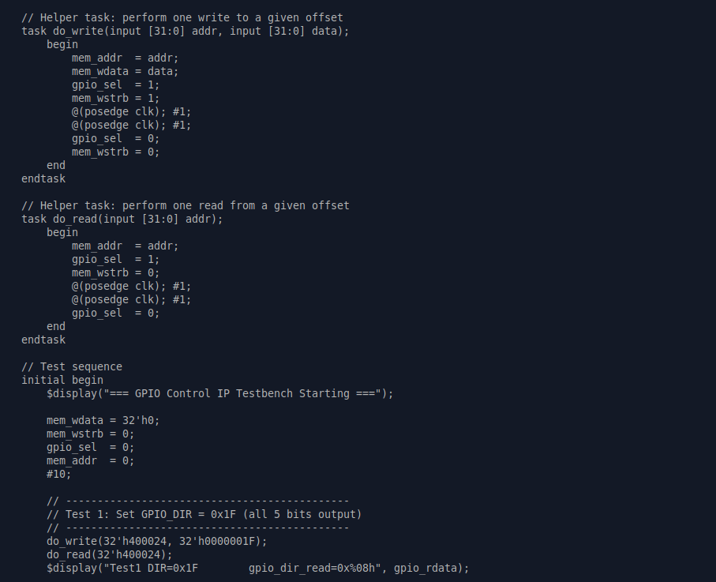

**Direction-masking test cases (Tests 2–6):**

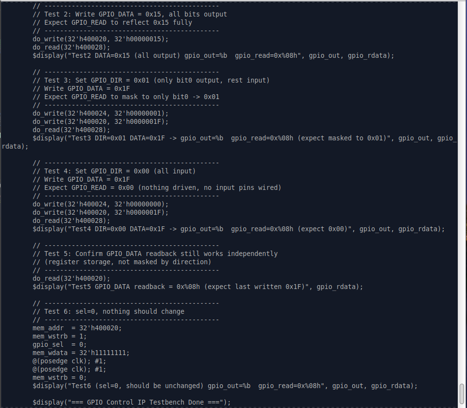

**Testbench completion:**

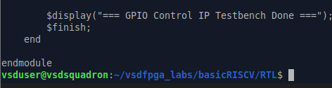

**Console output (`iverilog` + `vvp`):**

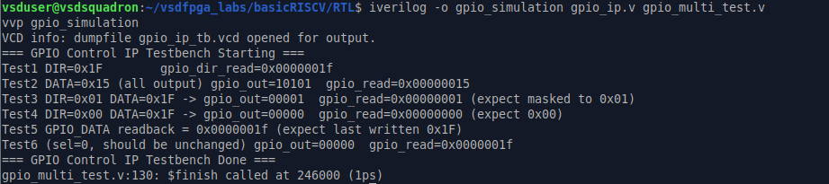
Test1 DIR=0x1F          gpio_dir_read=0x0000001f
Test2 DATA=0x15 (all output) gpio_out=10101  gpio_read=0x00000015
Test3 DIR=0x01 DATA=0x1F -> gpio_out=00001  gpio_read=0x00000001 (expect masked to 0x01)
Test4 DIR=0x00 DATA=0x1F -> gpio_out=00000  gpio_read=0x00000000 (expect 0x00)
Test5 GPIO_DATA readback = 0x0000001f (expect last written 0x1F)
Test6 (sel=0, should be unchanged) gpio_out=00000  gpio_read=0x0000001f
=== GPIO Control IP Testbench Done ===
**GTKWave waveform:**

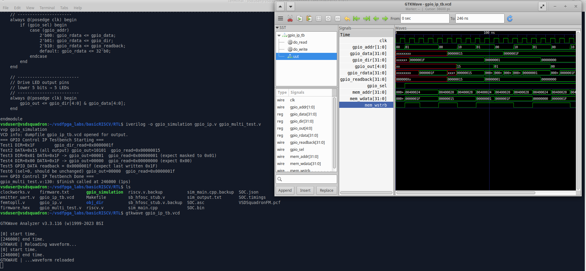

### Firmware source (`gpio_multi_test.c`)

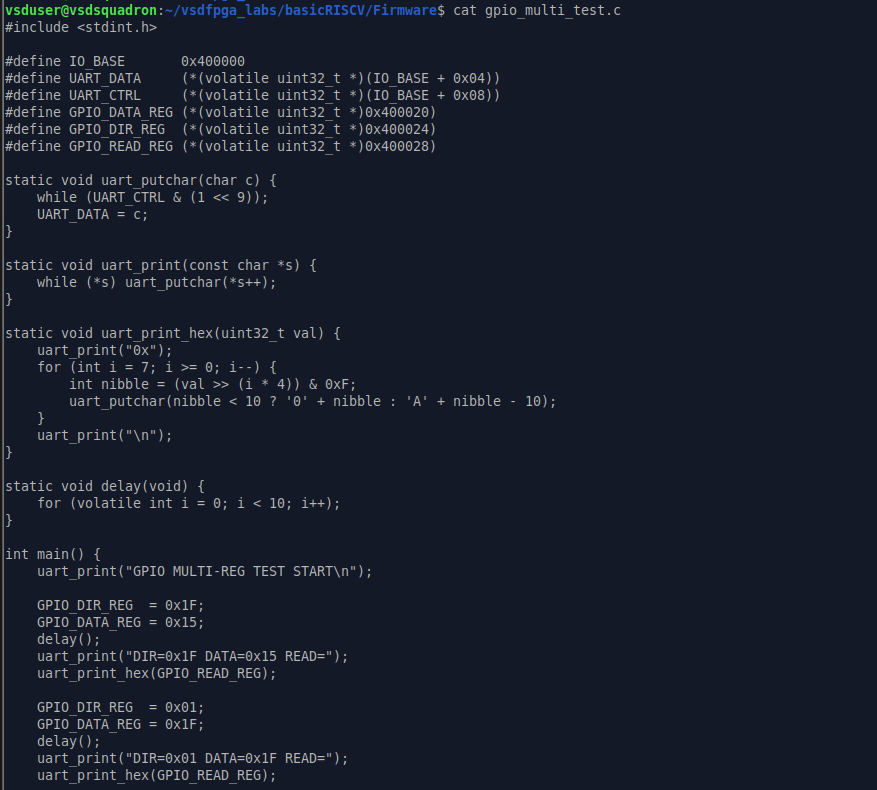
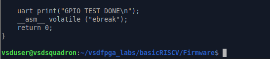

Sets `GPIO_DIR_REG`, writes `GPIO_DATA_REG`, and reads back `GPIO_READ_REG`,
printing each step via `uart_print`/`uart_print_hex` — first with all 5 bits
configured as output (`DIR=0x1F`, `DATA=0x15`), then with only bit 0 as
output (`DIR=0x01`, `DATA=0x1F`), to explicitly validate direction-based
masking. The program terminates cleanly with `ebreak`.

### Full SoC Simulation (primary proof)

The firmware was compiled with the RISC-V toolchain, linked into
`gpio_multi_test.bram.hex`, loaded as `firmware.hex`, and simulated
end-to-end with Verilator (`make sim`) — running the real CPU and
memory-mapped bus, not an isolated module testbench:

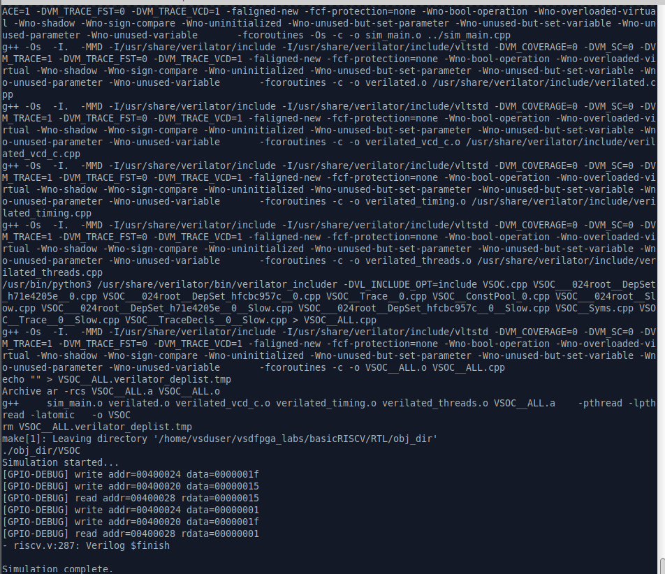

[GPIO-DEBUG] write addr=00400024 data=0000001f
[GPIO-DEBUG] write addr=00400020 data=00000015
[GPIO-DEBUG] read  addr=00400028 rdata=00000015
[GPIO-DEBUG] write addr=00400024 data=00000001
[GPIO-DEBUG] write addr=00400020 data=0000001f
[GPIO-DEBUG] read  addr=00400028 rdata=00000001

riscv.v:287: Verilog $finish
Simulation complete.

This confirms all three expected validation criteria through the CPU-driven
software path:

- **Direction control works** — `GPIO_DIR` writes (`0x1F`, then `0x01`) are
  correctly applied before each subsequent data write.
- **Output updates are reflected** — with `DIR=0x1F` (all output),
  `GPIO_READ` returns `0x15`, exactly matching the value written to
  `GPIO_DATA`.
- **Readback behaves as expected** — with `DIR=0x01` (only bit 0 as output),
  `GPIO_READ` correctly masks the written value `0x1F` down to `0x01`,
  proving direction-aware readback rather than a raw echo of `GPIO_DATA`.

Together, the module-level testbench and full-SoC simulation provide
consistent, matching proof that direction control, output updates, and
direction-aware readback all function correctly end-to-end — from C firmware
through the real CPU/bus, down to the register-level logic inside the IP.

## Summary

| Step | What Was Done | Result |
|------|--------------|--------|
| Step 1 | Studied Task-2 GPIO IP, planned register map and internal signals | Planning complete |
| Step 2 | Extended `gpio_ip.v` with 3 registers, address decoding, correct read/write logic | RTL complete |
| Step 3 | Updated `riscv.v` instantiation, verified full signal routing | Integration complete |
| Step 4 | Verilog testbench simulation + C software validation | All tests passed |
