# Task-6: Real Peripheral IP Development - SPI Master IP (Minimal, Single-Byte, Mode 0)

## Overview

This IP implements a minimal SPI Master peripheral for the `basicRISCV`
(femtorv32-based) SoC running on the VSDSquadron FM board (iCE40UP5K FPGA).
It supports single-byte, Mode 0 (CPOL=0, CPHA=0) transfers, memory-mapped
into the SoC's IO address space.

- **RTL:** `spi_master.v`
- **Integration:** `riscv.v` (SOC module)
- **Firmware:** `spi_test.c`
- **Testbench:** `spi_master_test.v`

---

## Step 1: Planning — Register Map & Block Diagram

Working directory:

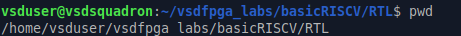

**SPI Base Address = `0x400040`**

| Offset | Register | Description            |
|--------|----------|-------------------------|
| 0x00   | CTRL     | Enable, Start, Clock Divider |
| 0x04   | TXDATA   | Transmit byte           |
| 0x08   | RXDATA   | Received byte           |
| 0x0C   | STATUS   | Busy and Done flags     |

Block-level structure — CPU connects through the memory bus and address
decoder into the SPI Master, which contains the register bank, shift
register, clock divider, and control FSM, driving the physical `CS`,
`SCLK`, `MOSI`, and `MISO` signals:

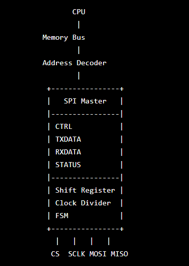

---

## Step 2: Create `spi_master.v`

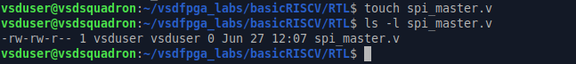

---

## RTL Implementation
 
### Module declaration and register bank
`SPI_MASTER` exposes a standard memory-mapped bus interface
(`spi_sel`, `spi_addr`, `mem_wstrb`, `mem_wdata`, `spi_rdata`) plus the
four SPI pins (`sclk`, `mosi`, `miso`, `cs_n`).
 
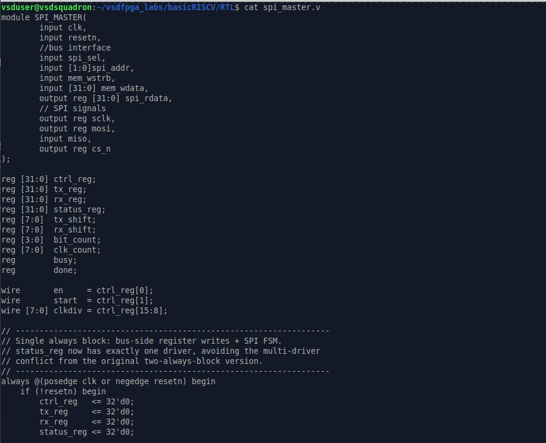
 
### Register write logic and read mux
- `CTRL` (offset `2'b00`) and `TXDATA` (offset `2'b01`) are written
  directly from the bus.
- `STATUS` (offset `2'b11`) supports write-1-to-clear on the `DONE` bit
  (`mem_wdata[1]`).
- `RXDATA` (offset `2'b10`) is read-only — no write case exists for it.
- The `START` bit (`ctrl_reg[1]`) auto-clears once a transfer begins
  (`en && start && !busy`).
- The read mux returns the correct register for each offset, and `32'd0`
  for undefined offsets, per spec.
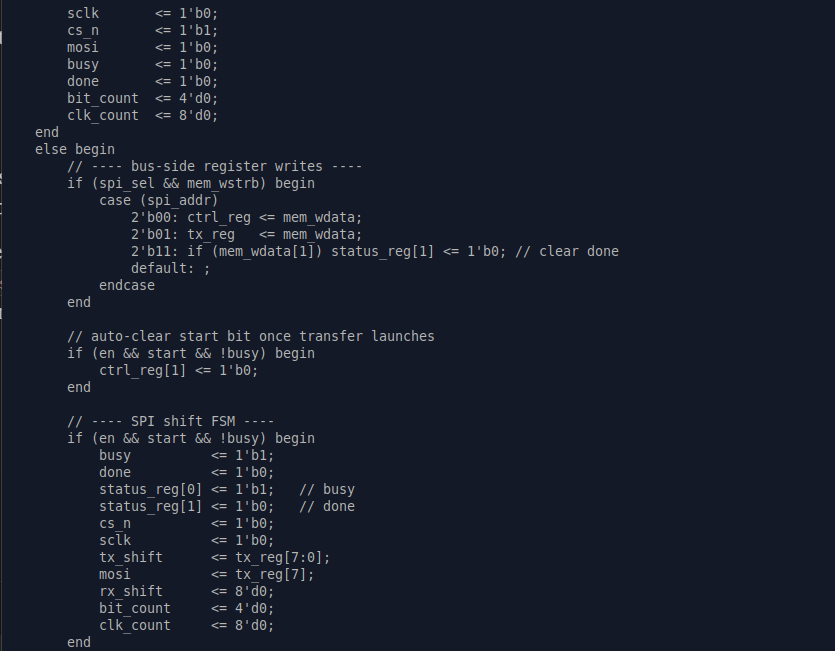
 
### Transfer FSM (Mode 0)
On `en && start && !busy`:
- `cs_n` is pulled low, `busy` is set, `tx_shift` is loaded from
  `tx_reg[7:0]`, and the first MOSI bit (`tx_reg[7]`) is driven out.
While `busy`, on each clock-divider tick (`clk_count == clkdiv`):
- `sclk` toggles.
- **MISO is sampled** on the edge where `sclk` is about to go high
  (rising-edge sample), shifting into `rx_shift`.
- **MOSI is shifted out** on the falling edge (`tx_shift` advances).
On `bit_count == 4'd7` (8th bit complete):
- `busy` clears, `done` and `STATUS.DONE` are set, `cs_n` returns high,
  `sclk` returns low, and the final received byte is latched into
  `rx_reg`.
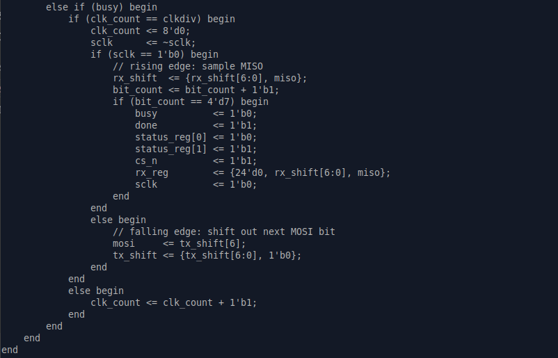
 
### Read mux
- `spi_addr` selects `CTRL` / `TXDATA` / `RXDATA` / `STATUS` when `spi_sel`
  is asserted.
- Returns `32'd0` when `spi_sel` is low, per spec.
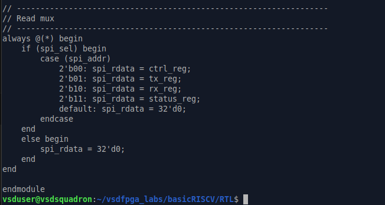

 
viewing the RTL directory
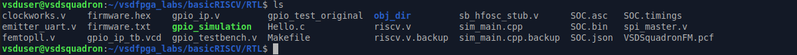

---

## Step 3: SoC Integration (`riscv.v`)

### IO address decode

Added `IO_SPI_bit = 4` to the existing 1-hot IO address decode scheme
(alongside LEDS, UART, GPIO):

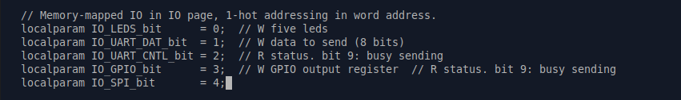

### Instantiation

`spi_sel` is derived the same way as the other peripherals
(`isIO & mem_wordaddr[IO_SPI_bit]`), and `SPI_MASTER` is instantiated as
`spi_ip`, wired to the CPU's memory bus signals:

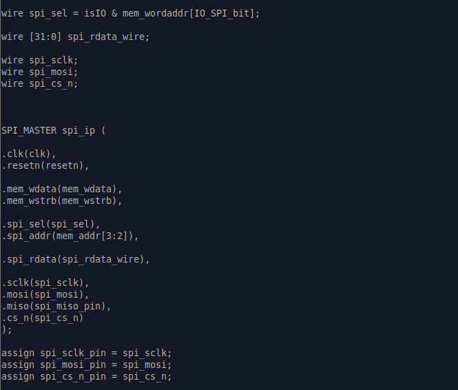

### Read-data mux

`spi_rdata_wire` is added as a new arm of the SoC-level `IO_rdata` mux,
alongside UART and GPIO:

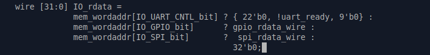

### Clockworks

Standard gearbox/reset instantiation:

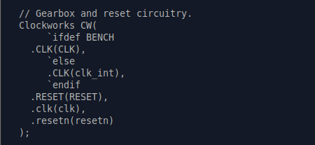

---

##  Verilator Testbench Harness

Standard `sim_main.cpp` Verilator harness — drives `CLK`/`RESET`, then
runs the simulation for a fixed number of clock edges:

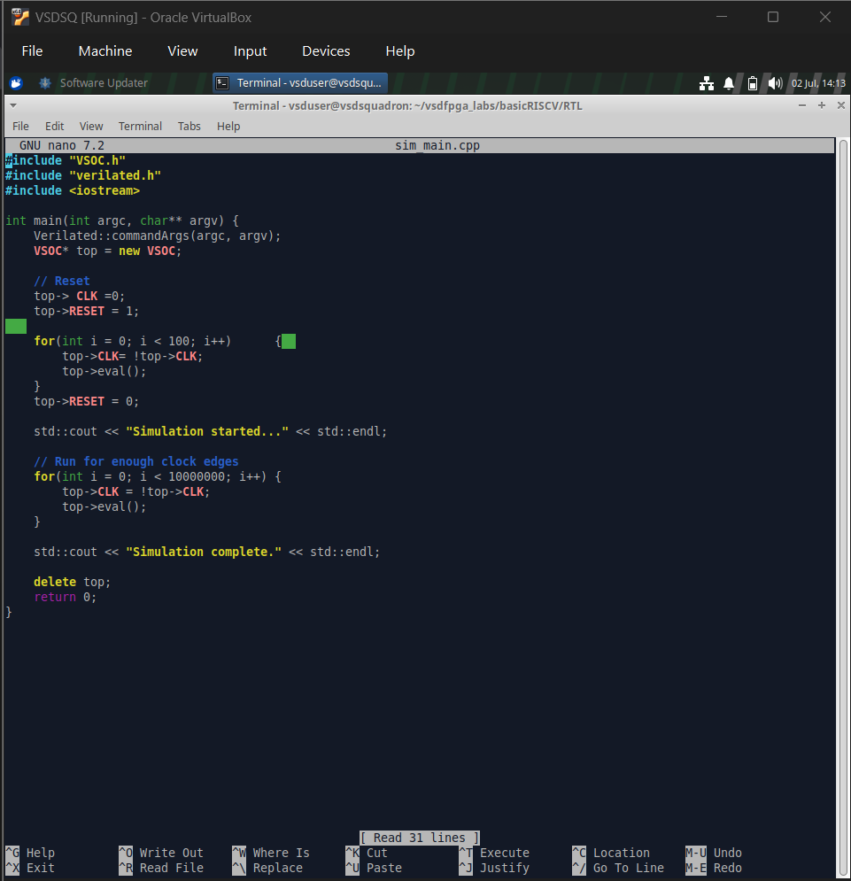

---

## Step 4a: Firmware — SPI Loopback Test with LED and UART Demonstration (`spi_test.c`)

This firmware performs an end-to-end validation of the SPI Master IP using
an internal loopback test, followed by a continuous LED toggling sequence.
It exercises the UART, LED, and SPI memory-mapped registers together,
confirming that all peripherals operate correctly on the shared bus.

### Memory Map
| Define | Address | Description |
|--------|---------|--------------|
| `LEDS` | `0x400000` | LED output register (bits [4:0]) |
| `UART_DATA` | `0x400008` | UART transmit data register |
| `UART_CTRL` | `0x400010` | UART status register (bit 9 = TX busy) |
| `SPI_CTRL` | `0x400040` | SPI control register (EN, START, CLKDIV) |
| `SPI_TXDATA` | `0x400044` | SPI transmit data register |
| `SPI_RXDATA` | `0x400048` | SPI receive data register |
| `SPI_STATUS` | `0x40004C` | SPI status register (BUSY, DONE) |

### Code Structure
- `delay()` — busy-wait loop implemented with `nop` instructions, used to
  time the LED toggling interval.
- `uart_putchar()` / `uart_print()` — polls `UART_CTRL` bit 9 to ensure the
  UART is not busy before writing each byte to `UART_DATA`.
- `uart_print_hex8()` — formats and prints an 8-bit value in `0xNN` form.
- `main()`:
  - Configures `SPI_CTRL` with `CLKDIV = 2` and `EN = 1`.
  - Writes `0xA5` to `SPI_TXDATA` and logs the value over UART.
  - Sets the `START` bit to launch the transfer.
  - Polls `SPI_STATUS` until the `DONE` bit is set.
  - Reads `SPI_RXDATA`, logs the received byte, and compares it against
    `0xA5`, printing `PASS` or `FAIL` accordingly.
  - Enters an infinite loop toggling `LEDS` between `0x1F` and `0x00` with
    a fixed delay between each state.

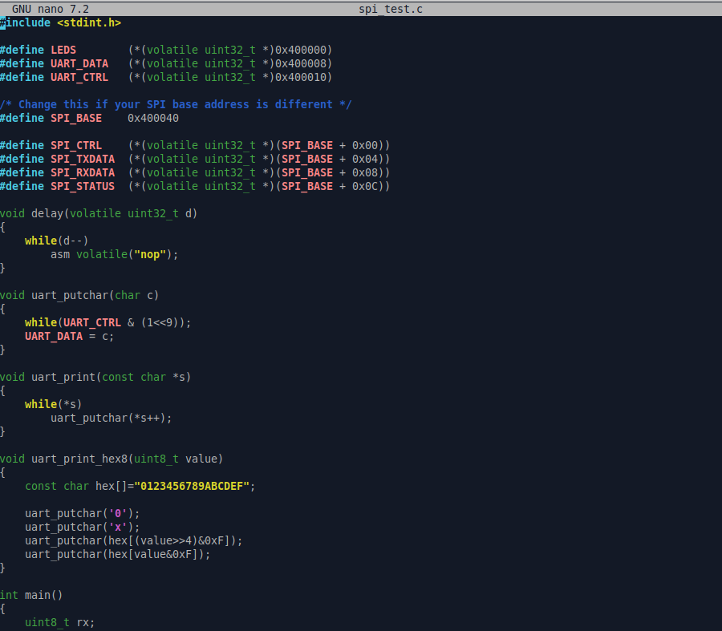


### Build and Simulation Flow
The firmware is compiled with the RISC-V GCC toolchain
(`riscv64-unknown-elf-gcc`/`as`/`ld`), converted to a hex image with
`firmware_words`, and copied into the RTL directory. The design is then
built and simulated with Verilator (`--trace`, top module `SOC`) alongside
`riscv.v`, `spi_master.v`, and `sb_hfosc_stub.v`.


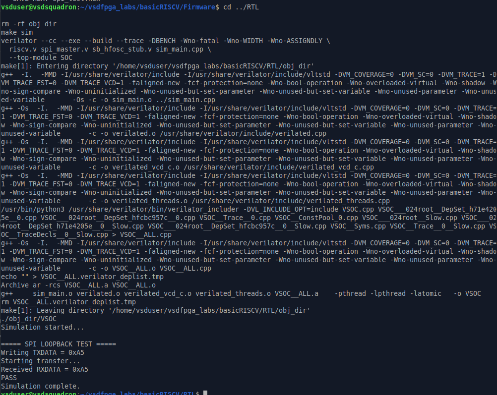

### Simulation Output
===== SPI LOOPBACK TEST =====
Writing TXDATA = 0xA5
Starting transfer...
Received RXDATA = 0xA5
PASS
Simulation complete.

The simulation confirms that the SPI Master IP correctly transmits and
receives data in loopback mode, and that UART logging and LED control
function correctly alongside the SPI transfer on the shared memory-mapped
bus.

---
## Step 4b: Testbench and Waveform Results

### Standalone IP-level testbench (`spi_master_test.v`)

A self-checking testbench instantiates `SPI_MASTER` directly (not the
full SoC), ties `miso = mosi` for loopback, and provides a `write_reg`
task to drive the bus:

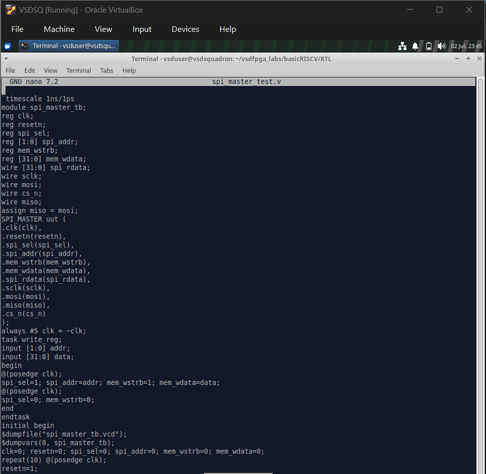

Sequence: write `CTRL = 0x201` (EN=1, CLKDIV=2) → write `TXDATA = 0xA5`
→ write `CTRL = 0x203` (START=1) → wait → read `STATUS` → read `RXDATA`
→ self-check `RXDATA == 0xA5`:

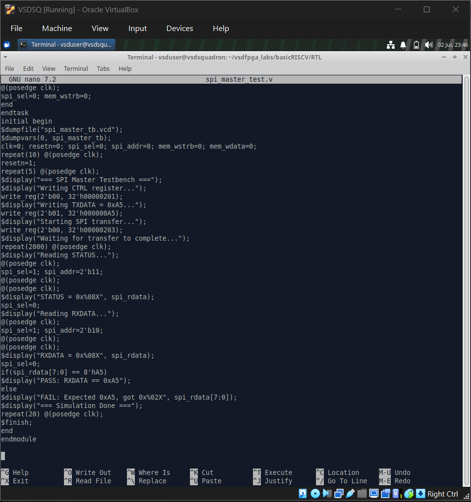

### Icarus Verilog run

```
$ iverilog -o spi_sim spi_master_test.v spi_master.v
$ vvp spi_sim

=== SPI Master Testbench ===
Writing CTRL register...
Writing TXDATA = 0xA5...
Starting SPI transfer...
Waiting for transfer to complete...
Reading STATUS...
STATUS = 0x00000002
Reading RXDATA...
RXDATA = 0x000000a5
PASS: RXDATA == 0xA5
=== Simulation Done ===
```

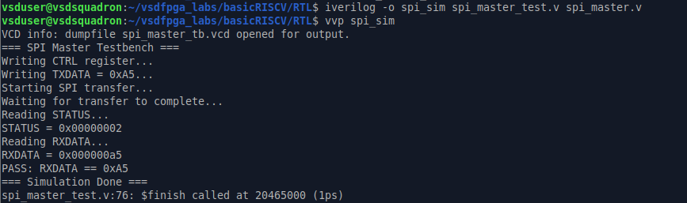

`STATUS = 0x00000002` confirms `BUSY=0`, `DONE=1` — correct final state.
`RXDATA` exactly matches the transmitted byte under loopback, confirming
correct Mode 0 shift/sample timing.

###  GTKWave waveform

`bit_count` advances 0→8 across the transfer; `tx_shift` shifts out
`A5 → 4A → 94 → 28 → 50 → A0 → 40 → 80` (MSB-first); `rx_shift`
accumulates up to the final value `A5`; `busy` is high for the full
transfer window, `cs_n` is low during the transfer:

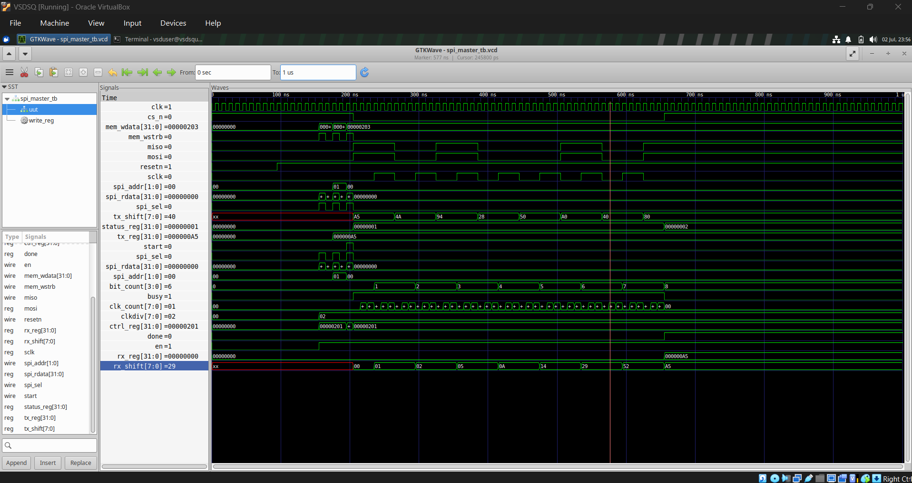

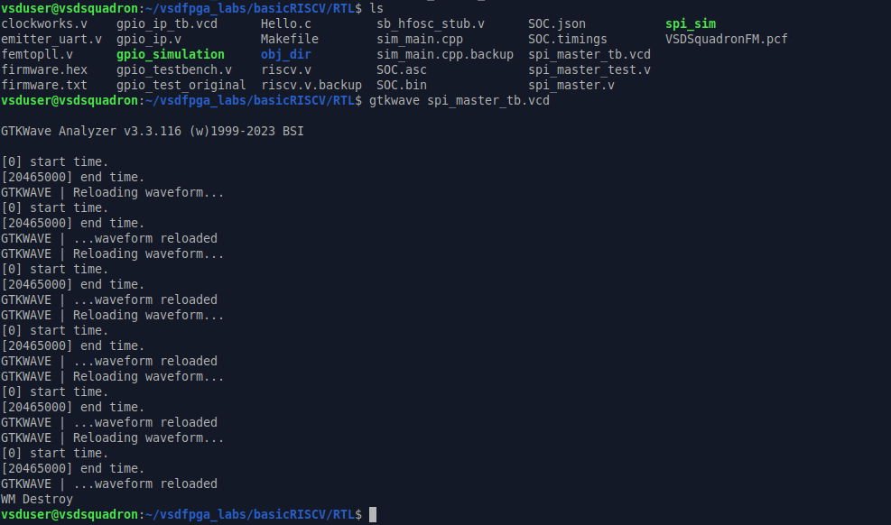

---

## Step 5: Hardware Validation

End-to-end flow for getting the SPI Master IP onto the VSDSquadron FM board: SOC port wiring → pin constraints → simulation check → build → flash → UART validation.

---

##  Adding SPI Ports to the SOC Module

The top-level `SOC` module port list was extended with the three SPI hardware pins, alongside the existing UART and LED ports:

```verilog
module SOC (
`ifdef BENCH
  input             CLK,      // system clock
`endif
  input             RESET,    // reset button
  output reg [4:0]  LEDS,     // system LEDs
  input             RXD,      // UART receive
  output            TXD,      // UART transmit
  output            spi_sclk_pin,  // SPI clock (hardware pin)
  output            spi_mosi_pin,  // SPI MOSI
  output            spi_cs_n_pin   // SPI chip-select (hardware pin)
);
```

Note `spi_miso_pin` isn't in this list — MISO is handled internally via loopback rather than as an external pin (see Step 3).

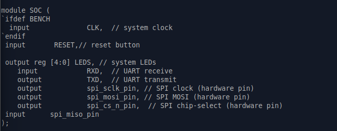

---

##  Adding SPI Pins to the PCF

The corresponding physical pin numbers were appended to `VSDSquadronFM.pcf`:

```bash
cat >> VSDSquadronFM.pcf << 'EOF'
set_io  spi_sclk_pin 9
set_io  spi_mosi_pin 10
set_io  spi_cs_n_pin 12
EOF
```

**Fixing a stray edit:** the append left `RXD 3` and `set_io spi_sclk_pin 9` glued onto one line (missing newline before the heredoc). Fixed with:

```bash
sed -i 's/RXD 3set_io/RXD 3\nset_io/' VSDSquadronFM.pcf
```

Final `VSDSquadronFM.pcf` correctly lists `RXD 3` on its own line, followed by the three SPI pin assignments each on their own line.

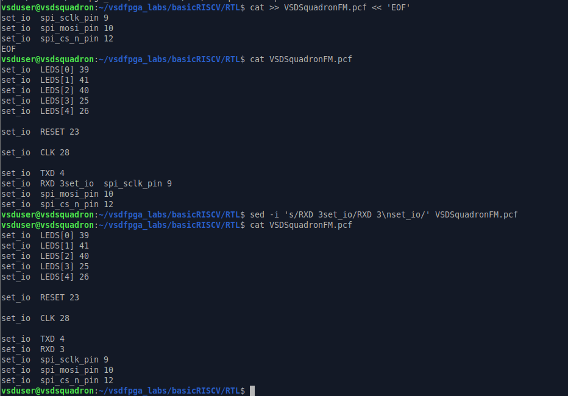

---

##  Adding the IP to the Build (Makefile)

`spi_master.v` was added alongside `riscv.v` in the Makefile's `VERILOG_FILE` list so every downstream target (`build`, `sim`) compiles them together:

```makefile
VERILOG_FILE= riscv.v spi_master.v
```

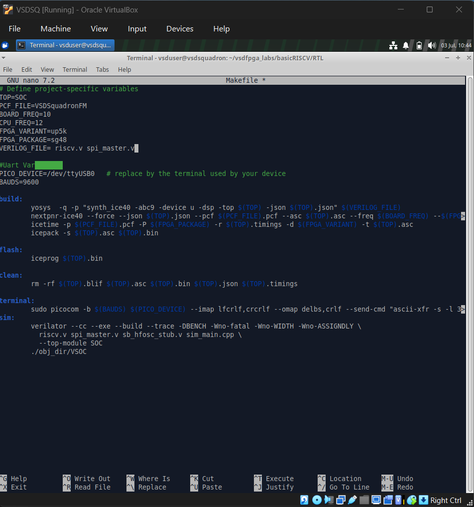

---

##  Synthesis, Place & Route, and Timing Analysis

```bash
make build
```

This runs Yosys synthesis → nextpnr-ice40 place & route → icetime static timing analysis → icepack bitstream packing.

**Result:** timing closed comfortably — max clock frequency came out to **16.32 MHz**, well above the 12 MHz constraint (PASS).

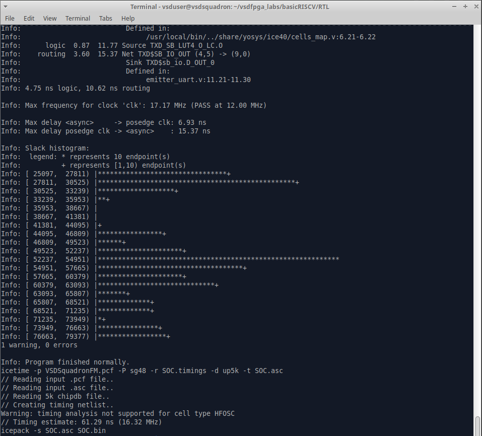

---

##  Flashing the Bitstream

```bash
sudo make flash
```

This succeeded cleanly:

```
flash ID: 0xEF 0x40 0x16 0x00
programming..
done.
reading..
VERIFY OK
cdone: high
Bye.
```

`cdone: high` at both start and end confirms the FPGA configured successfully from the newly written bitstream.

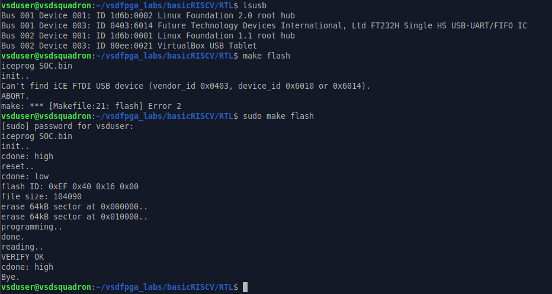

---
Completion Pending: CH340 and jumper wires to be connected
---

## Brief description of the task

Designed and integrated a memory-mapped SPI Master IP into a custom RISC-V SoC on the VSDSquadron FPGA platform using Verilog RTL. The SPI controller supports 8-bit full-duplex communication in SPI Mode 0 (CPOL=0, CPHA=0) with configurable clock division and control/status registers accessible through the processor's memory-mapped bus.
The IP implements CTRL, TXDATA, RXDATA, and STATUS registers, supporting features such as enable, start, busy, done, and software-clearable status flags. Functional verification was performed using Verilator simulation with MOSI-to-MISO loopback, successfully transmitting and receiving the test byte 0xA5. The design was synthesized, programmed onto the FPGA, and validated through UART-based debug messages and onboard LED indications, demonstrating successful hardware integration with the RISC-V system.
Technologies Used
Verilog HDL
RISC-V SoC Integration
Memory-Mapped I/O
SPI Protocol (Mode 0)
Verilator
Yosys
nextpnr-ice40
VSDSquadron FPGA

---

