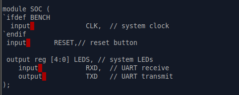

# Task-4: SPI Master IP (Minimal, Single-Byte, Mode 0)

## Overview

This IP implements a minimal SPI Master peripheral for the `basicRISCV`
(femtorv32-based) SoC running on the VSDSquadron FM board (iCE40UP5K FPGA).
It supports single-byte, Mode 0 (CPOL=0, CPHA=0) transfers, memory-mapped
into the SoC's IO address space.

- **RTL:** `spi_master.v`
- **Integration:** `riscv.v` (SOC module)
- **Firmware:** `spi_test.c`
- **Testbench:** `spi_master_test.v`

---

## Step 1: Planning — Register Map & Block Diagram

Working directory:


**SPI Base Address = `0x400030`**

| Offset | Register | Description            |
|--------|----------|-------------------------|
| 0x00   | CTRL     | Enable, Start, Clock Divider |
| 0x04   | TXDATA   | Transmit byte           |
| 0x08   | RXDATA   | Received byte           |
| 0x0C   | STATUS   | Busy and Done flags     |


Block-level structure — CPU connects through the memory bus and address
decoder into the SPI Master, which contains the register bank, shift
register, clock divider, and control FSM, driving the physical `CS`,
`SCLK`, `MOSI`, and `MISO` signals:


---

## Step 2: Create `spi_master.v`


---

## Step 3: RTL Implementation

### Module declaration and register bank

`SPI_MASTER` exposes a standard memory-mapped bus interface
(`spi_sel`, `spi_addr`, `mem_wstrb`, `mem_wdata`, `spi_rdata`) plus the
four SPI pins (`sclk`, `mosi`, `miso`, `cs_n`).


### Register write logic and read mux

- `CTRL` (offset `2'b00`) and `TXDATA` (offset `2'b01`) are written
  directly from the bus.
- `STATUS` (offset `2'b11`) supports write-1-to-clear on the `DONE` bit
  (`mem_wdata[1]`).
- `RXDATA` (offset `2'b10`) is read-only — no write case exists for it.
- The `START` bit (`ctrl_reg[1]`) auto-clears once a transfer begins
  (`en && start && !busy`).
- The read mux returns the correct register for each offset, and `32'd0`
  for undefined offsets, per spec.


Read mux default case (returns 0 when `spi_sel` is low):


### Transfer FSM (Mode 0)

On `en && start && !busy`:
- `cs_n` is pulled low, `busy` is set, `tx_shift` is loaded from
  `tx_reg[7:0]`, and the first MOSI bit (`tx_reg[7]`) is driven out.

While `busy`, on each clock-divider tick (`clk_count == clkdiv`):
- `sclk` toggles.
- **MISO is sampled** on the edge where `sclk` is about to go high
  (rising-edge sample), shifting into `rx_shift`.
- **MOSI is shifted out** on the falling edge (`tx_shift` advances).


On `bit_count == 4'd7` (8th bit complete):
- `busy` clears, `done` and `STATUS.DONE` are set, `cs_n` returns high,
  `sclk` returns low, and the final received byte is latched into
  `rx_reg`.


---

## Step 4: SoC Integration (`riscv.v`)

### IO address decode

Added `IO_SPI_bit = 4` to the existing 1-hot IO address decode scheme
(alongside LEDS, UART, GPIO):


### Instantiation

`spi_sel` is derived the same way as the other peripherals
(`isIO & mem_wordaddr[IO_SPI_bit]`), and `SPI_MASTER` is instantiated as
`spi_ip`, wired to the CPU's memory bus signals:


### Read-data mux

`spi_rdata_wire` is added as a new arm of the SoC-level `IO_rdata` mux,
alongside UART and GPIO:


### Top-level SOC port list (pre-hardware-validation state)

At this stage, the `SOC` module only exposed `CLK`, `RESET`, `LEDS`,
`RXD`, `TXD` — SPI pins were internal to the SoC only, sufficient for
simulation:



### Clockworks

Standard gearbox/reset instantiation:


### Simulation loopback for MISO

Under `BENCH`, `spi_miso` is tied directly to `spi_mosi` to emulate a
loopback connection during simulation, satisfying the spec's
"MISO loopback" validation requirement:


---

## Step 5: Verilator Testbench Harness

Standard `sim_main.cpp` Verilator harness — drives `CLK`/`RESET`, then
runs the simulation for a fixed number of clock edges:


---

## Step 6: Firmware — `spi_test.c`

Full firmware source. Memory-mapped register addresses match the SoC's
`IO_BASE + offset` scheme:

- `SPI_CTRL` = `0x400040`
- `SPI_TXDATA` = `0x400044`
- `SPI_RXDATA` = `0x400048`
- `SPI_STATUS` = `0x40004C`


The test:
1. Prints `"SPI TEST START"` over UART.
2. Configures `SPI_CTRL` with `EN=1` and `CLKDIV=2`.
3. Writes `0xA5` to `SPI_TXDATA`.
4. Sets the `START` bit.
5. Polls `SPI_STATUS` bit 1 (`DONE`).
6. Reads back `SPI_RXDATA` and prints it in hex over UART.


### Building the firmware

Compiled with the standard `riscv64-unknown-elf` toolchain into an ELF,
then linked against the board's `bram.ld`:


Converted to a BRAM-loadable hex image with `firmware_words`:

```
RAM SIZE = 6144
LOAD ELF: spi_test.bram.elf   max address = 3001
Code size: 750 words (total RAM size: 1536 words)
Occupancy: 48%
SAVE HEX: spi_test.hex
```


`spi_test.hex` is copied into `RTL/firmware.hex` before synthesis/sim,
so the CPU's BRAM is initialized with this exact program.

---

## Step 7: Simulation Results

### 7a. Standalone IP-level testbench (`spi_master_test.v`)

A self-checking testbench instantiates `SPI_MASTER` directly (not the
full SoC), ties `miso = mosi` for loopback, and provides a `write_reg`
task to drive the bus:


Sequence: write `CTRL = 0x201` (EN=1, CLKDIV=2) → write `TXDATA = 0xA5`
→ write `CTRL = 0x203` (START=1) → wait → read `STATUS` → read `RXDATA`
→ self-check `RXDATA == 0xA5`:


### 7b. Icarus Verilog run

```
$ iverilog -o spi_sim spi_master_test.v spi_master.v
$ vvp spi_sim

=== SPI Master Testbench ===
Writing CTRL register...
Writing TXDATA = 0xA5...
Starting SPI transfer...
Waiting for transfer to complete...
Reading STATUS...
STATUS = 0x00000002
Reading RXDATA...
RXDATA = 0x000000a5
PASS: RXDATA == 0xA5
=== Simulation Done ===
```


`STATUS = 0x00000002` confirms `BUSY=0`, `DONE=1` — correct final state.
`RXDATA` exactly matches the transmitted byte under loopback, confirming
correct Mode 0 shift/sample timing.

### 7c. GTKWave waveform

`bit_count` advances 0→8 across the transfer; `tx_shift` shifts out
`A5 → 4A → 94 → 28 → 50 → A0 → 40 → 80` (MSB-first); `rx_shift`
accumulates up to the final value `A5`; `busy` is high for the full
transfer window, `cs_n` is low during the transfer:


### 7d. Full-SoC Verilator simulation

`make sim` builds the complete SoC (`riscv.v` + `spi_master.v` +
`sb_hfosc_stub.v` + `sim_main.cpp`), running the actual `spi_test.c`
firmware on the CPU end-to-end through the memory bus and address
decoder — not just the isolated IP:

```
Simulation started...
SPI TEST START  RX = 0x000000A5
SPI TEST DONE   Simulation complete.
```


This confirms the SPI Master works correctly through the full SoC
integration path: CPU → bus → address decode → `SPI_MASTER` → loopback
→ firmware read-back — matching the standalone IP-level result exactly.

---

## Step 8: Hardware Validation


---

