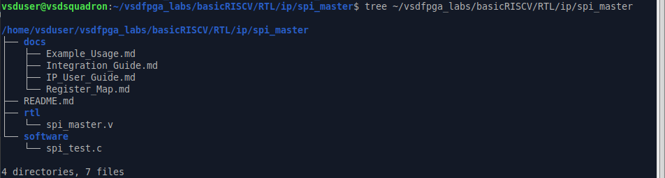

# TASK 7 : Commercial-Grade SPI Master IP

A lightweight, memory-mapped **SPI Master IP** for the **VSDSquadron RISC-V SoC**. The IP implements **SPI Mode 0 (CPOL = 0, CPHA = 0)** and supports **single-byte (8-bit) full-duplex SPI communication** with a programmable serial clock.

---

## Features

- Memory-mapped 32-bit register interface
- SPI Mode 0 operation
- 8-bit full-duplex data transfers
- Programmable SPI clock divider
- Hardware-controlled BUSY and DONE status flags
- Automatic Chip Select (CS_N) control
- Compatible with the VSDSquadron FPGA platform

---

## Memory Map

**Base Address:** `0x400040`

| Register | Offset |
|----------|--------|
| CTRL | `0x00` |
| TXDATA | `0x04` |
| RXDATA | `0x08` |
| STATUS | `0x0C` |

---

## Integration

To integrate the SPI Master IP into the VSDSquadron SoC:

1. Add `rtl/spi_master.v` to the RTL project.
2. Instantiate the SPI Master in the SoC top-level module.
3. Decode the address range beginning at **0x400040** to generate `spi_sel`.
4. Connect the processor bus signals (`clk`, `resetn`, `spi_addr`, `mem_wstrb`, `mem_wdata`, and `spi_rdata`).
5. Connect the SPI interface signals (`sclk`, `mosi`, `miso`, and `cs_n`) according to the system requirements.

Detailed integration instructions are provided in **docs/Integration_Guide.md**.

---

## Documentation

Additional documentation is available in the `docs/` directory:

| Document | Description |
|----------|-------------|
| **IP_User_Guide.md** | Functional overview, architecture, and operating principles |
| **Register_Map.md** | Register definitions, bit fields, and programming model |
| **Integration_Guide.md** | SoC integration procedure and hardware validation |
| **Example_Usage.md** | Example software and expected results |

---

## Testing

### RTL Simulation

Run the supplied testbench (`test/spi_master_tb.v`) to verify SPI functionality. The simulation uses a **MOSI-to-MISO loopback** connection within the testbench to validate SPI transmission and reception.

Expected result:

```text
PASS: RXDATA == 0xA5
```

### FPGA Validation

Program the VSDSquadron FPGA using the standard build flow:

```bash
make build
make flash
```

Run the example software located in `software/spi_test.c`.

Expected UART output:

```text
SPI TEST START
RX = 0x000000A5
SPI TEST DONE
```

---

## Directory Structure

```text
ip/
└── spi_master/
    ├── rtl/
    │   └── spi_master.v
    ├── software/
    │   └── spi_test.c
    ├── docs/
    │   ├── IP_User_Guide.md
    │   ├── Register_Map.md
    │   ├── Integration_Guide.md
    │   └── Example_Usage.md
    └── screenshots/
    |   ├── placeholder.md
    |   ├── ss14_b.png
    |   ├── ss14_spi_test_c.png
    |   ├── ss16_hex.png
    |   ├── ss17_make_sim.png
    |   ├── ss20_gtkwave.png
    |   ├── ss27_make_flash.png
    |   └── task7_tree.png
    └── README.md
```
## Terminal Verification


---

## License

This project was developed as part of the **VSDSquadron FPGA IP Development Program**.
