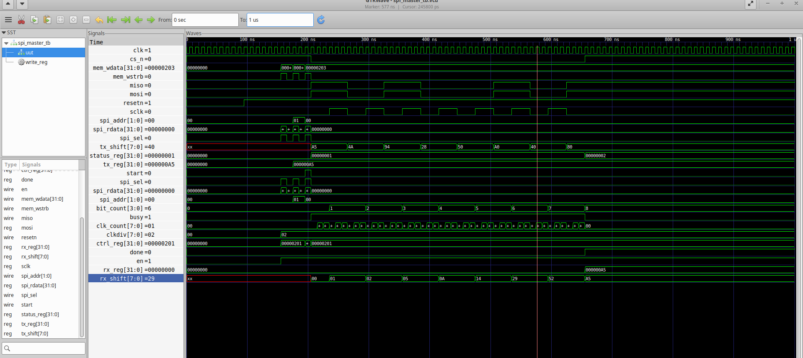

# SPI Master IP – Example Usage

**Version:** 1.0  
**Target Platform:** VSDSquadron FPGA SoC

---

# 1. Overview

This document provides a reference software example demonstrating the use of the SPI Master IP on the VSDSquadron RISC-V SoC. The example performs a single 8-bit SPI transaction by transmitting the byte 0xA5, waiting for transfer completion, and reading the received byte through the memory-mapped register interface. The example application performs a single 8-bit SPI transfer by transmitting the byte `0xA5` and reading the received byte through the memory-mapped register interface.

The application also prints the received value over the UART interface to verify correct SPI operation.

---

# 2. Memory Map

| Register | Address |
|----------|----------|
| CTRL | `0x400040` |
| TXDATA | `0x400044` |
| RXDATA | `0x400048` |
| STATUS | `0x40004C` |

---

# 3. Example Software

```c
#include <stdint.h>

#define IO_BASE 0x400000
#define UART_DATA  (*(volatile uint32_t *)(IO_BASE + 0x08))
#define UART_CTRL  (*(volatile uint32_t *)(IO_BASE + 0x10))
#define SPI_CTRL   (*(volatile uint32_t *)(0x400040))
#define SPI_TXDATA (*(volatile uint32_t *)(0x400044))
#define SPI_RXDATA (*(volatile uint32_t *)(0x400048))
#define SPI_STATUS (*(volatile uint32_t *)(0x40004C))

void uart_putchar(char c)
{
    while(UART_CTRL & (1<<9));
    UART_DATA = c;
}

void uart_print(char *s)
{
    while(*s)
        uart_putchar(*s++);
}

void uart_print_hex(uint32_t x)
{
    char hex[] = "0123456789ABCDEF";

    uart_print("0x");

    for(int i = 28; i >= 0; i -= 4)
        uart_putchar(hex[(x >> i) & 0xF]);

    uart_putchar('\n');
}

int main()
{
    uart_print("SPI TEST START  ");

    SPI_CTRL = (1 << 0) | (2 << 8);

    SPI_TXDATA = 0xA5;

    SPI_CTRL |= (1 << 1);

    while(!(SPI_STATUS & (1 << 1)));

    uart_print("RX = ");
    uart_print_hex(SPI_RXDATA);

    uart_print("SPI TEST DONE  ");

    while(1);

    return 0;
}
```

---

# 4. Software Execution Flow

The example performs the following sequence:

1. Initializes the SPI Master by enabling the peripheral and configuring the SPI clock divider.
2. Writes the transmit byte (`0xA5`) into the `TXDATA` register.
3. Starts an SPI transfer by setting the `START` bit in the `CTRL` register.
4. Waits until the hardware sets the `DONE` status flag.
5. Reads the received byte from the `RXDATA` register.
6. Prints the received value over the UART interface.

---

# 5. Expected UART Output

A successful execution produces output similar to:

```text
SPI TEST START
RX = 0x000000A5
SPI TEST DONE
```

---

# 6. Expected Register Activity

| Step | Register | Value |
|------|----------|-------|
| Configure SPI | CTRL | `0x00000201` |
| Load transmit data | TXDATA | `0x000000A5` |
| Start transfer | CTRL | `0x00000203` |
| Wait for completion | STATUS | `DONE = 1` |
| Read received data | RXDATA | `0x000000A5` |

---

# 7. Verification

Successful execution of this example verifies:

- Correct access to the SPI Master through the memory-mapped bus interface.
- Successful transmission of an 8-bit data frame.
- Successful reception of the transmitted data.
- Correct operation of the BUSY and DONE status flags.
- Proper interaction between the RISC-V software and the SPI Master peripheral.

During RTL simulation, the SPI receive path is verified using a testbench loopback (`assign miso = mosi;`).

During FPGA implementation, the SPI receive path is validated through the internal loopback connection integrated within the SoC design.

### Firmware Compilation

The example application was compiled successfully to generate the firmware image.


---

### Firmware HEX Generation

The compiled ELF file was successfully converted into a HEX file for SoC memory initialization.


---

### RTL Simulation

RTL simulation completed successfully, and the transmitted byte (`0xA5`) was correctly received through the SPI loopback path.


---

### Waveform Verification

GTKWave confirms correct SPI timing, data shifting, and successful reception of the transmitted byte.



---

### FPGA Programming

The generated bitstream was successfully programmed onto the VSDSquadron FPGA, completing hardware validation of the SPI Master IP.


# 8. Notes

- This example demonstrates a single 8-bit SPI transaction.
- The software uses polling to wait for transfer completion.
- The example is intended as a simple reference application for validating the SPI Master IP on the VSDSquadron FPGA platform.
