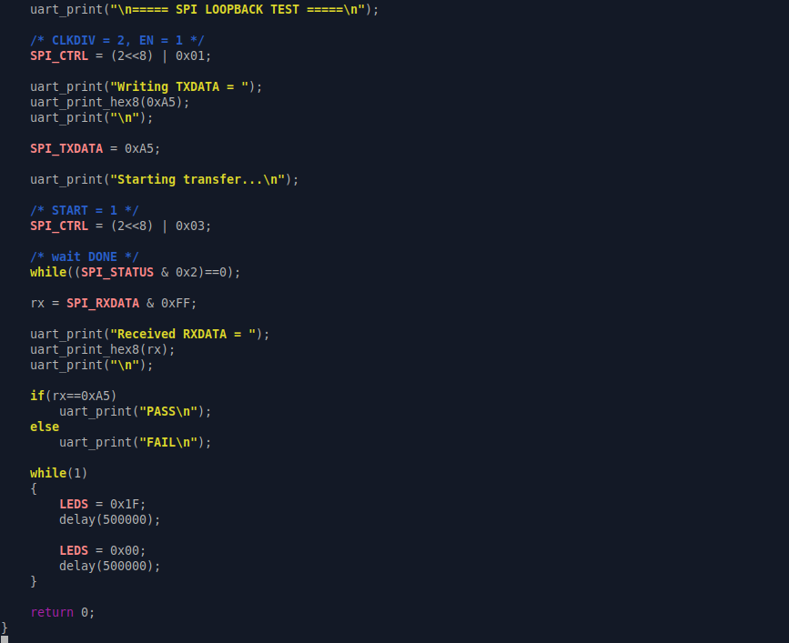
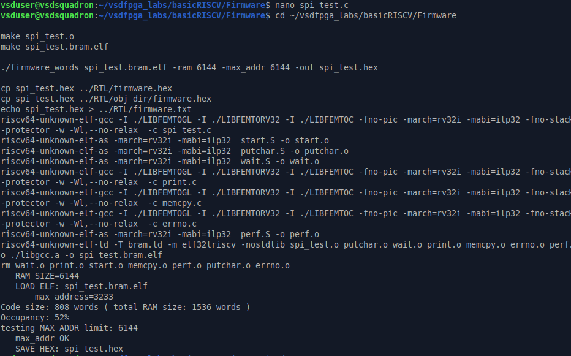
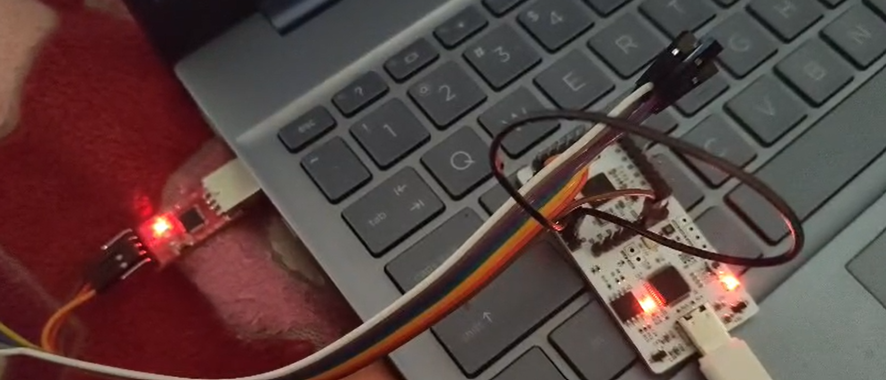

# SPI Master IP – Example Usage

**Version:** 1.0  
**Target Platform:** VSDSquadron FPGA SoC  
**SPI Mode:** Mode 0 (CPOL = 0, CPHA = 0)

---

# Overview

This document demonstrates how to use the SPI Master IP integrated into the VSDSquadron RISC-V SoC. The example application configures the SPI peripheral, performs an 8-bit SPI transfer, waits for completion, verifies the received data, and indicates successful operation through both the UART console and onboard LEDs.

The firmware transmits the byte **0xA5**. During hardware validation, the SPI Master communicates through a loopback connection (MOSI connected to MISO), allowing the transmitted byte to be received back without requiring an external SPI slave device.

---

# Example Demonstration

The example performs the following operations:

1. Configure the SPI clock divider.
2. Enable the SPI Master.
3. Load the transmit byte (`0xA5`) into the TXDATA register.
4. Start the SPI transaction.
5. Poll the DONE flag until the transfer completes.
6. Read the received byte from RXDATA.
7. Verify that the received byte matches the transmitted byte.
8. Continuously toggle the onboard LEDs to indicate successful execution.

---

# Memory-Mapped Registers

| Register | Address |
|-----------|----------|
| CTRL | 0x400040 |
| TXDATA | 0x400044 |
| RXDATA | 0x400048 |
| STATUS | 0x40004C |

---

# Firmware

The example firmware communicates with the SPI Master using memory-mapped I/O registers.

### Firmware Source




The application performs the complete SPI transaction followed by continuous LED blinking to indicate successful execution.

---

# Building the Firmware

Compile the firmware from the Firmware directory:

Successful compilation generates the firmware ELF and HEX images.

### Firmware Compilation



---

# Running RTL Simulation

After compiling the firmware, run the RTL simulation.

```bash
cd ../RTL
make sim
```

The simulator executes the firmware on the RISC-V processor while interacting with the SPI Master peripheral.

### Simulation Output


The expected console output is:

```
===== SPI LOOPBACK TEST =====

Writing TXDATA = 0xA5

Starting transfer...

Received RXDATA = 0xA5

PASS
```

The PASS message confirms that:

- TXDATA was transmitted correctly.
- The SPI state machine completed successfully.
- The received byte matched the transmitted byte.
- The DONE flag was asserted after transfer completion.

---

# Waveform Verification

The simulation also generates a VCD waveform that can be viewed using GTKWave.

```bash
gtkwave spi_master_tb.vcd
```

### GTKWave Verification


The waveform confirms:

- Chip Select (CS_N) is asserted during the transfer.
- SCLK is generated correctly.
- MOSI shifts out the byte `0xA5`.
- MISO receives the same byte through loopback.
- BUSY remains asserted during transmission.
- DONE becomes high after completion.
- RXDATA stores `0xA5`.

---

# Programming the FPGA

Generate the FPGA bitstream and flash the board.

```bash
make build

make flash
```

After programming:

- the RISC-V processor boots automatically,
- the firmware executes,
- the SPI transaction is performed,
- UART prints the received byte,
- the LEDs begin toggling continuously.

### FPGA Programming


---

# Hardware Setup

The hardware validation uses the VSDSquadron FPGA board.

Connect:

- Cp2102 USB-UART converter
- SPI loopback connection (MOSI ↔ MISO)
- USB power

### Hardware Setup



---

# Expected UART Output

A successful execution produces output similar to:

```
===== SPI LOOPBACK TEST =====

Writing TXDATA = 0xA5

Starting transfer...

Received RXDATA = 0xA5

PASS
```

---

# LED Behaviour

After the SPI transaction completes successfully, the firmware enters an infinite loop that continuously toggles the onboard LEDs.

This provides a simple visual indication that:

- firmware execution is active,
- the processor is running,
- the SPI transfer completed successfully,
- the program reached the final application loop.

---

# Complete Software Flow

```
Reset

↓

Enable SPI

↓

Configure Clock Divider

↓

Write TXDATA = 0xA5

↓

START = 1

↓

Poll DONE

↓

Read RXDATA

↓

Verify RXDATA == 0xA5

↓

Print PASS

↓

Blink LEDs Forever
```

---

# Example Result

| Item | Result |
|-------|--------|
| SPI Configuration | Successful |
| TXDATA Written | 0xA5 |
| Transfer Started | Yes |
| DONE Flag | Asserted |
| RXDATA | 0xA5 |
| Verification | PASS |
| UART Output | Correct |
| LED Indication | Successful |
| RTL Simulation | Passed |
| FPGA Validation | Passed |

---

# Conclusion

This example demonstrates the complete software workflow for operating the SPI Master IP. The RISC-V processor configures the peripheral through its memory-mapped registers, initiates an SPI transfer, receives the transmitted byte through a loopback connection, verifies the received data, and provides both UART and LED indications of successful operation.

The same sequence can be extended to communicate with external SPI peripherals such as sensors, EEPROMs, Flash memories, ADCs, and DACs by replacing the loopback connection with the target SPI device.
