# Task: GCC vs RISC-V Compilation & Output Verification

> **Objective:** Write a simple C program, compile and run it using standard GCC to verify correctness, then cross-compile the same program using the RISC-V toolchain and simulate it using Spike — confirming that both produce identical outputs. Additionally, analyze the compiled RISC-V binary using `objdump` to study the assembly instructions.

---

##  Tools & Environment

| Tool | Purpose |
|------|---------|
| GCC (x86) | Native compilation & output verification |
| `riscv64-unknown-elf-gcc` | RISC-V cross-compilation |
| Spike (`spike pk`) | RISC-V ISA simulator |
| `riscv64-unknown-elf-objdump` | Disassembly of RISC-V ELF binary |
| Leafpad / Gedit / Nano | Text editors used for writing C source |
| Oracle VirtualBox | Host environment for initial development |
| GitHub Codespaces | Cloud environment for RISC-V toolchain execution |

---

##  Project Structure

```
vsd-riscv2/
└── samples/
    ├── sum1ton.c       # C source: sum from 1 to N
    ├── 1ton_custom.c   # Custom variant
    ├── load.S          # Assembly file
    └── Makefile
```

---

##  Step 1: Writing the C Program

A simple C program `sum1ton.c` was written to compute the sum of integers from `1` to `n`.

### Source Code (`sum1ton.c`)

```c
#include <stdio.h>

int main(){
    int i, sum=0, n=10;
    for(i=1;i<=n;i++)
        sum = sum + i;
    printf("Sum from 1 to %d is %d \n", n, sum);
    return 0;
}
```

The program was initially written and tested with `n=5` on VirtualBox, then updated to `n=10` and later `n=100` during the Codespaces phase to validate the pipeline across different inputs.

**Writing and debugging `sum1ton.c` on VirtualBox using Leafpad:**

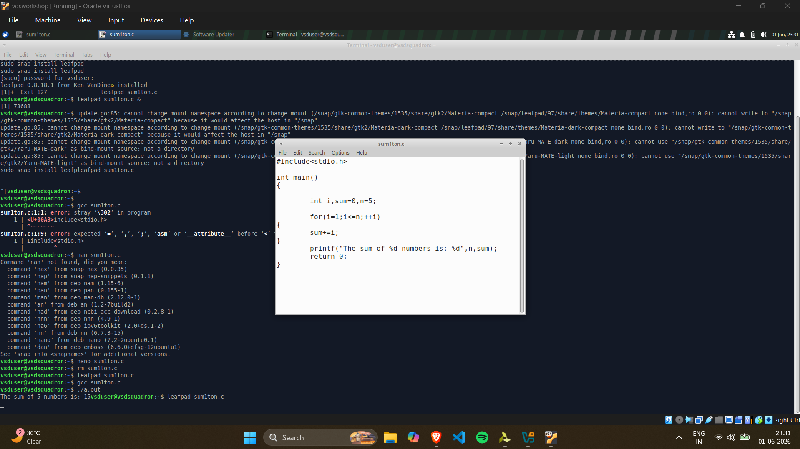

---

##  Step 2: Compile & Run with GCC (Output Verification)

The first step was to verify the program produces the correct output using standard GCC on the host machine.

```bash
gcc sum1ton.c
./a.out
```

### Output

```
Sum from 1 to 10 is 55
```

This established the **reference output** — the expected correct result that the RISC-V simulation must match.

> **Initial run on VirtualBox** with `n=5` produced: `The sum of 5 numbers is: 15` 
> **Codespaces run** with `n=10` produced: `Sum from 1 to 10 is 55` 

**GCC compile and run on VirtualBox (`n=5`):**

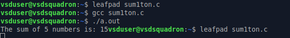

**GCC compile and run on Codespaces (`n=10`):**

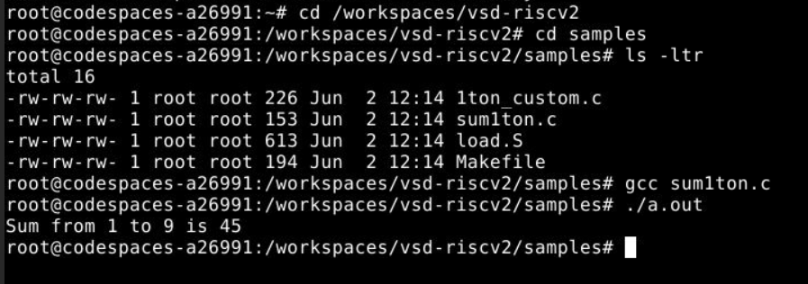

---

##  Step 3: Cross-Compile for RISC-V & Simulate with Spike

The same source file was then cross-compiled targeting the RISC-V 64-bit architecture and run on the Spike ISA simulator using the proxy kernel (`pk`).

```bash
riscv64-unknown-elf-gcc -o sum1ton.o sum1ton.c
spike pk sum1ton.o
```

### Output

```
bbl loader
Sum from 1 to 10 is 55
```

The output **matches the GCC output exactly**, confirming that the RISC-V toolchain and simulator produce correct results consistent with the native x86 GCC compilation. 

> The test was repeated with `n=100`:
> - GCC output: `Sum from 1 to 100 is 5050`
> - Spike output: `Sum from 1 to 100 is 5050` 

**Full session — GCC + RISC-V cross-compile + Spike simulation (`n=10`):**

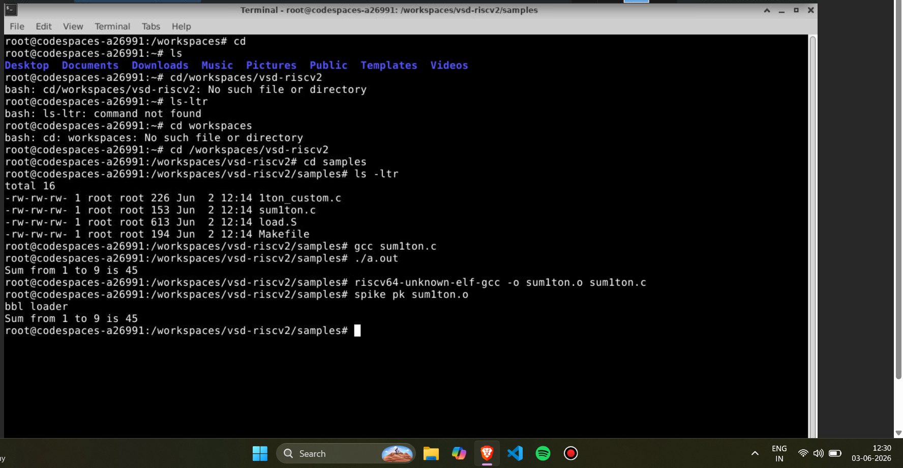

**Gedit showing source with `n=10`, Spike confirming match:**

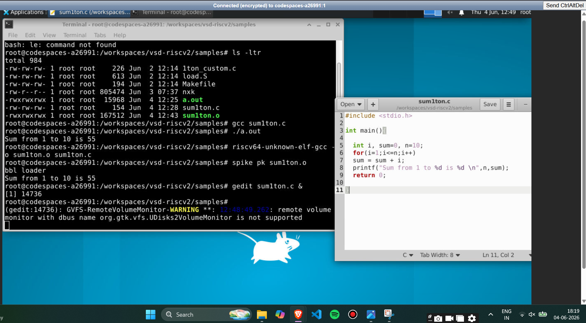

**Updated to `n=100`, Spike output matches GCC:**

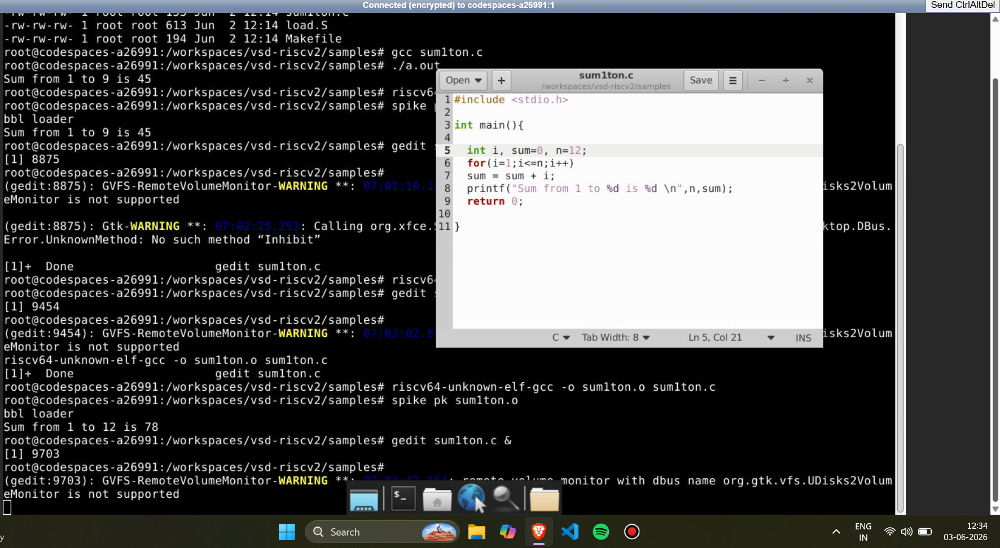

**Final source code confirmed via `cat` (`n=100`):**

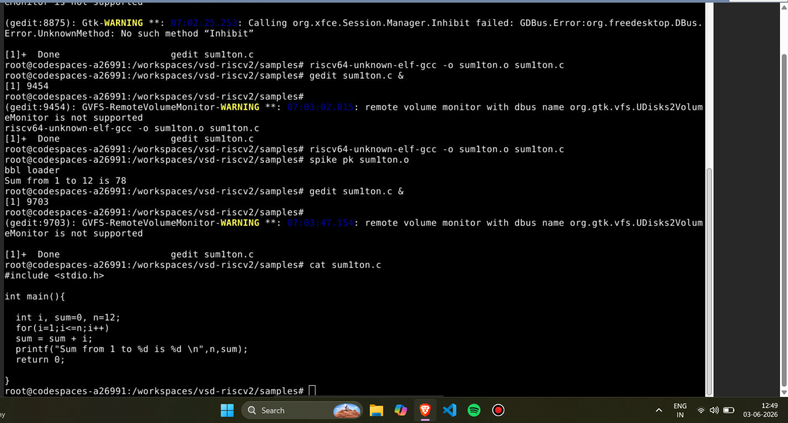

---

##  Step 4: Disassembly & Instruction Count Analysis

The compiled RISC-V ELF binary was disassembled using `objdump` to inspect the generated assembly instructions under two optimization levels.

### Compiling with O1 Optimization

```bash
riscv64-unknown-elf-gcc -O1 -mabi=lp64 -march=rv64i -o sum1ton.o sum1ton.c
```

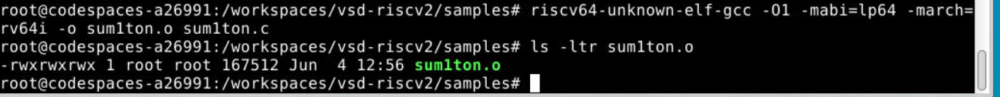

### Compiling with Ofast Optimization

```bash
riscv64-unknown-elf-gcc -Ofast -mabi=lp64 -march=rv64i -o sum1ton.o sum1ton.c
```

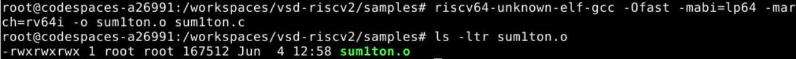

### Disassembling the binary

```bash
riscv64-unknown-elf-objdump -d sum1ton.o | less
```

### Disassembly of `main` (O1 Optimization)

```
0000000000010184 <main>:
   10184:   ff010113    addi    sp,sp,-16
   10188:   00113423    sd      ra,8(sp)
   1018c:   06400793    li      a5,100
   10190:   fff7879b    addiw   a5,a5,-1
   10194:   fe079ee3    bnez    a5,10190 <main+0xc>
   10198:   00001637    lui     a2,0x1
   1019c:   3ba60613    addi    a2,a2,954
   101a0:   06400593    li      a1,100
   101a4:   00021537    lui     a0,0x21
   101a8:   19050513    addi    a0,a0,400
   101ac:   26c000ef    jal     ra,10418 <printf>
   101b0:   00000513    li      a0,0
   101b4:   00813083    ld      ra,8(sp)
   101b8:   01010113    addi    sp,sp,16
   101bc:   00008067    ret
```

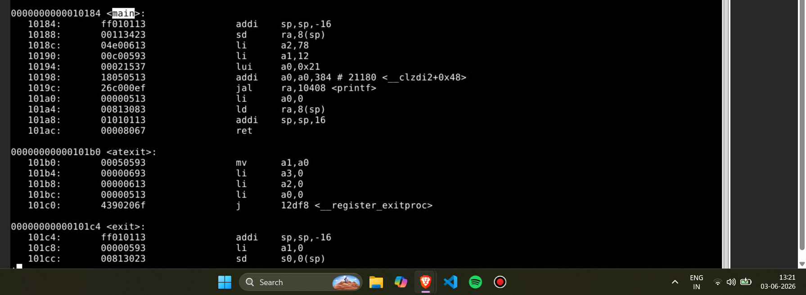

### Disassembly of `main` (Ofast Optimization)

```
00000000000100b0 <main>:
   100b0:   00001637    lui     a2,0x1
   100b4:   00021537    lui     a0,0x21
   100b8:   ff010113    addi    sp,sp,-16
   100bc:   3ba60613    addi    a2,a2,954
   100c0:   06400593    li      a1,100
   100c4:   18050513    addi    a0,a0,384
   100c8:   00113423    sd      ra,8(sp)
   100cc:   340000ef    jal     ra,1040c <printf>
   100d0:   00813083    ld      ra,8(sp)
   100d4:   00000513    li      a0,0
   100d8:   01010113    addi    sp,sp,16
   100dc:   00008067    ret
```

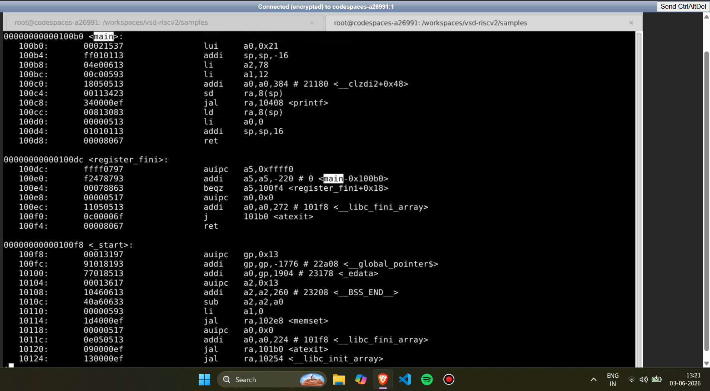

---

##  Instruction Count Calculation

The number of instructions in `main` was determined by computing the difference between the **start address of `main`** and the **start address of the next function**, then dividing by the instruction width (4 bytes for standard RISC-V 32-bit instructions).

### For O1 Optimization

| Property | Value |
|----------|-------|
| Start address of `main` | `0x10184` |
| Start address of next function (`atexit`) | `0x101c0` |
| Byte difference | `0x101c0 - 0x10184 = 0x3C = 60 bytes` |
| Number of instructions | `60 / 4 = 15 instructions` |

### For Ofast Optimization

| Property | Value |
|----------|-------|
| Start address of `main` | `0x100b0` |
| Start address of next function (`register_fini`) | `0x100e0` |
| Byte difference | `0x100e0 - 0x100b0 = 0x30 = 48 bytes` |
| Number of instructions | `48 / 4 = 12 instructions` |

> **Observation:** Unlike with constant values of `n`, here `n=100` is large enough that `-O1` retains the loop in the disassembly (15 instructions), while `-Ofast` applies aggressive optimization — pre-computing the result at compile time via **constant folding** — reducing the instruction count to just 12. This demonstrates how higher optimization levels can eliminate loop overhead entirely when the input is a compile-time constant.

---

##  Full Workflow Summary

```
Write C Program (sum1ton.c)
         │
         ▼
 GCC compile & run (x86)
  → Output: Sum from 1 to 10 is 55   (Reference)
         │
         ▼
 RISC-V Cross-compile
  riscv64-unknown-elf-gcc -o sum1ton.o sum1ton.c
         │
         ▼
 Simulate with Spike
  spike pk sum1ton.o
  → Output: Sum from 1 to 10 is 55   (Matches GCC)
         │
         ▼
 Compile with O1 & Ofast flags
  riscv64-unknown-elf-gcc -O1 -mabi=lp64 -march=rv64i -o sum1ton.o sum1ton.c
  riscv64-unknown-elf-gcc -Ofast -mabi=lp64 -march=rv64i -o sum1ton.o sum1ton.c
         │
         ▼
 Disassemble with objdump
  riscv64-unknown-elf-objdump -d sum1ton.o | less
         │
         ▼
 Analyze main function:
  - Identify start & end addresses
  - Compute byte range
  - Divide by 4 → Instruction count
  → O1:    15 instructions
  → Ofast: 12 instructions
```

---

##  Key Takeaways

- The GCC and RISC-V Spike simulation outputs **match exactly**, validating the correctness of the cross-compilation and simulation pipeline.
- Under `-O1`, the loop is **retained** in the disassembly since the compiler does not aggressively eliminate it.
- Under `-Ofast`, the compiler applies **constant folding** — pre-computing `sum = 5050` at compile time, eliminating the loop entirely and reducing instruction count from 15 to 12.
- Instruction count can be determined precisely by subtracting consecutive function start addresses in the `objdump` output and dividing by 4.
- The difference in instruction count between `-O1` (15) and `-Ofast` (12) directly reflects the impact of aggressive compiler optimization on generated code size.

---

## 📸 Screenshots Reference

| # | Screenshot | Description |
|---|------------|-------------|
| 1 |  | Writing & debugging `sum1ton.c` on VirtualBox using Leafpad; initial GCC errors and fixes |
| 2 |  | Successful GCC compile and execution on VirtualBox — output: `The sum of 5 numbers is: 15` |
| ss1 |  | Navigating to `vsd-riscv2/samples` in Codespaces; GCC compile and run — output: `Sum from 1 to 10 is 55` |
| ss2 |  | Full Codespaces session: GCC run + RISC-V cross-compile + Spike simulation — both output `Sum from 1 to 10 is 55` |
| ss3 |  | Gedit editor showing `sum1ton.c` with `n=10`; Spike simulation confirming match |
| ss4 |  | Updated `n=100`; Spike output: `Sum from 1 to 100 is 5050` |
| ss5 |  | Final source code confirmed via `cat sum1ton.c` with `n=100` |
| ss6a |  | O1 compile command: `riscv64-unknown-elf-gcc -O1 -mabi=lp64 -march=rv64i` |
| ss6 |  | `objdump` disassembly — `main` section under O1 optimization (15 instructions) |
| ss7a |  | Ofast compile command: `riscv64-unknown-elf-gcc -Ofast -mabi=lp64 -march=rv64i` |
| ss7 |  | `objdump` disassembly — `main` section under Ofast optimization (12 instructions) |

---

