# Task 2: Traffic light controller — GCC & RISC-V Compilation & Spike Debugging

> **Objective:** This task is divided into two distinct parts:
>
> **Part 1 — Traffic Light Controller:** Write a Traffic Light Controller program in C simulating RED → GREEN → YELLOW state transitions. Compile and verify using GCC, cross-compile using the RISC-V toolchain, simulate using Spike, and analyze the binary using `objdump` under `-O1` and `-Ofast` optimization levels — demonstrating how aggressive compiler optimization reduces instruction count when inputs are compile-time constants.
>
> **Part 2 — Spike Debugger Analysis:** Debug the `sum1ton` program using Spike's interactive debug mode (`spike -d`) to step through instructions and inspect register values — specifically analyzing how the `lui` and `addi` instructions work together to construct 32-bit addresses, and how the stack pointer (`sp`) is managed during function execution in RISC-V architecture.

---

##  Tools & Environment

| Tool | Purpose |
|------|---------|
| GCC (x86) | Native compilation & output verification |
| `riscv64-unknown-elf-gcc` | RISC-V cross-compilation |
| Spike (`spike pk`) | RISC-V ISA simulator |
| Spike Debug (`spike -d pk`) | Interactive instruction-level debugger |
| `riscv64-unknown-elf-objdump` | Disassembly of RISC-V ELF binary |
| Gedit | Text editor used for writing C source |
| GitHub Codespaces | Cloud environment for RISC-V toolchain execution |

---

# Part 1: Traffic Light Controller

---

##  Step 1: Writing the C Program

A C program `traffic_light.c` was written to simulate a traffic light controller cycling through RED → GREEN → YELLOW states. Each state has an associated duration and the controller completes two full cycles (6 state transitions total).

### Source Code (`traffic_light.c`)

```c
#include <stdio.h>

#define red    0
#define yellow 1
#define green  2

const char* get_state_name(int state) {
    if (state == red)   return "red";
    if (state == green) return "green";
    return "yellow";
}

int next_state(int state) {
    if (state == red)   return green;
    if (state == green) return yellow;
    return red;
}

int get_duration(int state) {
    if (state == red)   return 30;
    if (state == green) return 25;
    return 5;
}

void display(int state) {
    printf("state: %s | duration: %d seconds \n",
        get_state_name(state),
        get_duration(state));
}

int main() {
    printf("traffic light controller\n");
    printf("-------------------------\n");

    int state = red;
    display(state);
    state = next_state(state);
    display(state);
    state = next_state(state);
    display(state);
    state = next_state(state);
    display(state);
    state = next_state(state);
    display(state);
    state = next_state(state);
    display(state);

    return 0;
}
```

**Opening Gedit to write `traffic_light.c`:**

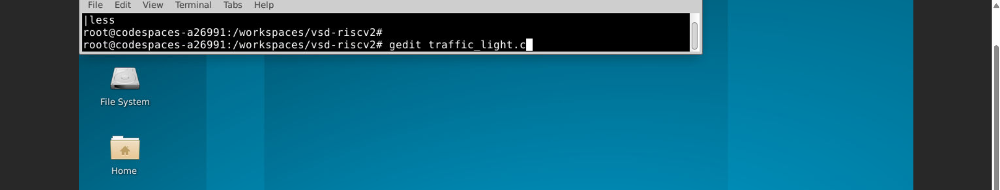

**Source code in Gedit — functions:**

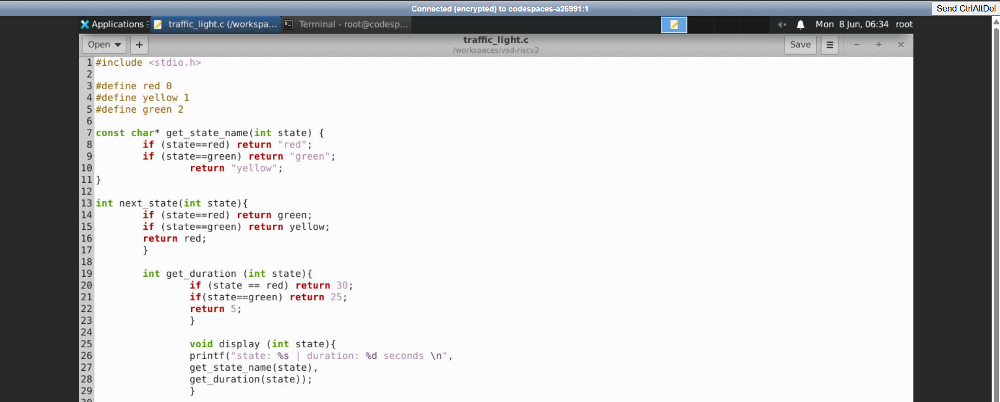

**Source code in Gedit — main function:**

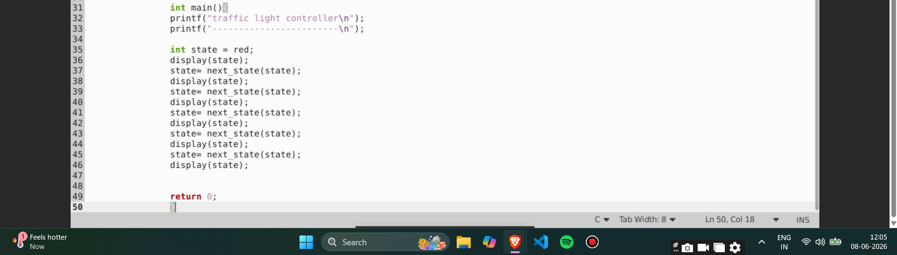

**Source code verified via `cat` command:**

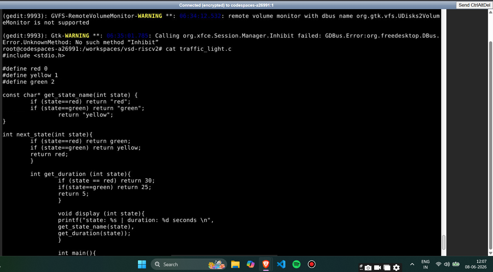

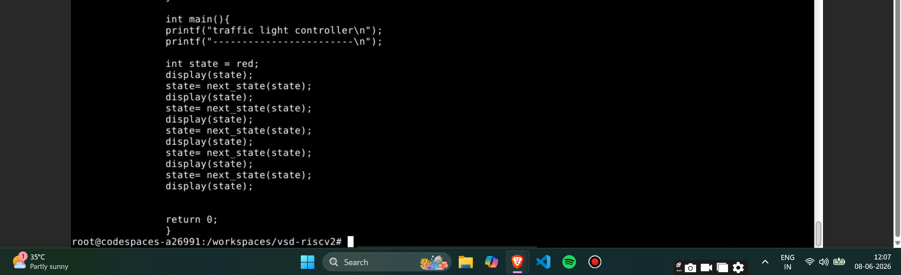

---

##  Step 2: Compile & Run with GCC (Output Verification)

```bash
gcc traffic_light.c
./a.out
```

### Output

```
traffic light controller
-------------------------
state: red    | duration: 30 seconds
state: green  | duration: 25 seconds
state: yellow | duration: 5 seconds
state: red    | duration: 30 seconds
state: green  | duration: 25 seconds
state: yellow | duration: 5 seconds
```

This established the **reference output** for the RISC-V simulation to match.

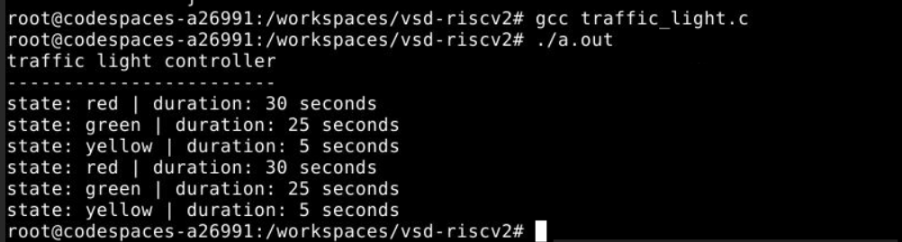

---

## ⚙️ Step 3: Cross-Compile for RISC-V & Simulate with Spike

### O1 Optimization

```bash
riscv64-unknown-elf-gcc -O1 -mabi=lp64 -march=rv64i -o traffic_light.o traffic_light.c
spike pk traffic_light.o
```

### Ofast Optimization

```bash
riscv64-unknown-elf-gcc -Ofast -mabi=lp64 -march=rv64i -o traffic_light.o traffic_light.c
spike pk traffic_light.o
```

**Both outputs match GCC exactly** 

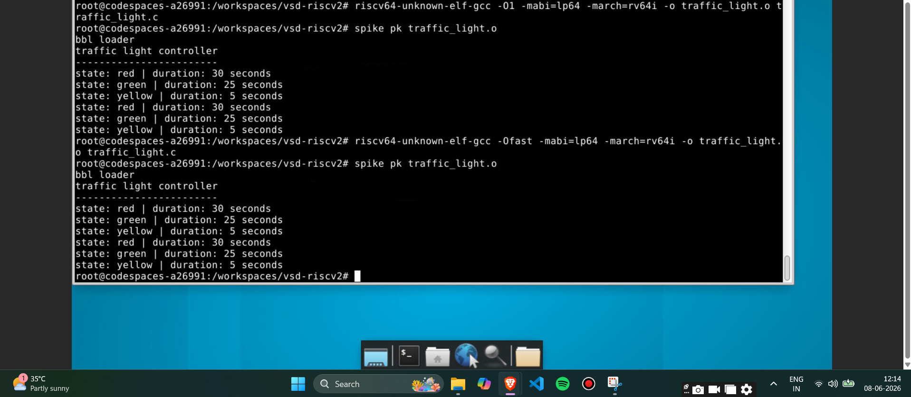

---

##  Step 4: Disassembly & Instruction Count Analysis

### O1 Disassembly

```bash
riscv64-unknown-elf-gcc -O1 -mabi=lp64 -march=rv64i -o traffic_light.o traffic_light.c
riscv64-unknown-elf-objdump -d traffic_light.o | less
```

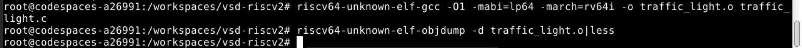

```
0000000000010240 <main>:
   10240:   ff010113    addi    sp,sp,-16
   10244:   00113423    sd      ra,8(sp)
   10248:   00813023    sd      s0,0(sp)
   1024c:   00021537    lui     a0,0x21
   10250:   3b050513    addi    a0,a0,944
   10254:   3f4000ef    jal     ra,10648 <puts>
   10258:   00021537    lui     a0,0x21
   1025c:   3d050513    addi    a0,a0,976
   10260:   3e8000ef    jal     ra,10648 <puts>
   10264:   00000513    li      a0,0
   10268:   f8dff0ef    jal     ra,101f4 <display>
   1026c:   00000513    li      a0,0
   10270:   f45ff0ef    jal     ra,101b4 <next_state>
   10274:   00050413    mv      s0,a0
   10278:   f7dff0ef    jal     ra,101f4 <display>
   1027c:   00040513    mv      a0,s0
   10280:   f35ff0ef    jal     ra,101b4 <next_state>
   10284:   00050413    mv      s0,a0
   10288:   f6dff0ef    jal     ra,101f4 <display>
   1028c:   00040513    mv      a0,s0
   10290:   f25ff0ef    jal     ra,101b4 <next_state>
   10294:   00050413    mv      s0,a0
   10298:   f5dff0ef    jal     ra,101f4 <display>
   1029c:   00040513    mv      a0,s0
   102a0:   f15ff0ef    jal     ra,101b4 <next_state>
   102a4:   00050413    mv      s0,a0
   102a8:   f4dff0ef    jal     ra,101f4 <display>
   102ac:   00040513    mv      a0,s0
   102b0:   f05ff0ef    jal     ra,101b4 <next_state>
   102b4:   f41ff0ef    jal     ra,101f4 <display>
   102b8:   00000513    li      a0,0
   102bc:   00813083    ld      ra,8(sp)
   102c0:   00013403    ld      s0,0(sp)
   102c4:   01010113    addi    sp,sp,16
   102c8:   00008067    ret
```

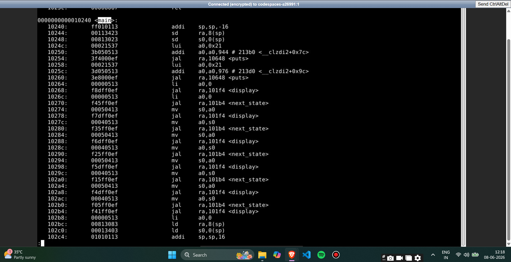


#### Instruction Count (O1)

| Property | Value |
|----------|-------|
| Start address of `main` | `0x10240` |
| Start address of next function | `0x102cc` |
| Byte difference | `0x102cc - 0x10240 = 0x8C = 140 bytes` |
| Number of instructions | `140 / 4 = 35 instructions` |

> **O1 retains all `next_state()` and `display()` function calls** — the compiler keeps the original program structure with explicit `jal` instructions for each function call.

---

### Ofast Disassembly

```bash
riscv64-unknown-elf-gcc -Ofast -mabi=lp64 -march=rv64i -o traffic_light.o traffic_light.c
riscv64-unknown-elf-objdump -d traffic_light.o | less
```

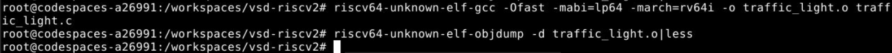

```
00000000000100b0 <main>:
   100b0:   00021537    lui     a0,0x21
   100b4:   ff010113    addi    sp,sp,-16
   100b8:   39050513    addi    a0,a0,912
   100bc:   00113423    sd      ra,8(sp)
   100c0:   564000ef    jal     ra,10624 <puts>
   100c4:   00021537    lui     a0,0x21
   100c8:   3b050513    addi    a0,a0,944
   100cc:   558000ef    jal     ra,10624 <puts>
   100d0:   00000513    li      a0,0
   100d4:   180000ef    jal     ra,10254 <display>
   100d8:   00200513    li      a0,2
   100dc:   178000ef    jal     ra,10254 <display>
   100e0:   00100513    li      a0,1
   100e4:   170000ef    jal     ra,10254 <display>
   100e8:   00000513    li      a0,0
   100ec:   168000ef    jal     ra,10254 <display>
   100f0:   00200513    li      a0,2
   100f4:   160000ef    jal     ra,10254 <display>
   100f8:   00100513    li      a0,1
   100fc:   158000ef    jal     ra,10254 <display>
   10100:   00813083    ld      ra,8(sp)
   10104:   00000513    li      a0,0
   10108:   01010113    addi    sp,sp,16
   1010c:   00008067    ret
```

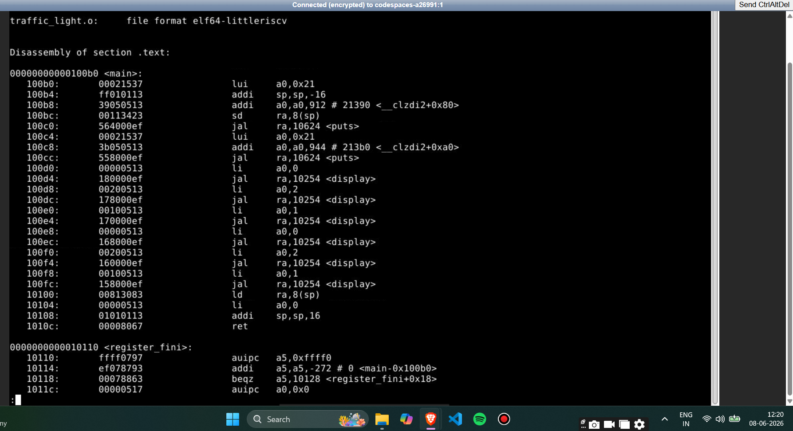

#### Instruction Count (Ofast)

| Property | Value |
|----------|-------|
| Start address of `main` | `0x100b0` |
| Start address of next function (`register_fini`) | `0x10110` |
| Byte difference | `0x10110 - 0x100b0 = 0x60 = 96 bytes` |
| Number of instructions | `96 / 4 = 24 instructions` |

> **Ofast eliminates all `next_state()` calls** — since `state = red` is a compile-time constant, the compiler traces through every `next_state()` call statically and directly loads the pre-computed state values before each `display()` call.

---

##  O1 vs Ofast Comparison

| Property | O1 | Ofast |
|----------|----|-------|
| Start address of `main` | `0x10240` | `0x100b0` |
| End of `main` | `0x102c8` | `0x1010c` |
| Instruction count | **35** | **24** |
| `next_state()` calls | 5 (retained) | 0 (eliminated) |
| Optimization technique | Basic | Constant folding + inlining |
| Instruction reduction | — | **11 instructions (31%)** |

---

# Part 2: Spike Debugger Analysis — `sum1ton`

---

##  Step 5: Debugging `sum1ton` with Spike Interactive Debugger

The `sum1ton` program (compiled under Ofast with `n=100`) was analyzed using Spike's interactive debug mode to observe register values at each instruction — specifically studying `lui`, `addi` and stack pointer (`sp`) behavior.

### GCC + Spike verification:

```bash
gcc sum1ton.c
./a.out
```
Output: `Sum from 1 to 100 is 5050` 

```bash
riscv64-unknown-elf-gcc -Ofast -mabi=lp64 -march=rv64i -o sum1ton.o sum1ton.c
spike pk sum1ton.o
```
Output: `Sum from 1 to 100 is 5050` 

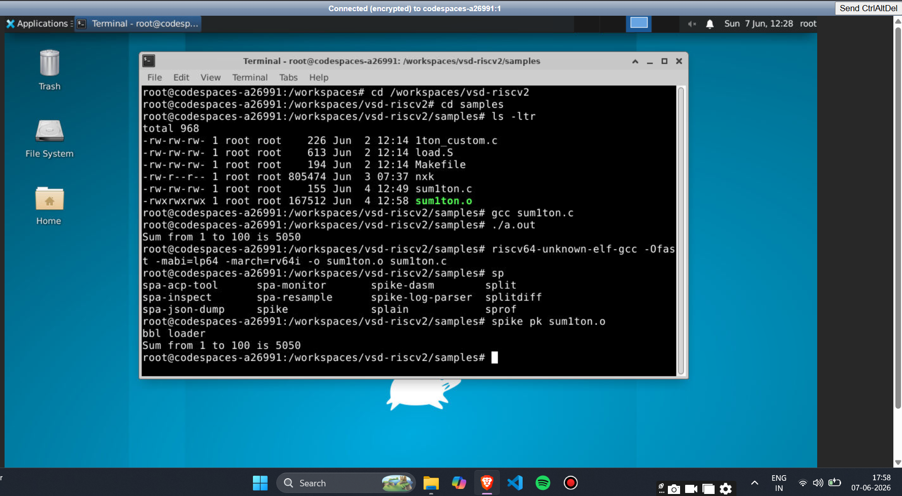

---

##  Step 6: Disassembly of `sum1ton` (Ofast)

```bash
riscv64-unknown-elf-objdump -d sum1ton.o | less
```

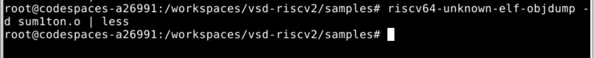

```
00000000000100b0 <main>:
   100b0:   00001637    lui     a2,0x1
   100b4:   00021537    lui     a0,0x21
   100b8:   ff010113    addi    sp,sp,-16
   100bc:   3ba60613    addi    a2,a2,954 # 13ba
   100c0:   06400593    li      a1,100
   100c4:   18050513    addi    a0,a0,384 # 21180
   100c8:   00113423    sd      ra,8(sp)
   100cc:   340000ef    jal     ra,1040c <printf>
   100d0:   00813083    ld      ra,8(sp)
   100d4:   00000513    li      a0,0
   100d8:   01010113    addi    sp,sp,16
   100dc:   00008067    ret
```

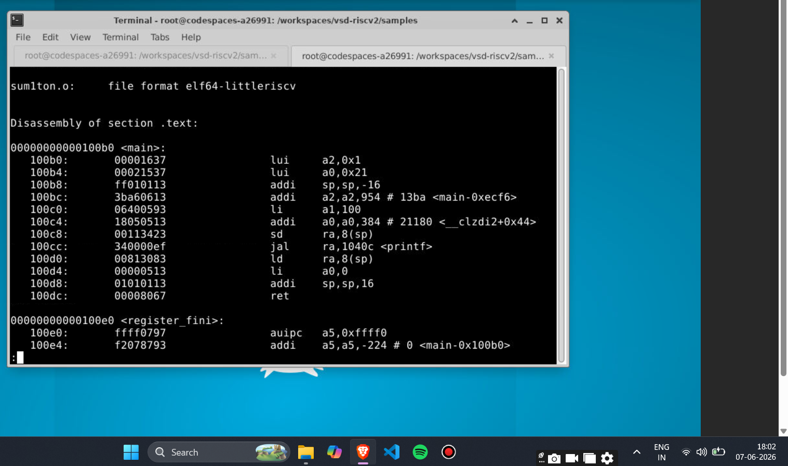

---

##  Step 7: Interactive Spike Debug Session

```bash
spike -d pk sum1ton.o
```

**Debug commands used:**
- `until pc 0 100b0` — run until reaching `main`
- `reg 0 <register>` — inspect register value
- Press **Enter** — execute next instruction

---

### 7a. Analyzing `lui` Instructions

#### Observing `lui a2, 0x1`

```
(spike) until pc 0 100b0
bbl loader
(spike) reg 0 a2
0x0000000000000000        ← a2 before lui
(spike)
core 0: 0x100b0  lui  a2, 0x1
(spike) reg 0 a2
0x0000000000001000        ← a2 = 0x1 << 12 = 0x1000
```

#### Observing `lui a0, 0x21`

```
(spike)
core 0: 0x100b4  lui  a0, 0x21
(spike) reg 0 a0
0x0000000000021000        ← a0 = 0x21 << 12 = 0x21000
```

#### How `lui` + `addi` builds a 32-bit address

| Instruction | Operation | Register Value |
|-------------|-----------|----------------|
| `lui a2, 0x1` | `a2 = 0x1 << 12` | `0x0000000000001000` |
| `addi a2, a2, 954` | `a2 = 0x1000 + 954` | `0x00000000000013BA` |
| `lui a0, 0x21` | `a0 = 0x21 << 12` | `0x0000000000021000` |
| `addi a0, a0, 384` | `a0 = 0x21000 + 384` | `0x0000000000021180` |

> **Key Insight:** RISC-V cannot encode a full 32-bit address in a single instruction. The `lui` instruction loads the upper 20 bits and `addi` fills in the lower 12 bits — together constructing the complete address in two steps.

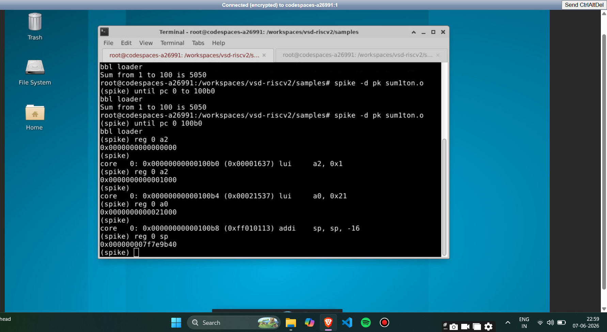

---

### 7b. Stack Pointer (sp) Analysis

The stack pointer was explicitly tracked before and after the `addi sp, sp, -16` instruction to verify stack frame allocation.

#### Observing `addi sp, sp, -16`

```bash
spike -d pk sum1ton.o
(spike) until pc 0 100b8
(spike) reg 0 sp
0x000000007f7e9b50        ← sp BEFORE addi
(spike)
core 0: 0x100b8  addi  sp, sp, -16
(spike) reg 0 sp
0x000000007f7e9b40        ← sp AFTER addi = 0x7f7e9b50 - 16
```

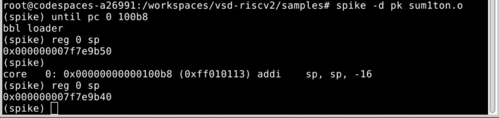

#### Stack Pointer Behavior

| Step | sp Value | Change |
|------|----------|--------|
| Before `addi sp,sp,-16` | `0x7f7e9b50` | — |
| After `addi sp,sp,-16` | `0x7f7e9b40` | Decreased by 16 bytes |
| After `addi sp,sp,16` (epilogue) | `0x7f7e9b50` | Restored to original |

> **Observation:** The stack grows **downward** in RISC-V — the sp decreases when allocating and increases when deallocating. The 16-byte frame provides space to save the return address (`ra`) via `sd ra, 8(sp)`.

---

### 7c. Function Prologue & Epilogue Pattern

Every RISC-V function follows this standard pattern:

| Part | Instructions | Purpose |
|------|-------------|---------|
| **Prologue** | `addi sp,sp,-16` | Allocate 16-byte stack frame |
| **Prologue** | `sd ra,8(sp)` | Save return address onto stack |
| **Body** | ... | Function logic |
| **Epilogue** | `ld ra,8(sp)` | Restore return address from stack |
| **Epilogue** | `addi sp,sp,16` | Deallocate stack frame |
| **Epilogue** | `ret` | Return to caller |

> This pattern ensures that when `main` calls `printf`, the return address is safely preserved on the stack and correctly restored after `printf` returns — allowing `main` to continue execution normally.

---

##  Full Workflow Summary

```
PART 1: Traffic Light Controller
         │
         ▼
 Write traffic_light.c
         │
         ▼
 GCC compile & run
  → Output: RED→GREEN→YELLOW (×2)  
         │
         ▼
 RISC-V O1 + Spike → Matches GCC  
 RISC-V Ofast + Spike → Matches GCC  
         │
         ▼
 objdump O1  → main: 35 instructions
              → next_state() calls retained
         │
         ▼
 objdump Ofast → main: 24 instructions
               → next_state() eliminated
               → 11 fewer instructions (31%)

PART 2: Spike Debugger Analysis
         │
         ▼
 spike -d pk sum1ton.o
         │
         ▼
 until pc 0 100b0 → reach main
         │
         ▼
 Step through lui + addi
  → lui a2,0x1  → a2 = 0x1000
  → lui a0,0x21 → a0 = 0x21000
  → addi builds full 32-bit addresses
         │
         ▼
 Track stack pointer
  → sp before addi: 0x7f7e9b50
  → sp after addi:  0x7f7e9b40
  → Stack grows downward 
  → 16-byte frame allocated 
```

---

##  Key Takeaways

- The Traffic Light Controller GCC and RISC-V Spike outputs **match exactly** under both `-O1` and `-Ofast`. 
- **O1 = 35 instructions**, **Ofast = 24 instructions** — a reduction of **11 instructions (31%)** due to constant folding eliminating all `next_state()` calls.
- The `lui`+`addi` pair is RISC-V's standard mechanism to construct full 32-bit addresses — `lui` sets the upper 20 bits, `addi` fills the lower 12 bits.
- The stack pointer **decreases** during function prologue (`addi sp,sp,-16`) and **increases** during epilogue (`addi sp,sp,16`) — confirming that the RISC-V stack grows downward.
- The return address (`ra`) is saved to the stack before calling `printf` and restored afterward — ensuring correct program flow.
- Spike's interactive debug mode provides precise instruction-level register visibility, making it a powerful tool for verifying compiler-generated assembly behavior.

---

##  Screenshots Reference

| # | Screenshot | Description |
|---|------------|-------------|
| ss1 |  | Opening Gedit to write `traffic_light.c` |
| ss2 |  | Source code in Gedit — helper functions |
| ss2a |  | Source code in Gedit — main function |
| ss4 |  | `cat traffic_light.c` — part 1 |
| ss4a |  | `cat traffic_light.c` — part 2 |
| ss5 |  | GCC compile and run — traffic light output |
| ss6 |  | RISC-V O1 + Ofast Spike — both match GCC |
| ss7 |  | O1 compile + objdump command |
| ss7a |  | O1 `main` disassembly — 35 instructions |
| ss7b |  | O1 `main` — final `ret` instruction |
| ss8 |  | Ofast compile + objdump command |
| ss8a |  | Ofast `main` disassembly — 24 instructions |
| ss9 |  | GCC + Spike verification of `sum1ton` — `Sum from 1 to 100 is 5050` |
| ss10 |  | `objdump -d sum1ton.o` command |
| ss10a |  | `sum1ton` Ofast disassembly showing `lui` and `addi` |
| ss11 |  | Spike debug — stepping through `lui` instructions with register inspection |
| ss12 |  | Spike debug — verifying `sp` before and after `addi sp,sp,-16` |

---

