# Task 1 — Environment Setup & RISC-V Reference Bring-Up

---

## Objective

Set up the development environment and successfully run a working RISC-V reference design, followed by running the VSDFPGA labs on the same environment.

This task focuses on:
- Toolchain readiness
- Understanding the RISC-V execution flow
- Preparing for upcoming FPGA and IP development work

---

## Step 1 — Set Up GitHub Codespace

**Repository used:** [https://github.com/vsdip/vsd-riscv2](https://github.com/vsdip/vsd-riscv2)

- Forked the `vsd-riscv2` repository to my GitHub account
- Launched a GitHub Codespace from the fork
- Codespace built successfully and opened without errors

---

## Step 2 — Verify RISC-V Reference Flow (in Codespace)

### Program: `sum1ton.c`

Located at `vsd-riscv2/samples/sum1ton.c`:

```c
#include <stdio.h>

int main(){
    int i, sum=0, n=100;
    for(i=1; i<=n; i++)
        sum = sum + i;
    printf("Sum from 1 to %d is %d \n", n, sum);
    return 0;
}
```

---

### Compile with RISC-V GCC and run on Spike simulator

```bash
cd ~/workspaces/vsd-riscv2/samples
riscv64-unknown-elf-gcc -o sum1ton.o sum1ton.c
spike pk sum1ton.o
```

**Output:**
```
bbl loader
Sum from 1 to 9 is 45
```

**Screenshot — Codespace: navigate to repo, RISC-V compile + Spike run:**

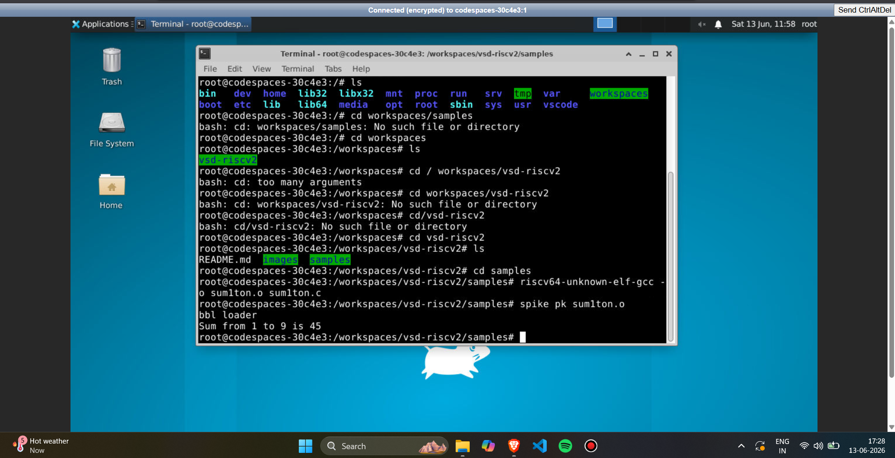

---

### Compile and run with standard GCC (x86 baseline)

```bash
gcc sum1ton.c
./a.out
```

**Output:**
```
Sum from 1 to 9 is 45
```

**Screenshot — GCC compile and ./a.out output:**

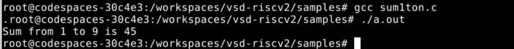

---

### Source code review and both runs side by side

**Screenshot — gedit showing sum1ton.c + terminal with RISC-V and GCC runs:**

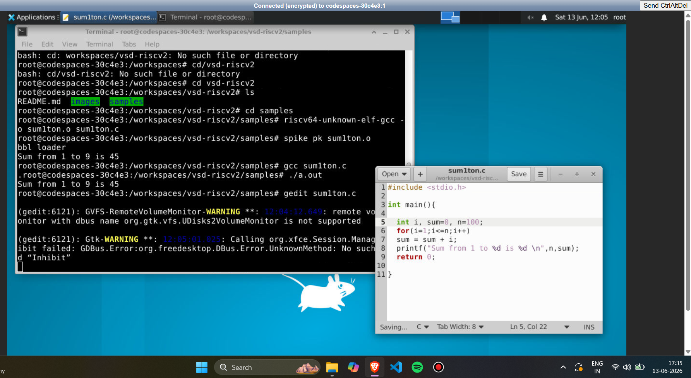

---

### Modified run (n=100) — Optional Confidence Task preview

After modifying `n` from 9 to 100 in `sum1ton.c`:

```bash
riscv64-unknown-elf-gcc -o sum1ton.o sum1ton.c
spike pk sum1ton.o
```

**Output:**
```
bbl loader
Sum from 1 to 100 is 5050
```

**Screenshot — VS Code terminal: RISC-V compile + Spike with n=100:**

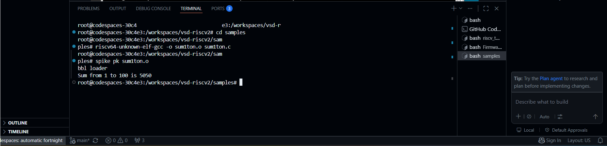

**Screenshot — Same run confirming n=100 output:**

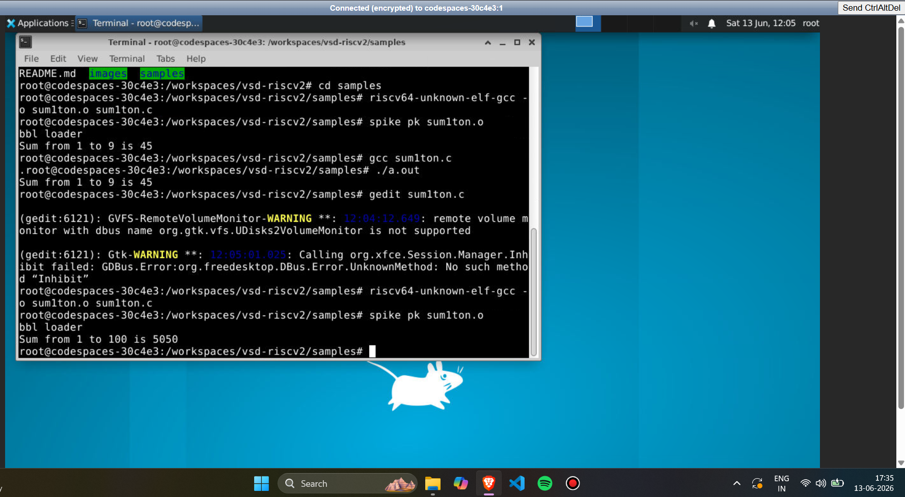

Both runs (n=9 → 45, n=100 → 5050) confirm the RISC-V toolchain is working correctly end-to-end.

---

## Step 3 — Clone and Run VSDFPGA Labs (in Codespace)

### Clone the repository

```bash
cd ~
git clone https://github.com/vsdip/vsdfpga_labs
```

**Screenshot — git clone vsdfpga_labs in Codespace:**

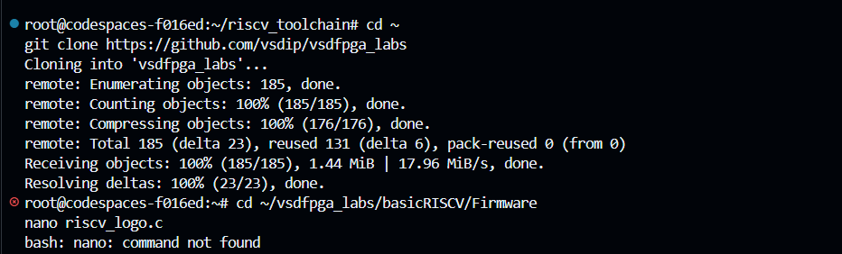

---

### Review the firmware source

```bash
cd ~/vsdfpga_labs/basicRISCV/Firmware
cat riscv_logo.c        # nano not available in Codespace; cat used to review
```

**Screenshot — cat riscv_logo.c showing full source:**

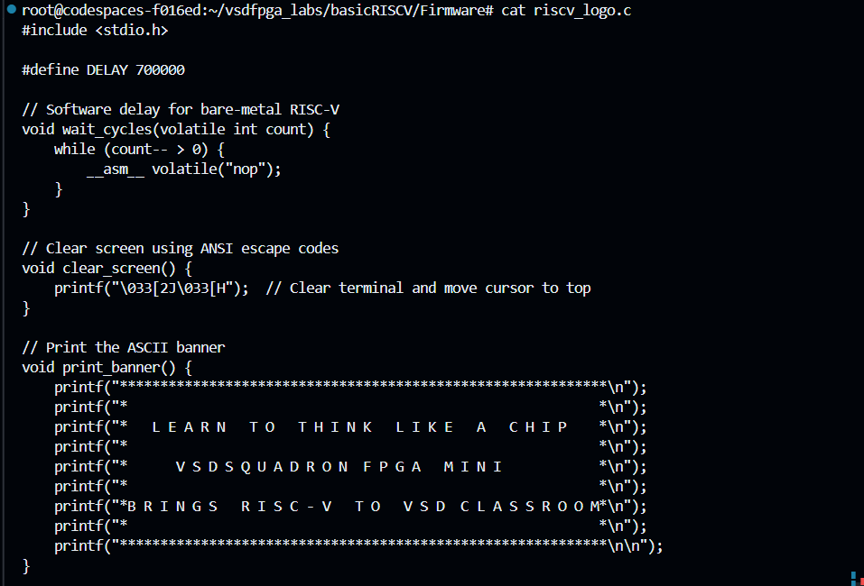

---

### Build the firmware hex

```bash
make riscv_logo.bram.hex
```

**Build output:**
```
RAM SIZE=6144
LOAD ELF: riscv_logo.bram.elf
    max address=3121
Code size: 780 words ( total RAM size: 1536 words )
Occupancy: 50%
testing MAX_ADDR limit: 6144
    max_addr OK
    SAVE HEX: riscv_logo.bram.hex
```

**Screenshot — make riscv_logo.bram.hex success:**

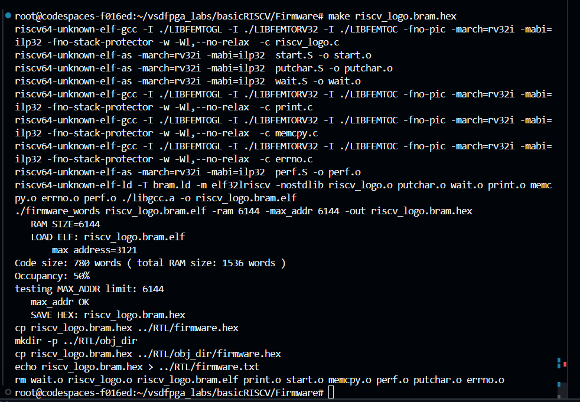

---

### FPGA build in Codespace (using OSS CAD Suite)

Since `yosys` was not natively installed in the Codespace, the OSS CAD Suite was used:

```bash
source oss-cad-suite/environment
cd ~/vsdfpga_labs/basicRISCV/RTL
make build
```

**Screenshot — OSS CAD Suite activated + make build (nextpnr place & route output):**

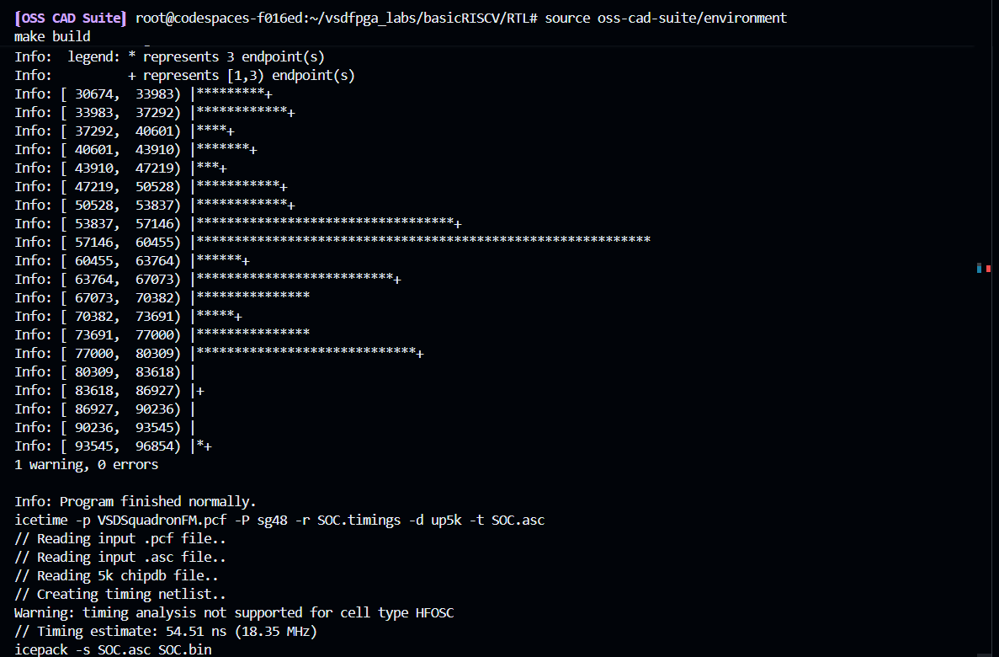

---

## Step 4 — Local Machine Preparation (VSD VirtualBox VM)

On the VSD VM (`vsduser@vsdsquadron`), the RISC-V toolchain was already present and both repositories were cloned for local execution.

### Toolchain verification + clone vsdfpga_labs on VM

```bash
cd ~
git clone https://github.com/vsdip/vsdfpga_labs
```

**Screenshot — VSD VM: riscv_toolchain present + git clone vsdfpga_labs:**

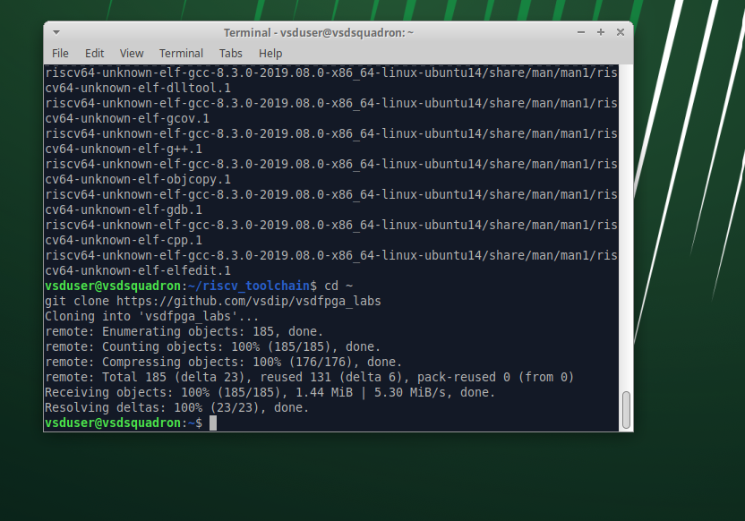

---

### Review and build firmware on VM

```bash
cd ~/vsdfpga_labs/basicRISCV/Firmware
nano riscv_logo.c       # nano works on the VSD VM
make riscv_logo.bram.hex
```

**Screenshot — VSD VM: clone + cd Firmware + nano + make up to date:**

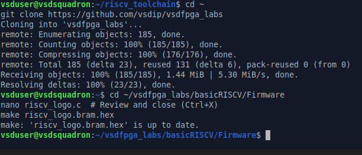

---

### nano view of riscv_logo.c on VM

**Screenshot — nano riscv_logo.c on VSD VM (original, DELAY=700000):**

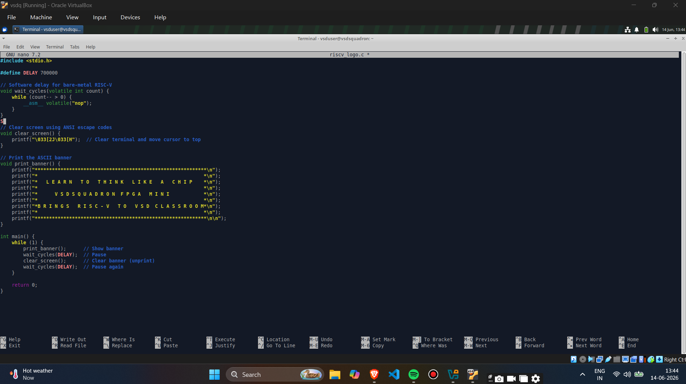

---

### Full FPGA build pipeline on VM

```bash
cd ~/vsdfpga_labs/basicRISCV/RTL
make clean
make build
```

`make build` runs the full FPGA toolchain:
- **Yosys** — RTL synthesis (Verilog → gate netlist)
- **nextpnr-ice40** — Place & Route onto iCE40 UP5K fabric
- **icetime** — Static timing analysis
- **icepack** — Pack into binary bitstream `SOC.bin`

**Screenshot — VSD VM: make clean + make build (synthesis + place & route):**

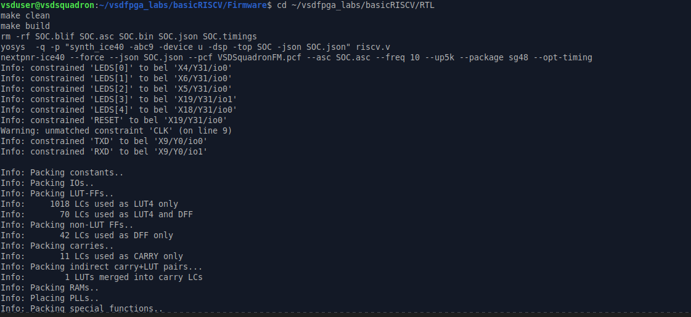

**Screenshot — VSD VM: timing analysis + icepack → SOC.bin generated:**

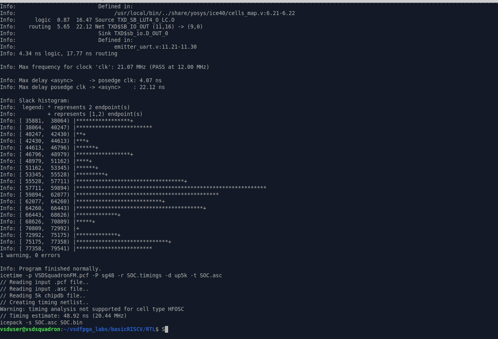

**Screenshot — VSD VM: directory navigation between Firmware and RTL:**

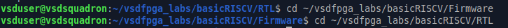

---

## Understanding Check — Four Questions

### Q1. Where is the RISC-V program located in the vsd-riscv2 repository?

The RISC-V program is located at:
```
vsd-riscv2/samples/sum1ton.c
```
The `samples/` folder contains the fundamental C programs used to validate the toolchain. The compiled RISC-V object file `sum1ton.o` is generated in the same directory after running `riscv64-unknown-elf-gcc`.

---

### Q2. How is the program compiled and loaded into memory?

**Compilation:**
```bash
riscv64-unknown-elf-gcc -o sum1ton.o sum1ton.c
```
The RISC-V cross-compiler translates the C source into a RISC-V ELF binary targeting the `rv64` ISA.

**Loading into memory:**
```bash
spike pk sum1ton.o
```
Spike (the RISC-V ISA simulator) loads the ELF binary into a simulated memory space. The proxy kernel (`pk`) acts as a minimal OS — it sets up the memory map, handles system calls such as `printf`, and transfers control to `main()`. The program runs entirely in software simulation with no physical hardware required.

---

### Q3. How does the RISC-V core access memory and memory-mapped IO?

In the RISC-V architecture:

- **Memory access** uses standard `load` (`lw`, `lb`, `ld`) and `store` (`sw`, `sb`, `sd`) instructions. The core issues an address on the memory bus and the memory controller returns or writes data.

- **Memory-mapped IO (MMIO)** works by assigning peripheral registers (UART, GPIO, timers) to fixed addresses in the same address space as RAM. Writing to those addresses triggers hardware actions — for example, writing to the UART TX register sends a byte over serial. There is no separate IO instruction; a regular store to the mapped address is sufficient.

- In the SoC context (`vsdfpga_labs/basicRISCV`), the `femtopll.v`, `emitter_uart.v`, and `clockworks.v` modules are the hardware side of this — their registers sit at memory-mapped addresses that the C firmware reaches via the `printf` → UART TX path.

---

### Q4. Where would a new FPGA IP block logically integrate in this system?

A new IP block would integrate at the **SoC interconnect level**, inside `riscv.v` (the top-level SoC module). The steps would be:

1. Add the IP's Verilog module to the RTL directory
2. Instantiate it inside `riscv.v` alongside existing peripherals (UART, clockworks)
3. Assign it a memory-mapped address range in the address decoder so the RISC-V core can communicate with it via load/store instructions
4. Add pin constraints to `VSDSquadronFM.pcf` if the IP needs external IO pins
5. Update the firmware to read/write the new IP's mapped address
6. Rebuild — `make riscv_logo.bram.hex` then `make build` — to generate a new bitstream

---

## Optional Confidence Task — Modify, Rebuild & Observe

### What was modified

In `riscv_logo.c`, the `clear_screen()` function was modified on the VSD VM:

**Before (original):**
```c
void clear_screen() {
    printf("\033[2J\033[H");  // Clear terminal and move cursor to top
}
```

**After (modified):**
```c
void clear_screen() {
    printf("VSDSq");  // Modified output string
}
```

**Screenshot — nano showing original file (before modification):**


**Screenshot — nano after modification (printf "VSDSq"):**


---

### Rebuild after modification

```bash
cd ~/vsdfpga_labs/basicRISCV/Firmware
make riscv_logo.bram.hex
cd ~/vsdfpga_labs/basicRISCV/RTL
make clean
make build
```

**Screenshot — Full rebuild pipeline on VSD VM after modification:**


---

### Observed change

| | Before | After |
|--|--------|-------|
| `clear_screen()` output | ANSI escape — invisible screen clear | Prints `VSDSq` visibly |
| String | `\033[2J\033[H` (7 chars) | `VSDSq` (5 chars) |
| Bitstream | Original `SOC.bin` | New `SOC.bin` generated |

The modification proves that a C source change propagates through the entire toolchain — firmware compilation → hex → RTL synthesis → new FPGA bitstream.

---

## Summary

| Step | Action | Environment | Result |
|------|--------|-------------|--------|
| Step 1 | Fork & launch vsd-riscv2 Codespace | GitHub Codespace |  Built successfully |
| Step 2 | RISC-V GCC compile + Spike (n=9) | Codespace |  `Sum from 1 to 9 is 45` |
| Step 2 | GCC compile + ./a.out (n=9) | Codespace |  `Sum from 1 to 9 is 45` |
| Step 2 | Modified run (n=100) + Spike | Codespace |  `Sum from 1 to 100 is 5050` |
| Step 3 | Clone vsdfpga_labs | Codespace |  185 objects cloned |
| Step 3 | cat riscv_logo.c | Codespace |  Source reviewed |
| Step 3 | make riscv_logo.bram.hex | Codespace |  780 words, 50% occupancy |
| Step 3 | make build (OSS CAD Suite) | Codespace |  SOC.bin generated |
| Step 4 | Clone repos on VSD VM | VSD VirtualBox VM |  Local environment ready |
| Step 4 | nano + make + full FPGA build | VSD VM |  SOC.bin generated |
| Optional | Modify printf + rebuild | VSD VM |  New bitstream confirmed |

**Environment used:** GitHub Codespace + VSD VirtualBox VM (local)
